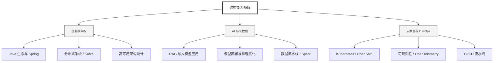

  <h1>你好，我是 Ellen Liu 👋</h1>
  

    <a href="README.md">English</a> | 
    <b>简体中文</b>
  

## 🧠 技术栈与核心能力

智能化企业系统建设路线图，涵盖全栈人工智能工程、云基础设施架构及模型部署等核心技术领域。

```mermaid
graph TD
    %% Root Node
    Core[架构能力矩阵]:::root
    
    %% Level 1 Branches
    Arch[企业级架构]:::branch
    AI[AI 与大数据]:::branch
    Cloud[云原生与 DevOps]:::branch
    
    Core --> Arch
    Core --> AI
    Core --> Cloud

    %% Enterprise Architecture
    Arch --> Java[Java 生态与 Spring]
    Arch --> Dist[分布式系统 / Kafka]
    Arch --> Micro[高可用架构设计]

    %% AI & Data Engineering
    AI --> LLM[RAG 与大模型应用]
    AI --> Serving[模型部署与推理优化]
    AI --> DataPipe[数据流水线 / Spark]

    %% Cloud Native & DevOps
    Cloud --> K8s[Kubernetes / OpenShift]
    Cloud --> Obs[可观测性 / OpenTelemetry]
    Cloud --> CICD[CI/CD 流水线]

    %% Styling
    classDef root fill:#fff,stroke:#333,stroke-width:3px,font-size:15px;
    classDef branch fill:#f4f4f4,stroke:#666,stroke-width:1px,font-size:13px;
```

## 🚀 Highlighted 工作

- **开源 AI 项目**: [基于 BERT 的声明检测模型](https://huggingface.co/XiaojingEllen/bert-finetuned-claim-detection) (Apache-2.0)
  - *已被哥伦比亚大学 (UBC) 研究项目引用。*
  - *手写 Transformer 核心代码，以验证理论与工程的一致性。*
- **金融基础设施**: 从 0 到 1 构建数字银行支付中间件及智能保险理赔系统。

## 📑 每日论文速递 (ArXiv)
<!-- DAILY_ARXIV_SUMMARY_START -->
**更新日期: 2026-06-23**

### 1. [LedgerAgent：面向策略合规工具调用代理的结构化状态](http://arxiv.org/abs/2606.20529v1)
- **摘要**: 在客户服务领域中，遵循策略的工具调用代理需要在多轮对话中维护任务状态，同时调用工具并遵守领域策略。任务状态包含通过用户交互和工具调用获取的相关事实、标识符、约束条件及状态信息。在标准代理中，任务状态并未被单独表示。观察结果、工具返回值和策略指令被直接放入提示词中，导致代理每次决策时都需要从提示词中重新构建相关状态。这种设计使得状态管理变得隐式，从而引发两种常见故障模式：代理可能获取正确的事实，但后续决策时却基于过时、缺失或错误的信息；此外，语法有效的工具调用仍可能违反依赖于当前任务状态的领域策略。我们提出\textsc{LedgerAgent}——一种针对工具调用代理的推理时方法，该方法将观察到的任务状态维护在独立账本中，并将这些状态渲染到提示词中。在改变环境的工具调用执行前，该账本还会用于检查状态相关的策略约束，从而阻止策略违规行为。在四个客户服务领域以及开源与闭源模型的混合评估中，\textsc{LedgerAgent}相较于标准基于提示词的工具调用方法，在平均pass\textasciicircum{}k指标上有所提升，且在更严格的多轮一致性评估指标下取得了最大改进。

### 2. [超越全局重规划：跨设备智能体系统的分层恢复机制](http://arxiv.org/abs/2606.20487v1)
- **摘要**: 现实世界中的计算机使用任务通常跨越多个应用和设备，要求智能体在动态运行时故障下协调异构环境。现有的多设备智能体系统支持任务分解和跨设备分配，但恢复机制仍较为粗粒度：当执行失败时，它们通常重试相同策略、重新分配子任务或修改全局计划，而未系统性地建模设备本地的策略空间。这限制了其区分"可在当前设备内修复的故障"与"需要跨设备重新规划的故障"的能力。我们提出\textbf{H-RePlan}——一种面向多设备智能体的分层重规划框架，支持统一的API--CLI--GUI执行模式。H-RePlan为每个设备配备可互换的执行策略，并通过紧凑的跨层故障抽象，将设备本地策略恢复与编排器级别的全局重规划相分离。为评估该能力，我们引入\textbf{HeraBench}——一个注入故障的基准测试集，在Linux和Android设备上构建跨设备工作流，并注入策略级和设备级故障。实验表明，H-RePlan显著优于单策略和粗粒度多设备基线方法，在实现更高完成率、指令遵循率和完美通过率的同时，降低了实现可靠端到端成功所需的令牌成本。这些结果证明，范围感知的分层恢复对于鲁棒的多设备智能体执行至关重要。

### 3. [你的鼠标和眼睛在悄悄泄露你的偏好：利用用户隐式反馈进行大语言模型对齐](http://arxiv.org/abs/2606.20482v1)
- **摘要**: 为了对齐大型语言模型（LLM），现有方法大多收集显式人类反馈，并基于响应文本训练奖励模型以预测人类偏好。这些方法存在两个关键局限：首先，用户很少为LLM响应提供显式反馈，导致高质量偏好标注的收集成本高昂；其次，这些方法未能利用隐式人类反馈——而这类反馈已被证明是互联网巨头经济护城河的关键要素。为量化隐式反馈的价值，我们构建了名为IFLLM的新数据集，收集了59名Mechanical Turk工作者提出的1336个多轮问题、其鼠标轨迹以及通过摄像头记录的针对LLM响应的眼动注视点数据。IFLLM表明用户具有高度多样化的注视行为与鼠标轨迹类型。基于隐式用户反馈的奖励模型将基于文本的奖励模型准确率从55%提升至64%，并在对八个LLM应用DPO后使相对响应质量提升近三倍，充分验证了隐式反馈在真实场景中的价值。我们的数据收集网站、数据集及代码可通过https://github.com/themehulpatwari/llm-implicit-feedback/获取。

<!-- DAILY_ARXIV_SUMMARY_END -->

## 🌐 保持联系

  
<i>期待与您探讨 AI 基础设施的未来！</i>

