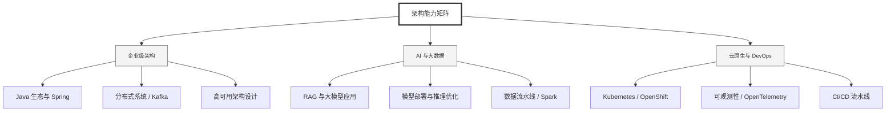

  <h1>你好，我是 Ellen Liu 👋</h1>
  

    <a href="README.md">English</a> | 
    <b>简体中文</b>
  

## 🧠 技术栈与核心能力

智能化企业系统建设路线图，涵盖全栈人工智能工程、云基础设施架构及模型部署等核心技术领域。

```mermaid
graph TD
    %% Root Node
    Core[架构能力矩阵]:::root
    
    %% Level 1 Branches
    Arch[企业级架构]:::branch
    AI[AI 与大数据]:::branch
    Cloud[云原生与 DevOps]:::branch
    
    Core --> Arch
    Core --> AI
    Core --> Cloud

    %% Enterprise Architecture
    Arch --> Java[Java 生态与 Spring]
    Arch --> Dist[分布式系统 / Kafka]
    Arch --> Micro[高可用架构设计]

    %% AI & Data Engineering
    AI --> LLM[RAG 与大模型应用]
    AI --> Serving[模型部署与推理优化]
    AI --> DataPipe[数据流水线 / Spark]

    %% Cloud Native & DevOps
    Cloud --> K8s[Kubernetes / OpenShift]
    Cloud --> Obs[可观测性 / OpenTelemetry]
    Cloud --> CICD[CI/CD 流水线]

    %% Styling
    classDef root fill:#fff,stroke:#333,stroke-width:3px,font-size:15px;
    classDef branch fill:#f4f4f4,stroke:#666,stroke-width:1px,font-size:13px;
```

## 🚀 Highlighted 工作

- **开源 AI 项目**: [基于 BERT 的声明检测模型](https://huggingface.co/XiaojingEllen/bert-finetuned-claim-detection) (Apache-2.0)
  - *已被哥伦比亚大学 (UBC) 研究项目引用。*
  - *手写 Transformer 核心代码，以验证理论与工程的一致性。*
- **金融基础设施**: 从 0 到 1 构建数字银行支付中间件及智能保险理赔系统。

## 📑 每日论文速递 (ArXiv)
<!-- DAILY_ARXIV_SUMMARY_START -->
**更新日期: 2026-05-16**

### 1. [ATLAS：智能体推理还是潜在视觉推理？一词足以涵盖两者](http://arxiv.org/abs/2605.15198v1)
- **摘要**: 视觉推理常与中间视觉状态交织，已成为该领域颇具前景的研究方向。一种直接方法是通过统一模型在推理过程中直接生成图像，但这种方式计算成本高昂且架构实现复杂。近期替代方案包括通过代码或工具调用的智能体推理，以及使用可学习隐式嵌入的潜在推理。然而，智能体方法因外部执行产生上下文切换延迟，而潜在方法缺乏任务泛化能力且难以通过自回归并行化训练。为融合两者优势并规避局限，我们提出ATLAS框架——将单个离散"词"（称为功能标记）同时作为智能体操作单元和潜在视觉推理单元。每个功能标记关联内化的视觉操作，无需视觉监督即可保持分词器词汇表中的标准标记形态，通过下一标记预测生成。该设计既避免了冗长的中间视觉内容生成，又保持与标准可扩展SFT和RL训练的兼容性，无需架构或方法学修改。针对强化学习中功能标记稀疏性问题，我们引入潜在锚定GRPO（LA-GRPO），通过静态加权辅助目标锚定功能标记稳定训练过程，提供更强梯度更新。大量实验与分析表明，ATLAS在保持清晰可解释性的同时，在挑战性基准测试中取得卓越性能。我们期待ATLAS能为未来视觉推理研究提供新范式启示。

### 2. [FutureSim：回放世界事件以评估自适应智能体](http://arxiv.org/abs/2605.15188v1)
- **摘要**: 人工智能代理正越来越多地被部署在动态、开放式的环境中，这要求它们能够根据新信息的到来实时调整适应。为了在现实场景中有效衡量这一能力，我们提出构建基于真实事件的模拟系统，按时间顺序重演真实世界事件。我们开发了FutureSim系统，在该系统中，代理需在交互式体验按时间顺序重演的世界（包括模拟期间实时出现的新闻文章和逐步解答的问题）的同时，预测超出其知识截止日期后的世界事件。我们通过原生测试框架评估前沿代理，检验其在2026年1月至3月这三个月内预测世界事件的能力。FutureSim清晰揭示了各代理能力的显著差异：表现最佳的代理准确率仅为25%，而多数代理的布莱尔技能得分甚至低于完全不进行预测的基准水平。通过精细的消融实验，我们展示了FutureSim如何为研究长期测试时自适应、搜索、记忆及不确定性推理等新兴方向提供真实场景。总体而言，我们希望这一基准设计能为衡量人工智能在真实世界长期开放环境中的适应能力铺平道路。

### 3. [Grep 是否已足够？智能体如何重塑搜索能力](http://arxiv.org/abs/2605.15184v1)
- **摘要**: 近期大语言模型（LLM）智能体的研究进展已实现复杂自主工作流，模型可自主检索信息、调用工具，并在大规模语料库中进行推理以代表用户完成任务。尽管检索增强生成（RAG）在智能搜索系统中得到日益广泛的应用，现有文献仍缺乏对检索策略选择如何与智能体架构及工具调用范式相互作用的系统性比较。在智能体循环中，诸如工具输出如何呈现给模型、当搜索需处理更多无关上下文文本时性能如何变化等重要实践维度仍未得到充分探索。本文报告了一项包含两项实验的实证研究。实验1基于LongMemEval的116个问题样本，使用定制智能体框架（Chronos）和供应商原生CLI框架（Claude Code、Codex及Gemini CLI），比较了grep检索与向量检索在两种场景下的表现：内联工具结果与模型单独读取的基于文件的工具结果。实验2在逐步混入额外无关对话历史的情况下，仅比较grep检索与向量检索，使每个查询在相关段落之外嵌入更多干扰信息。在Chronos及供应商CLI框架中，实验1的比较结果显示grep检索通常比向量检索获得更高准确率；同时，即使底层对话数据相同，整体得分仍强烈依赖于所使用的框架及工具调用风格。

<!-- DAILY_ARXIV_SUMMARY_END -->

## 🌐 保持联系

  
<i>期待与您探讨 AI 基础设施的未来！</i>

