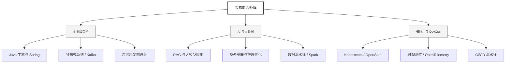

  <h1>你好，我是 Ellen Liu 👋</h1>
  

    <a href="README.md">English</a> | 
    <b>简体中文</b>
  

## 🧠 技术栈与核心能力

智能化企业系统建设路线图，涵盖全栈人工智能工程、云基础设施架构及模型部署等核心技术领域。

```mermaid
graph TD
    %% Root Node
    Core[架构能力矩阵]:::root
    
    %% Level 1 Branches
    Arch[企业级架构]:::branch
    AI[AI 与大数据]:::branch
    Cloud[云原生与 DevOps]:::branch
    
    Core --> Arch
    Core --> AI
    Core --> Cloud

    %% Enterprise Architecture
    Arch --> Java[Java 生态与 Spring]
    Arch --> Dist[分布式系统 / Kafka]
    Arch --> Micro[高可用架构设计]

    %% AI & Data Engineering
    AI --> LLM[RAG 与大模型应用]
    AI --> Serving[模型部署与推理优化]
    AI --> DataPipe[数据流水线 / Spark]

    %% Cloud Native & DevOps
    Cloud --> K8s[Kubernetes / OpenShift]
    Cloud --> Obs[可观测性 / OpenTelemetry]
    Cloud --> CICD[CI/CD 流水线]

    %% Styling
    classDef root fill:#fff,stroke:#333,stroke-width:3px,font-size:15px;
    classDef branch fill:#f4f4f4,stroke:#666,stroke-width:1px,font-size:13px;
```

## 🚀 Highlighted 工作

- **开源 AI 项目**: [基于 BERT 的声明检测模型](https://huggingface.co/XiaojingEllen/bert-finetuned-claim-detection) (Apache-2.0)
  - *已被哥伦比亚大学 (UBC) 研究项目引用。*
  - *手写 Transformer 核心代码，以验证理论与工程的一致性。*
- **金融基础设施**: 从 0 到 1 构建数字银行支付中间件及智能保险理赔系统。

## 📑 每日论文速递 (ArXiv)
<!-- DAILY_ARXIV_SUMMARY_START -->
**更新日期: 2026-06-18**

### 1. [ReproRepo：利用GitHub仓库问题扩展可重复性审计规模](http://arxiv.org/abs/2606.18237v1)
- **摘要**: 复现论文及公开代码的研究成果是科学进步的核心。现有研究已引入基准测试来评估LLM智能体能否辅助复现，但这些测试因依赖大量人工进行数据整理和评估而难以规模化。我们提出ReproRepo——一个可扩展的复现性评估框架，该框架利用人类在GitHub上提出的议题作为自然监督信号，识别真实的复现障碍。我们在来自顶级会议的1149篇近期机器学习论文上实例化ReproRepo，并评估了四种前沿模型-智能体配置。结果表明，即使不执行代码，LLM智能体也能从论文-仓库配对中识别出许多真实世界的复现问题：本研究中表现最佳的智能体（即搭载GPT-5.5的Codex）能为约90%的论文发现至少一个语义相关的人类报告障碍。进一步分析显示，智能体在识别显性故障和定位正确语义区域方面尤为有效，但在精确位置定位上仍显不足。ReproRepo可作为可复用、可扩展的框架，用于未来对LLM智能体在真实世界复现审计中的评估。我们的代码已发布于https://github.com/LithiumDA/ReproRepo。

### 2. [近端策略优化区域：提示中的教师，而非梯度中的教师](http://arxiv.org/abs/2606.18216v1)
- **摘要**: 知识蒸馏将教师模型的能力迁移至小型学生模型，但在小规模学生场景下存在脆弱性：强制学生模仿来自更大规模教师模型的logits，会使其过度聚焦于教师最尖锐的模式，从而损害训练语料库之外基准测试族群的泛化能力。强化学习通过基于学生自身轨迹进行训练，避免了logits模仿。然而，当所有轨迹均失败（产生零优势并被静默丢弃）时，将更强教师模型的响应注入策略梯度会破坏同策略假设并引发漂移。我们提出最近发展区策略优化（ZPPO），受维果茨基最近发展区理论启发，将教师置于提示而非策略梯度中。针对难题，ZPPO构建两种重构提示：二元候选包含问题（BCQ）将一条正确教师响应与一条错误学生响应配对，作为匿名候选供学生区分；负候选包含问题（NCQ）将学生的错误轨迹聚合为单一提示，揭示其共同失败模式。提示回放缓冲区循环处理每个难题，直至其毕业（学生在该问题上的平均轨迹准确率达到半数），或在有限容量下按先进先出原则被淘汰，从而在学生的当前最近发展区内强化BCQ与NCQ。在Qwen3.5系列四个学生规模（0.8B-9B）搭配27B教师模型、后训练为视觉语言模型并在31项基准测试（16项VLM、10项LLM、5项视频）评估的场景下，ZPPO在离策略/同策略蒸馏及GRPO方法中表现最优，且最小规模模型获得最大性能提升。

### 3. [RubricsTree：面向个人健康代理的健康记忆与医疗技能的可扩展且不断演进的开放式评估](http://arxiv.org/abs/2606.18203v1)
- **摘要**: 基于用户健康（传感器）指标的LLM赋能个人健康代理，为缓解全球医疗资源获取不均提供了可行路径。然而，大规模临床部署仍受限于开放式评估瓶颈：医师标注可靠但成本高昂且难以扩展，而LLM作为评判者的评估方式虽可扩展却存在主观性强、一致性差，甚至有时与临床实践脱节的问题。我们提出RubricsTree——一种可扩展的评估框架，其包含由专家校准的层级化分类体系，涵盖100余项原子化、可临床验证的布尔评估准则。该体系源于对4000条真实用户查询的深度分析，并通过由资深医师领衔的专家组采用迭代式人机协同审核协议持续优化。框架内置的上下文感知自适应路由器，能够针对每条查询仅激活相关且自动加权的最优准则子集，在保持专家级评估质量的同时满足规模化评估所需的吞吐量。通过系统性元评估，我们证明RubricsTree：(i) 在开放式复杂查询的专家一致性方面显著超越强大规模评估基线；(ii) 能可靠识别并惩罚上下文退化的响应；(iii) 当作为结构化指令、文本反馈或性能优化训练奖励时，可使Gemini、GPT及Qwen模型家族在HealthBench基准上获得最高约66%的相对性能提升。RubricsTree由此为产品级个人医疗AI的持续优化，提供了可扩展、可审计且持续演进的评估基础设施。

<!-- DAILY_ARXIV_SUMMARY_END -->

## 🌐 保持联系

  
<i>期待与您探讨 AI 基础设施的未来！</i>

