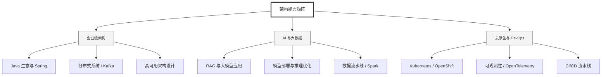

  <h1>你好，我是 Ellen Liu 👋</h1>
  

    <a href="README.md">English</a> | 
    <b>简体中文</b>
  

## 🧠 技术栈与核心能力

智能化企业系统建设路线图，涵盖全栈人工智能工程、云基础设施架构及模型部署等核心技术领域。

```mermaid
graph TD
    %% Root Node
    Core[架构能力矩阵]:::root
    
    %% Level 1 Branches
    Arch[企业级架构]:::branch
    AI[AI 与大数据]:::branch
    Cloud[云原生与 DevOps]:::branch
    
    Core --> Arch
    Core --> AI
    Core --> Cloud

    %% Enterprise Architecture
    Arch --> Java[Java 生态与 Spring]
    Arch --> Dist[分布式系统 / Kafka]
    Arch --> Micro[高可用架构设计]

    %% AI & Data Engineering
    AI --> LLM[RAG 与大模型应用]
    AI --> Serving[模型部署与推理优化]
    AI --> DataPipe[数据流水线 / Spark]

    %% Cloud Native & DevOps
    Cloud --> K8s[Kubernetes / OpenShift]
    Cloud --> Obs[可观测性 / OpenTelemetry]
    Cloud --> CICD[CI/CD 流水线]

    %% Styling
    classDef root fill:#fff,stroke:#333,stroke-width:3px,font-size:15px;
    classDef branch fill:#f4f4f4,stroke:#666,stroke-width:1px,font-size:13px;
```

## 🚀 Highlighted 工作

- **开源 AI 项目**: [基于 BERT 的声明检测模型](https://huggingface.co/XiaojingEllen/bert-finetuned-claim-detection) (Apache-2.0)
  - *已被哥伦比亚大学 (UBC) 研究项目引用。*
  - *手写 Transformer 核心代码，以验证理论与工程的一致性。*
- **金融基础设施**: 从 0 到 1 构建数字银行支付中间件及智能保险理赔系统。

## 📑 每日论文速递 (ArXiv)
<!-- DAILY_ARXIV_SUMMARY_START -->
**更新日期: 2026-03-20**

### 1. [ConGA：语境性别标注指南——机器翻译中性别标注的框架体系](http://arxiv.org/abs/2603.17962v1)
- **摘要**: 跨语言性别处理始终是机器翻译（MT）与大规模语言模型（LLMs）面临的持续性挑战，尤其在从性别中立语言（如英语）翻译至形态学上具有性别特征的语言（如意大利语）时更为突出。英语基本不体现语法性别，而意大利语则要求多个语法范畴保持明确的性别一致。这种不对称性常导致机器翻译系统默认采用阳性形式，既强化了性别偏见，又降低了翻译准确性。为应对这一问题，我们提出语境化性别标注（ConGA）框架——一套基于语言学原理的词汇级性别标注准则。该方案通过阳性（M）、阴性（F）和模糊（A）三类标签区分英语的语义性别，同时标注意大利语中语法性别的实现形式（阳性/阴性），并结合实体级标识符实现跨句子追踪。我们将ConGA应用于gENder-IT数据集，构建了用于评估翻译中性别偏见的黄金标准资源。实验结果显示当前机器翻译系统存在系统性阳性形式过度使用及阴性形式表达不一致的问题，凸显了现有技术的局限性。通过将细粒度语言标注与量化评估相结合，本研究不仅提供了方法论，更为构建更具性别意识的多语言自然语言处理系统建立了基准。

### 2. [无需训练的高效多令牌预测：基于嵌入空间探测的方法](http://arxiv.org/abs/2603.17942v1)
- **摘要**: 尽管大型语言模型（LLM）仅针对下一词元生成进行训练，却展现出潜在的**多词元预测**能力。我们提出一种无需训练的简易MTP方法：通过从模型嵌入空间中动态提取掩码词元对LLM进行探测，无需修改模型权重或依赖辅助草稿模型即可实现未来词元的并行预测。该方法通过从掩码词元逻辑值中采样Top-K候选构建推测词元树，并采用轻量级剪枝策略保留高概率延续序列。在解码过程中，候选预测结果通过并行验证实现无损生成，同时显著减少模型调用次数并提升词元吞吐量。在多项基准测试中，这种基于探测的MTP方法持续优于现有无需训练的基线模型：在LLaMA3上接受长度提升约12%，在Qwen3上提升8-12%，吞吐量增益最高达15-19%。最后，我们通过理论分析与实证证据表明，解码器层能自然对齐掩码词元表征与下一词元状态，无需重新训练或辅助模型即可实现精准的多步预测。

### 3. [在权重聚类的大型语言模型中，只有相对排名才至关重要。](http://arxiv.org/abs/2603.17917v1)
- **摘要**: 大型语言模型（LLMs）包含数十亿参数，但许多精确数值并非关键。我们发现，权重相对排序的重要性远高于具体数值——即连接强度的相对高低比精确量级更为关键。为减少权重值的唯一数量，我们对预训练模型应用权重聚类，通过K均值算法将每个权重矩阵替换为K个共享值。对于Llama 3.1-8B-Instruct和SmolLM2-135M模型，将每个矩阵压缩至仅16-64个不同值后，仍能保持较强准确性且无需重新训练，这为LLMs提供了一种简单的免训练磁盘压缩方案。若选择仅微调聚类中心值，能以极小代价恢复剩余精度差距的30%-40%。

随后我们系统性地随机化聚类中心值，同时保持权重分配关系不变。实验表明：打乱聚类中心的相对排序会急剧降低模型质量——困惑度可能激增数个数量级——即使全局统计量（如均值与方差）保持不变。相反，保持排序不变的随机化操作在中后层几乎不会造成性能损失。另一方面，当多层同时受扰动时，逐层渐进替换实验揭示：导致模型崩溃的主要机制是尺度漂移而非排序失真；但通过仿射校正w' = aw + b（其中a > 0，同时保持排序关系与整体权重分布），可显著延缓这种漂移。这种基于排序的视角为模型压缩与鲁棒性研究提供了新的理论框架。

<!-- DAILY_ARXIV_SUMMARY_END -->

## 🌐 保持联系

  
<i>期待与您探讨 AI 基础设施的未来！</i>

