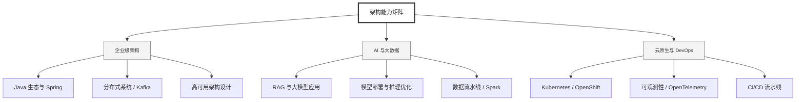

  <h1>你好，我是 Ellen Liu 👋</h1>
  

    <a href="README.md">English</a> | 
    <b>简体中文</b>
  

## 🧠 技术栈与核心能力

智能化企业系统建设路线图，涵盖全栈人工智能工程、云基础设施架构及模型部署等核心技术领域。

```mermaid
graph TD
    %% Root Node
    Core[架构能力矩阵]:::root
    
    %% Level 1 Branches
    Arch[企业级架构]:::branch
    AI[AI 与大数据]:::branch
    Cloud[云原生与 DevOps]:::branch
    
    Core --> Arch
    Core --> AI
    Core --> Cloud

    %% Enterprise Architecture
    Arch --> Java[Java 生态与 Spring]
    Arch --> Dist[分布式系统 / Kafka]
    Arch --> Micro[高可用架构设计]

    %% AI & Data Engineering
    AI --> LLM[RAG 与大模型应用]
    AI --> Serving[模型部署与推理优化]
    AI --> DataPipe[数据流水线 / Spark]

    %% Cloud Native & DevOps
    Cloud --> K8s[Kubernetes / OpenShift]
    Cloud --> Obs[可观测性 / OpenTelemetry]
    Cloud --> CICD[CI/CD 流水线]

    %% Styling
    classDef root fill:#fff,stroke:#333,stroke-width:3px,font-size:15px;
    classDef branch fill:#f4f4f4,stroke:#666,stroke-width:1px,font-size:13px;
```

## 🚀 Highlighted 工作

- **开源 AI 项目**: [基于 BERT 的声明检测模型](https://huggingface.co/XiaojingEllen/bert-finetuned-claim-detection) (Apache-2.0)
  - *已被哥伦比亚大学 (UBC) 研究项目引用。*
  - *手写 Transformer 核心代码，以验证理论与工程的一致性。*
- **金融基础设施**: 从 0 到 1 构建数字银行支付中间件及智能保险理赔系统。

## 📑 每日论文速递 (ArXiv)
<!-- DAILY_ARXIV_SUMMARY_START -->
**更新日期: 2026-06-27**

### 1. [使用多语言联合实体-关系抽取流水线绘制欧洲政治精英网络图谱](http://arxiv.org/abs/2606.27347v1)
- **摘要**: 政治精英究竟会组织成攫取公共资源的寻租联盟，还是构建维系治理的公民网络，这是比较政治学的核心问题。然而，大规模观察这些复杂、非正式且具有对抗性的关系网络，历来需要大量人工编码，而基于文本数据的自动化方法大多局限于简单的共现分析。近期的大语言模型（LLM）方法虽提供了新路径，但往往依赖专有API、缺乏跨语言能力，且难以实现可扩展的实体解析。我们提出一种模块化、完全开源的流水线，用于多语言联合实体关系抽取，能从海量非结构化新闻语料中构建带符号的时序知识图谱。该方法将基于跨度（span）的命名实体识别（NER）与三级链接级联相结合，将提及项映射至语言无关的维基数据标识符；随后采用高通量、本体约束的混合专家模型，通过引导式解码提取基于领域本体的有向带符号关系。针对包含3491条关系的黄金标准进行全覆盖抽查显示，其文本正确率从严格标准的68.2%到宽松标准的93.7%不等。两项大规模案例研究验证了该流水线与公开记录的一致性。在奥地利案例中，该方法重构了某政党的完整生命周期，识别内部分裂时间节点，并追踪人员流向后续派系及法院定罪记录。在波兰语料库中，该方法揭示了国有企业庇护网络中重叠的经济与治理网络，同时呈现了极化政治格局下公民纲领党（PO）与法律与公正党（PiS）双头垄断的结构平衡型带符号冲突网络。通过连接原始多语言文本与结构化关系数据，本框架为跨国实证计算社会科学提供了稳健且可复现的基础。

### 2. [通过自主经验探索与事后经验利用赋能GUI智能体任务规划](http://arxiv.org/abs/2606.27330v1)
- **摘要**: 多模态网页代理能够协助人类完成重复性图形界面操作任务，其中有效的任务规划对于将复杂任务分解为可执行动作至关重要。相较于商业大模型，小型开源多模态大语言模型虽具有成本效益和隐私保护优势，但其规划能力薄弱且跨网站泛化能力有限。为解决这些局限，我们提出规划经验探索与利用方法，该方法可自主探索环境以发现经验，并利用事后经验合成严格对齐的高层级训练数据。为定量分析驱动该性能的泛化行为，我们提出任务分解层次分析框架，系统研究低、中、高三个任务粒度的组合泛化能力。分析表明：掌握低层级原子技能并不能保证高层级规划能力，而高层级任务训练能产生更强的分布外泛化效果。在真实世界基准测试中，PEEU方法展现出卓越效能：我们的7B模型达到30.6%准确率，超越参数规模更大的Qwen2.5-VL-32B模型。这些结果表明，构建事后高层级任务并利用经验对于提升小型多模态大语言模型的分布外规划能力至关重要。

### 3. [基于大语言模型的德国央行证券招股说明书资格标准审查](http://arxiv.org/abs/2606.27316v1)
- **摘要**: 验证证券作为抵押品的资格是德国中央银行的一项关键职责。然而，在冗长、半结构化且常为双语的招股说明书中，依据法律和财务标准手动核验这些资产是一项资源密集型任务。尽管以往的研究利用传统命名实体识别（NER）进行信息提取，但这些方法难以应对OCR噪声、语言差异以及严格的基于跨度的约束，且需要为每种相关标注类型手动标注训练数据。本文首次提出将大语言模型（LLMs）应用于资格审核流程的案例研究，将范式转向生成式信息提取流水线。我们的方法将任务分解为提取、标准化和解释三个环节，从而更灵活地处理含噪文本及德英混合内容。我们进一步引入基于价值的评估方法，采用LLM作为裁判，相较于基于位置的指标提供更具语义性的评估。结果表明，基于LLM的系统在文档级资格审核中实现了高精度（最高达91%），并展现出保守的运行特征，从而最大限度降低误接受率。

<!-- DAILY_ARXIV_SUMMARY_END -->

## 🌐 保持联系

  
<i>期待与您探讨 AI 基础设施的未来！</i>

