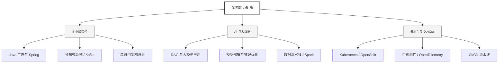

  <h1>你好，我是 Ellen Liu 👋</h1>
  

    <a href="README.md">English</a> | 
    <b>简体中文</b>
  

## 🧠 技术栈与核心能力

智能化企业系统建设路线图，涵盖全栈人工智能工程、云基础设施架构及模型部署等核心技术领域。

```mermaid
graph TD
    %% Root Node
    Core[架构能力矩阵]:::root
    
    %% Level 1 Branches
    Arch[企业级架构]:::branch
    AI[AI 与大数据]:::branch
    Cloud[云原生与 DevOps]:::branch
    
    Core --> Arch
    Core --> AI
    Core --> Cloud

    %% Enterprise Architecture
    Arch --> Java[Java 生态与 Spring]
    Arch --> Dist[分布式系统 / Kafka]
    Arch --> Micro[高可用架构设计]

    %% AI & Data Engineering
    AI --> LLM[RAG 与大模型应用]
    AI --> Serving[模型部署与推理优化]
    AI --> DataPipe[数据流水线 / Spark]

    %% Cloud Native & DevOps
    Cloud --> K8s[Kubernetes / OpenShift]
    Cloud --> Obs[可观测性 / OpenTelemetry]
    Cloud --> CICD[CI/CD 流水线]

    %% Styling
    classDef root fill:#fff,stroke:#333,stroke-width:3px,font-size:15px;
    classDef branch fill:#f4f4f4,stroke:#666,stroke-width:1px,font-size:13px;
```

## 🚀 Highlighted 工作

- **开源 AI 项目**: [基于 BERT 的声明检测模型](https://huggingface.co/XiaojingEllen/bert-finetuned-claim-detection) (Apache-2.0)
  - *已被哥伦比亚大学 (UBC) 研究项目引用。*
  - *手写 Transformer 核心代码，以验证理论与工程的一致性。*
- **金融基础设施**: 从 0 到 1 构建数字银行支付中间件及智能保险理赔系统。

## 📑 每日论文速递 (ArXiv)
<!-- DAILY_ARXIV_SUMMARY_START -->
**更新日期: 2026-04-22**

### 1. [语言模型层与人类句子处理的双重对齐](http://arxiv.org/abs/2604.18563v1)
- **摘要**: 近期一项研究（Kuribayashi等人，2025年）表明，人类句子加工行为（通常基于句法结构简单的句式进行测量）可以通过大型语言模型（LLMs）浅层输出的惊奇度进行有效建模。这引发了一个问题：内部层的这种优势是否也能延伸到句法结构更复杂的句式上？此前研究曾指出，在这类句式中，惊奇度会低估人类的认知负荷。本文首先探究了哪些内部层能更好地拟合英语句法歧义加工中观察到的人类认知负荷。实验表明，与自然阅读情境不同，较深层能更好地拟合此类认知负荷，但仍会低估人类实际数据。这种双重对应关系揭示了人类与语言模型在句子加工中的不同模式：自然阅读采用类似于语言模型浅层的弱预测机制，而句法复杂加工则需要更充分的情境化表征，这更接近语言模型深层的运作模式。基于这些发现，我们还探索了利用语言模型浅层与深层构建的多种概率更新度量方法，证明其在阅读时间建模中能与单层惊奇度形成互补优势。

### 2. [GSQ：基于Gumbel-Softmax采样的高精度低比特标量量化方法，专为大型语言模型设计](http://arxiv.org/abs/2604.18556v1)
- **摘要**: 权重量化已成为高效大语言模型部署的标准工具，尤其在本地推理场景中，模型参数现已普遍压缩至每参数2-3比特。当前技术前沿主要分为两类方法：一类是GPTQ或AWQ等简单标量量化技术，虽已广泛部署但其精度在每参数3-4比特时即达瓶颈；另一类是QTIP、GPTVQ和AQLM等"第二代"向量/网格量化方法，虽能在低比特位宽下突破精度边界，却因实现复杂、扩展困难而应用相对有限。本文旨在探究这一鸿沟是否具有根本性，以及经过精心优化的标量量化器能否弥合差距。我们通过提出GSQ（Gumbel-Softmax量化）给出了肯定答案——这是一种后训练标量量化方法，通过离散网格的Gumbel-Softmax松弛联合学习逐坐标网格分配与分组缩放系数。GSQ将松弛基数与目标比特位宽下的有限层级数相匹配（例如三元量化对应3级，3比特每参数对应8级），使松弛过程更紧密且优化更易处理。在实际应用中，基于标准Llama-3.1-8B/70B-Instruct模型的测试表明，GSQ在2-3比特位宽下基本弥合了标量量化与QTIP前沿技术的精度差距，同时采用对称标量网格与分组量化方案，完全兼容现有标量推理内核。我们进一步证明GSQ可扩展至万亿参数规模的专家混合模型（如Kimi-K2.5），而向量量化方法在此类场景中难以适用。

### 3. [FUSE：零标注数据下的验证器集成方法](http://arxiv.org/abs/2604.18547v1)
- **摘要**: 模型输出验证正迅速成为大型语言模型（LLM）训练和实际部署的关键基础环节。实践中，由于获取真实标注数据耗时且昂贵，这一过程通常依赖于不完美的LLM评估器和奖励模型。我们提出了一种名为"完全无监督评分集成"（FUSE）的方法，该方法通过集成多个验证器来提升验证质量，且无需依赖真实正确性标注。FUSE的核心思想在于控制验证器之间的条件依赖性，从而提升集成文献中一类谱算法在无监督场景下的性能。尽管完全无需真实标注，FUSE在涵盖多种生成模型、验证器和基准测试的运行时扩展实验中，通常能达到或优于半监督替代方案的表现。我们特别在传统学术基准（如GPQA Diamond）以及前沿非饱和基准（如"人类终极考试"和IMO短名单问题）上验证了该方法的有效性。

<!-- DAILY_ARXIV_SUMMARY_END -->

## 🌐 保持联系

  
<i>期待与您探讨 AI 基础设施的未来！</i>

