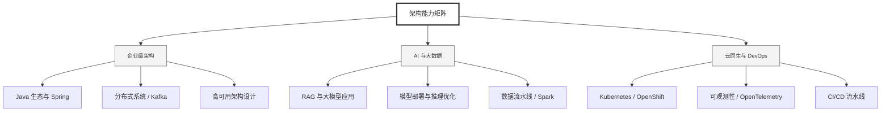

  <h1>你好，我是 Ellen Liu 👋</h1>
  

    <a href="README.md">English</a> | 
    <b>简体中文</b>
  

## 🧠 技术栈与核心能力

智能化企业系统建设路线图，涵盖全栈人工智能工程、云基础设施架构及模型部署等核心技术领域。

```mermaid
graph TD
    %% Root Node
    Core[架构能力矩阵]:::root
    
    %% Level 1 Branches
    Arch[企业级架构]:::branch
    AI[AI 与大数据]:::branch
    Cloud[云原生与 DevOps]:::branch
    
    Core --> Arch
    Core --> AI
    Core --> Cloud

    %% Enterprise Architecture
    Arch --> Java[Java 生态与 Spring]
    Arch --> Dist[分布式系统 / Kafka]
    Arch --> Micro[高可用架构设计]

    %% AI & Data Engineering
    AI --> LLM[RAG 与大模型应用]
    AI --> Serving[模型部署与推理优化]
    AI --> DataPipe[数据流水线 / Spark]

    %% Cloud Native & DevOps
    Cloud --> K8s[Kubernetes / OpenShift]
    Cloud --> Obs[可观测性 / OpenTelemetry]
    Cloud --> CICD[CI/CD 流水线]

    %% Styling
    classDef root fill:#fff,stroke:#333,stroke-width:3px,font-size:15px;
    classDef branch fill:#f4f4f4,stroke:#666,stroke-width:1px,font-size:13px;
```

## 🚀 Highlighted 工作

- **开源 AI 项目**: [基于 BERT 的声明检测模型](https://huggingface.co/XiaojingEllen/bert-finetuned-claim-detection) (Apache-2.0)
  - *已被哥伦比亚大学 (UBC) 研究项目引用。*
  - *手写 Transformer 核心代码，以验证理论与工程的一致性。*
- **金融基础设施**: 从 0 到 1 构建数字银行支付中间件及智能保险理赔系统。

## 📑 每日论文速递 (ArXiv)
<!-- DAILY_ARXIV_SUMMARY_START -->
**更新日期: 2026-03-10**

### 1. [超越行与列：面向多模态电子表格理解与编辑的智能检索](http://arxiv.org/abs/2603.06503v1)
- **摘要**: 多模态检索增强生成（RAG）技术的最新进展，使得大语言模型（LLM）能够分析包含数百万单元格、跨表格依赖关系和嵌入式可视化元素的企业级电子表格工作簿。然而，现有前沿方法存在三大局限：单轮检索遗漏关键上下文、数据压缩导致信息分辨率损失、以及简单全上下文注入超出LLM处理窗口，这些缺陷阻碍了对复杂企业工作簿进行可靠的多步推理。为此，我们提出"超越单元格到推理"（BRTR）框架——一种用于电子表格理解的多模态智能体框架，通过迭代式工具调用循环取代单轮检索，支持从复杂分析到结构化编辑的端到端Excel工作流。

基于超过200小时的人工专家评估，BRTR在三大前沿电子表格理解基准测试中均取得最优性能：在FRTR-Bench上超越先前方法25个百分点，在SpreadsheetLLM上提升7个百分点，在FINCH基准上领先32个百分点。我们评估了五种多模态嵌入模型，发现英伟达NeMo Retriever 1B在处理混合表格与视觉数据时表现最佳，并测试了九种不同LLM。消融实验证实规划器、检索模块和迭代推理机制均具有显著贡献，成本分析显示GPT-5.2实现了最优的效能-精度平衡。所有评估过程中，BRTR通过显式的工具调用轨迹始终保持完整的可审计性。

### 2. [COLD-Steer：通过上下文一步学习动态引导大型语言模型](http://arxiv.org/abs/2603.06495v1)
- **摘要**: 激活导向方法能够在无需重新训练的情况下，在推理阶段控制大语言模型（LLM）的行为，但现有方法面临一个根本性权衡：样本高效的方法难以从标注示例中充分提取导向信号，而能更好提取信号的方法则需要数百至数千个示例。我们提出COLD-Steer——一种无需训练即可通过近似上下文示例梯度下降所产生的表征变化来引导LLM激活的框架。我们的核心洞见在于：对少量示例进行微调的效果，可以在推理阶段通过高效近似实现，而无需实际更新模型参数。我们通过两种互补方法将其形式化：（1）单元核近似法，直接利用激活梯度（跨示例归一化）更新激活值；（2）有限差分近似法，无论示例数量多少仅需两次前向传播。在多种导向任务和基准测试中的实验表明，COLD-Steer仅需使用最佳基线方法1/50的样本量，即可实现高达95%的导向效能。该框架无需大量演示数据即可兼容多元观点，我们通过多元化对齐任务的实验验证了这一点。COLD-Steer通过基于学习动态的原理性近似（而非专门训练流程），为适应不同语境、灵活应对多样化损失驱动的人类偏好开辟了新的自适应模型控制路径。

### 3. [NOBLE：通过非线性低秩分支加速Transformer模型](http://arxiv.org/abs/2603.06492v1)
- **摘要**: 我们提出NOBLE（非线性低秩分支线性增强架构），这是一种通过为Transformer线性层添加非线性低秩分支实现的架构增强方法。与LoRA及其他参数高效微调方法不同，NOBLE专为从头预训练而设计。该分支作为架构的永久组成部分存在，而非基于冻结权重的微调适配器。分支通过计算σ(xWdown)Wup实现非线性变换，其中σ为可学习的非线性函数。我们评估了多种激活函数，发现CosNet——一种在瓶颈空间内具有可学习频率与相位、中间包含线性投影的双层余弦非线性函数——表现最佳。NOBLE以极低开销实现显著改进：达到基线评估损失所需的训练步数最高可减少32%（训练加速比达1.47倍），仅需增加4%参数和7%单步时间开销，最终实现最高1.22倍的净墙钟加速比。在LLM（2.5亿/15亿参数）、BERT、VQGAN和ViT上的实验均显示出训练效率的持续提升。我们注意到一个特例：在ImageNet分类任务中，Mixup/CutMix等随机增强方法会干扰NOBLE的增益效果，但当禁用这些增强时，ViT同样能获得改进。这种差异可能源于正则化技术倾向于使模型更平滑地拟合目标函数，而NOBLE可能更专注于目标函数中更尖锐的特征维度。

<!-- DAILY_ARXIV_SUMMARY_END -->

## 🌐 保持联系

  
<i>期待与您探讨 AI 基础设施的未来！</i>

