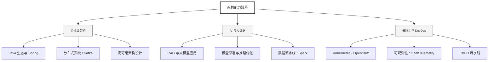

  <h1>你好，我是 Ellen Liu 👋</h1>
  

    <a href="README.md">English</a> | 
    <b>简体中文</b>
  

## 🧠 技术栈与核心能力

智能化企业系统建设路线图，涵盖全栈人工智能工程、云基础设施架构及模型部署等核心技术领域。

```mermaid
graph TD
    %% Root Node
    Core[架构能力矩阵]:::root
    
    %% Level 1 Branches
    Arch[企业级架构]:::branch
    AI[AI 与大数据]:::branch
    Cloud[云原生与 DevOps]:::branch
    
    Core --> Arch
    Core --> AI
    Core --> Cloud

    %% Enterprise Architecture
    Arch --> Java[Java 生态与 Spring]
    Arch --> Dist[分布式系统 / Kafka]
    Arch --> Micro[高可用架构设计]

    %% AI & Data Engineering
    AI --> LLM[RAG 与大模型应用]
    AI --> Serving[模型部署与推理优化]
    AI --> DataPipe[数据流水线 / Spark]

    %% Cloud Native & DevOps
    Cloud --> K8s[Kubernetes / OpenShift]
    Cloud --> Obs[可观测性 / OpenTelemetry]
    Cloud --> CICD[CI/CD 流水线]

    %% Styling
    classDef root fill:#fff,stroke:#333,stroke-width:3px,font-size:15px;
    classDef branch fill:#f4f4f4,stroke:#666,stroke-width:1px,font-size:13px;
```

## 🚀 Highlighted 工作

- **开源 AI 项目**: [基于 BERT 的声明检测模型](https://huggingface.co/XiaojingEllen/bert-finetuned-claim-detection) (Apache-2.0)
  - *已被哥伦比亚大学 (UBC) 研究项目引用。*
  - *手写 Transformer 核心代码，以验证理论与工程的一致性。*
- **金融基础设施**: 从 0 到 1 构建数字银行支付中间件及智能保险理赔系统。

## 📑 每日论文速递 (ArXiv)
<!-- DAILY_ARXIV_SUMMARY_START -->
**更新日期: 2026-04-29**

### 1. [长上下文感知升级：混合大语言模型扩展的新前沿](http://arxiv.org/abs/2604.24715v1)
- **摘要**: 混合序列模型结合了高效的Transformer组件与线性序列建模模块，是纯Transformer模型的有前景替代方案，但大多数模型仍需从头预训练，因此无法复用现有的Transformer检查点。我们研究将预训练Transformer大语言模型升级为混合架构的实用路径，在保持短上下文质量的同时提升长上下文能力。我们将解决方案命名为\emph{HyLo}（HYbrid LOng-context）：一种长上下文升级方案，通过架构适配结合高效Transformer模块、多头潜在注意力（MLA）与线性模块（Mamba2或Gated DeltaNet），并采用分阶段长上下文训练与教师引导蒸馏实现稳定优化。HyLo通过高效后训练将可用上下文长度扩展至$32\times$，并将KV缓存内存减少超过$90\%$，在我们的\texttt{vLLM}推理栈中支持高达200万token的预填充与解码，而同等规模的Llama基线在超过6.4万上下文时即内存耗尽。在1B和3B规模设置（基于Llama和Qwen的变体）中，HyLo在短上下文和长上下文任务上均表现稳定，并在RULER等长上下文评估中显著优于最先进的升级混合基线。值得注意的是，在相似规模下，仅用100亿token训练的HyLo-Qwen-1.7B在GSM8K、Lm-Harness常识推理和RULER-64K上显著优于使用4000亿token训练的JetNemotron。

### 2. [临床AI评估的案例特定评分标准：方法论、验证及823次诊疗中LLM与临床医生的一致性分析](http://arxiv.org/abs/2604.24710v1)
- **摘要**: 目标。临床AI文档系统需要评估方法，这些方法需具备临床有效性、经济可行性，并能对迭代变化保持敏感。需要专家逐条评分的方法对于安全、迭代部署而言过于缓慢且成本高昂。我们提出一种针对具体病例、由临床医生编写的评估标准方法，用于临床AI评估，并检验大语言模型生成的评估标准能否接近临床医生的一致性。  
材料与方法。20名临床医生为823个临床病例（736个真实病例，87个合成病例）编写了1646条评估标准，涵盖初级医疗、精神科、肿瘤科和行为健康领域。每条评估标准均通过验证：基于大语言模型的评分代理始终对临床医生偏好的输出给出高于被拒绝输出的评分。对嵌入电子病历系统的AI代理的七个版本在所有病例中进行了评估。  
结果。临床医生编写的评估标准能有效区分高质量与低质量输出（中位分数差距：82.9%），且评分稳定性高（中位范围：0.00%）。中位分数从84%提升至95%。在后续实验中，临床医生与大语言模型的排名一致性（tau值：0.42-0.46）达到或超过临床医生之间的一致性（tau值：0.38-0.43），这归因于天花板压缩效应和大语言模型评估标准的改进。  
讨论。这种趋同现象支持将大语言模型评估标准与临床医生编写的评估标准结合使用。大语言模型评估标准的成本约为前者的千分之一，可大幅扩大评估覆盖范围，而持续由临床医生编写评估标准则确保评估基于专家判断。天花板压缩效应对未来评分者间一致性研究构成方法论挑战。  
结论。针对具体病例的评估标准为临床AI评估提供了一条路径，既保留专家判断，又能以三个数量级更低的成本实现自动化。临床医生编写的评估标准为验证大语言模型评估标准建立了基线。

### 3. [绿色屏蔽：以用户为中心的可信人工智能路径](http://arxiv.org/abs/2604.24700v1)
- **摘要**: 大型语言模型（LLMs）的部署日益广泛，但其输出对用户提问方式中常规、非对抗性的措辞变化高度敏感，而现有红队测试方法未能充分解决这一差距。我们提出"绿色屏蔽"（Green Shielding）这一以用户为中心的研究议程，通过刻画良性输入变化如何改变模型行为，构建基于实证的部署指导。该议程通过CUE标准实现：包含真实语境的基准测试（Context）、反映真实效用的参考标准与指标（Utility），以及模拟模型行为激发中现实变化的扰动机制（Elicitation）。在PCS框架指导下，我们与执业医师合作，将绿色屏蔽应用于医学诊断领域，构建了患者自述查询基准HealthCareMagic-Diagnosis（HCM-Dx），配套结构化参考诊断集和基于临床实践的鉴别诊断列表评估指标。同时研究捕获常规输入变化的扰动机制，发现提示层面因素会沿临床意义维度改变模型行为。在多个前沿LLM中，这些变化呈现出帕累托式权衡：特别是"中性化"处理（在保留临床内容的同时移除常见用户层面因素）虽能提升诊断合理性、生成更简洁且接近临床医生的鉴别诊断，但会降低高风险及关键安全病症的覆盖度。这些结果表明，交互选择可系统性改变模型输出的任务相关属性，为高风险领域的安全部署提供面向用户的指导。尽管本文以医学诊断为实例，该议程可自然延伸至其他决策支持场景及自主AI系统。

<!-- DAILY_ARXIV_SUMMARY_END -->

## 🌐 保持联系

  
<i>期待与您探讨 AI 基础设施的未来！</i>

