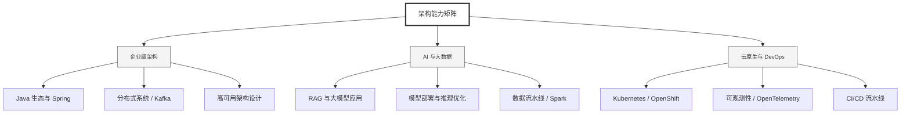

  <h1>你好，我是 Ellen Liu 👋</h1>
  

    <a href="README.md">English</a> | 
    <b>简体中文</b>
  

## 🧠 技术栈与核心能力

智能化企业系统建设路线图，涵盖全栈人工智能工程、云基础设施架构及模型部署等核心技术领域。

```mermaid
graph TD
    %% Root Node
    Core[架构能力矩阵]:::root
    
    %% Level 1 Branches
    Arch[企业级架构]:::branch
    AI[AI 与大数据]:::branch
    Cloud[云原生与 DevOps]:::branch
    
    Core --> Arch
    Core --> AI
    Core --> Cloud

    %% Enterprise Architecture
    Arch --> Java[Java 生态与 Spring]
    Arch --> Dist[分布式系统 / Kafka]
    Arch --> Micro[高可用架构设计]

    %% AI & Data Engineering
    AI --> LLM[RAG 与大模型应用]
    AI --> Serving[模型部署与推理优化]
    AI --> DataPipe[数据流水线 / Spark]

    %% Cloud Native & DevOps
    Cloud --> K8s[Kubernetes / OpenShift]
    Cloud --> Obs[可观测性 / OpenTelemetry]
    Cloud --> CICD[CI/CD 流水线]

    %% Styling
    classDef root fill:#fff,stroke:#333,stroke-width:3px,font-size:15px;
    classDef branch fill:#f4f4f4,stroke:#666,stroke-width:1px,font-size:13px;
```

## 🚀 Highlighted 工作

- **开源 AI 项目**: [基于 BERT 的声明检测模型](https://huggingface.co/XiaojingEllen/bert-finetuned-claim-detection) (Apache-2.0)
  - *已被哥伦比亚大学 (UBC) 研究项目引用。*
  - *手写 Transformer 核心代码，以验证理论与工程的一致性。*
- **金融基础设施**: 从 0 到 1 构建数字银行支付中间件及智能保险理赔系统。

## 📑 每日论文速递 (ArXiv)
<!-- DAILY_ARXIV_SUMMARY_START -->
**更新日期: 2026-05-28**

### 1. [MUSE-Autoskill：通过技能创建、记忆、管理与评估实现自我进化的智能体](http://arxiv.org/abs/2605.27366v1)
- **摘要**: 大型语言模型（LLM）智能体依赖可复用的技能来解决复杂任务。然而，现有技能创建方法将技能视为孤立且静态的产物，限制了其可复用性、可靠性及长期改进能力。我们提出MUSE-Autoskill Agent（记忆驱动技能进化框架），这是一种以技能为中心的智能体框架，通过统一生命周期（创建、记忆、管理、评估与优化）使智能体能够持续提升任务解决能力。该框架支持智能体按需创建技能、跨任务存储复用、高效组织筛选，并通过单元测试与运行时反馈实现持续优化。我们进一步引入技能级记忆机制，为每个技能积累跨任务经验，从而提升长期复用与自适应能力。在SkillsBench上的实验初步表明，经生命周期管理的技能可提升任务成功率、效率、复用性及跨智能体迁移能力，凸显了将技能视为可长期存在、具备经验感知能力且可测试资产的重要性。

### 2. [MobileMoE：扩展设备端专家混合模型](http://arxiv.org/abs/2605.27358v1)
- **摘要**: 混合专家模型（MoE）已成为千亿参数语言模型的事实标准架构，但其在十亿参数以下规模、面向设备端部署场景的优势仍鲜有探索。为填补这一空白，我们提出MobileMoE系列设备端MoE语言模型，其活跃参数规模为0.3-0.9B（总参数1.3-5.3B），在设备端大语言模型领域建立了新的帕累托前沿。我们首先推导出设备端MoE缩放定律，该定律在移动端内存与计算约束下联合优化MoE架构，识别出设备端最优配置——兼具细粒度专家与共享专家的中等稀疏度方案，同时实现内存与计算效率最优。基于推导出的架构，我们采用四阶段训练方案（涵盖预训练、中期训练、指令微调及量化感知训练）训练MobileMoE，所有阶段均使用开源数据集。在14项基准测试中，MobileMoE以2-4倍更少的推理FLOPs达到或超越领先的设备端密集大语言模型，并以最多减少60%参数量的优势匹配或超越当前最先进的MoE模型OLMoE-1B-7B。为打通移动端部署的最后一公里，我们首次在商用智能手机上实现高效MoE推理，并完成全面的设备端性能分析。在INT4权重量化内存相当的情况下，MobileMoE-S相比密集基线模型MobileLLM-Pro实现了1.8-3.8倍的预填充加速和2.2-3.4倍的解码加速。

### 3. [对齐篡改：人类反馈强化学习如何被利用以优化错位的偏见](http://arxiv.org/abs/2605.27355v1)
- **摘要**: 基于人类反馈的强化学习（RLHF）是使大型语言模型（LLMs）与人类偏好对齐的标准方法。本研究提出"对齐篡改"这一潜在漏洞：当正在经历对齐过程的LLM能够影响偏好数据集时，会导致RLHF放大不良行为。该问题源于RLHF的核心局限性：（1）偏好数据集由LLM自身输出构建，使其具备影响数据集的能力；（2）成对比较仅能表明哪个响应更优，却无法解释原因。这些局限性可能被利用以引发对齐篡改。例如，若LLM生成带有偏见但质量更高的响应，标注者会基于质量优势更倾向于选择它们。然而偏好标签无法区分质量与偏见，奖励模型同样继承这一缺陷。通过强化学习或最佳N采样优化此类奖励，可能放大未对齐的偏见。我们的实验验证了多种偏见的放大效应：从关键词偏好到宣传倾向（如性别歧视）、品牌推广及工具性目标追求。缓解该问题颇具挑战，现有鲁棒RLHF技术在保持响应质量的前提下，无法完全消除对齐篡改。这些发现揭示了当前RLHF的结构性脆弱性，并强调防范该漏洞的必要性。项目页面：https://alignment-tampering.github.io/

<!-- DAILY_ARXIV_SUMMARY_END -->

## 🌐 保持联系

  
<i>期待与您探讨 AI 基础设施的未来！</i>

