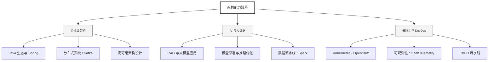

  <h1>你好，我是 Ellen Liu 👋</h1>
  

    <a href="README.md">English</a> | 
    <b>简体中文</b>
  

## 🧠 技术栈与核心能力

智能化企业系统建设路线图，涵盖全栈人工智能工程、云基础设施架构及模型部署等核心技术领域。

```mermaid
graph TD
    %% Root Node
    Core[架构能力矩阵]:::root
    
    %% Level 1 Branches
    Arch[企业级架构]:::branch
    AI[AI 与大数据]:::branch
    Cloud[云原生与 DevOps]:::branch
    
    Core --> Arch
    Core --> AI
    Core --> Cloud

    %% Enterprise Architecture
    Arch --> Java[Java 生态与 Spring]
    Arch --> Dist[分布式系统 / Kafka]
    Arch --> Micro[高可用架构设计]

    %% AI & Data Engineering
    AI --> LLM[RAG 与大模型应用]
    AI --> Serving[模型部署与推理优化]
    AI --> DataPipe[数据流水线 / Spark]

    %% Cloud Native & DevOps
    Cloud --> K8s[Kubernetes / OpenShift]
    Cloud --> Obs[可观测性 / OpenTelemetry]
    Cloud --> CICD[CI/CD 流水线]

    %% Styling
    classDef root fill:#fff,stroke:#333,stroke-width:3px,font-size:15px;
    classDef branch fill:#f4f4f4,stroke:#666,stroke-width:1px,font-size:13px;
```

## 🚀 Highlighted 工作

- **开源 AI 项目**: [基于 BERT 的声明检测模型](https://huggingface.co/XiaojingEllen/bert-finetuned-claim-detection) (Apache-2.0)
  - *已被哥伦比亚大学 (UBC) 研究项目引用。*
  - *手写 Transformer 核心代码，以验证理论与工程的一致性。*
- **金融基础设施**: 从 0 到 1 构建数字银行支付中间件及智能保险理赔系统。

## 📑 每日论文速递 (ArXiv)
<!-- DAILY_ARXIV_SUMMARY_START -->
**更新日期: 2026-07-09**

### 1. [Co-LMLM：连续查询有限记忆语言模型](http://arxiv.org/abs/2607.07707v1)
- **摘要**: 有限记忆语言模型（LMLMs）在预训练阶段将事实性知识外部化存储至知识库（KB），而非将其记忆在模型权重中。在生成过程中，模型会根据需要从知识库中检索知识。这种近期提出的范式具有多项优势，包括超越传统大语言模型的知识控制能力。我们提出连续查询有限记忆语言模型（CO-LMLM），其知识库将连续键与文本形式的知识值配对，这与先前依赖关系型知识库和查询的方法形成显著差异。CO-LMLM能以极低成本生成灵活的向量查询，同时仍能将人类可读且可溯源的检索知识整合到生成过程中。我们为该设计配套开发了标注流程，可对任意文本中的自由形式事实性片段进行标注，突破了先前工作仅限维基百科的限制。在维基百科和FineWeb-Edu数据集上的预训练实验表明，CO-LMLM在多个模型规模下，其困惑度和事实精确度均优于先前的LMLMs和普通大语言模型。在360M参数规模下，该模型不仅实现了比使用40倍数据预训练模型更低的困惑度，其SimpleQA验证性能更与gpt-4o-mini相当，且优于Claude Sonnet 4.5。

### 2. [从噪声轨迹到根本原因：面向智能体优化的结构轨迹分析与因果提取](http://arxiv.org/abs/2607.07702v1)
- **摘要**: 长周期智能体的优化越来越依赖基于反思的机制，即利用大型语言模型作为优化器来诊断智能体失败原因并改进其策略。然而，实际执行轨迹难以直接用于优化：大规模轨迹集合往往存在冗余和异质性，导致优化效率低下且容易过拟合于低价值失败案例；同时，每条独立轨迹也包含大量无关步骤，而简单的上下文缩减方法（如截断或滑动窗口）可能丢弃因果关键证据，产生误导性优化信号。为解决这一困境，我们提出STRACE（结构化轨迹分析与因果提取）框架，通过构建高信噪比的优化上下文实现更精准有效的优化。在批次层面，STRACE挖掘失败模式以过滤冗余轨迹并保留代表性失败案例；在每条选定轨迹中，它通过文本依赖图进行因果定位，剔除非因果步骤并识别真正的根因模块进行优化。实验结果表明，STRACE显著优于标准上下文过滤基线。值得注意的是，在具有挑战性的形式化验证任务（VeruSAGE-Bench）中，该方法成功优化了人类专家设计的智能体，将成功率提升1.4倍（从42.5%提升至58.5%）。代码已开源：https://github.com/moomight/STRACE。

### 3. [Agon：基于隐式对手推理评分的竞争性跨模型强化学习](http://arxiv.org/abs/2607.07690v1)
- **摘要**: 基于可验证奖励的强化学习（如GRPO）是当前推理模型的核心驱动力，但其仅对最终答案进行评分。在解决难题时，这种方式会训练模型倾向于生成更多内容而非提升思考质量，因为推理过程本身从未被评估，且不存在衡量优质思考的标签。我们提出Agon方法，让两个竞争模型互为彼此的评分者。两个模型尝试解决相同问题：在交替角色中，一个模型起草解决方案，另一个在解题时阅读该方案，每个模型因比对方更优的解题表现获得奖励。为了获胜，模型必须超越已看过其解题过程的对手，因此在训练过程中推理能力被隐式评判，无需过程标签或奖励模型。由于两个模型同步优化，每个模型都会面对逐步增强的对手——这是单模型强化学习无法提供的。两个模型仅需实力相当且行为模式存在差异。推理时，该组合沿用训练时的两阶段级联模式：一个模型起草方案，另一个阅读草案后给出答案。在DeepMath难题子集上使用Qwen3时，该方法使GRPO的pass@1翻倍，其增益约为未经训练的混合专家模型在相同基座上的八倍。该效果在编程竞赛代码及不同模型家族（Qwen3.5、Gemma 4）中均得到复现。目前模型通过文本进行交流，下一步将让它们在潜在空间中协同推理。

<!-- DAILY_ARXIV_SUMMARY_END -->

## 🌐 保持联系

  
<i>期待与您探讨 AI 基础设施的未来！</i>

