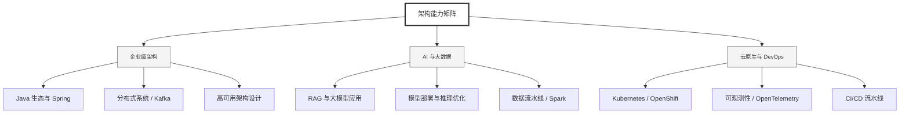

  <h1>你好，我是 Ellen Liu 👋</h1>
  

    <a href="README.md">English</a> | 
    <b>简体中文</b>
  

## 🧠 技术栈与核心能力

智能化企业系统建设路线图，涵盖全栈人工智能工程、云基础设施架构及模型部署等核心技术领域。

```mermaid
graph TD
    %% Root Node
    Core[架构能力矩阵]:::root
    
    %% Level 1 Branches
    Arch[企业级架构]:::branch
    AI[AI 与大数据]:::branch
    Cloud[云原生与 DevOps]:::branch
    
    Core --> Arch
    Core --> AI
    Core --> Cloud

    %% Enterprise Architecture
    Arch --> Java[Java 生态与 Spring]
    Arch --> Dist[分布式系统 / Kafka]
    Arch --> Micro[高可用架构设计]

    %% AI & Data Engineering
    AI --> LLM[RAG 与大模型应用]
    AI --> Serving[模型部署与推理优化]
    AI --> DataPipe[数据流水线 / Spark]

    %% Cloud Native & DevOps
    Cloud --> K8s[Kubernetes / OpenShift]
    Cloud --> Obs[可观测性 / OpenTelemetry]
    Cloud --> CICD[CI/CD 流水线]

    %% Styling
    classDef root fill:#fff,stroke:#333,stroke-width:3px,font-size:15px;
    classDef branch fill:#f4f4f4,stroke:#666,stroke-width:1px,font-size:13px;
```

## 🚀 Highlighted 工作

- **开源 AI 项目**: [基于 BERT 的声明检测模型](https://huggingface.co/XiaojingEllen/bert-finetuned-claim-detection) (Apache-2.0)
  - *已被哥伦比亚大学 (UBC) 研究项目引用。*
  - *手写 Transformer 核心代码，以验证理论与工程的一致性。*
- **金融基础设施**: 从 0 到 1 构建数字银行支付中间件及智能保险理赔系统。

## 📑 每日论文速递 (ArXiv)
<!-- DAILY_ARXIV_SUMMARY_START -->
**更新日期: 2026-03-21**

### 1. [FinTradeBench：面向大型语言模型的金融推理基准测试](http://arxiv.org/abs/2603.19225v1)
- **摘要**: 现实世界的金融决策是一个复杂难题，需要综合处理异质化信号进行推理，包括从监管文件中提取的公司基本面数据，以及根据价格动态计算得出的交易信号。近年来，随着大语言模型（LLMs）的发展，金融分析师已开始将其应用于金融决策任务。然而，现有用于测试这些模型的金融问答基准主要聚焦于公司资产负债表数据，很少评估模型对公司股票市场交易行为及其与基本面关联的推理能力。为融合两种方法的优势，我们推出FinTradeBench——一个整合公司基本面与交易信号的金融推理评估基准。该基准包含基于纳斯达克100指数成分股十年历史数据构建的1400道问题，并按推理类型分为三类：聚焦基本面的问题、聚焦交易信号的问题，以及需要跨信号推理的混合型问题。

为确保大规模评估的可靠性，我们采用"校准-扩展"框架，该框架融合了专家种子问题生成、多模型响应生成、模型内自过滤、数值审计以及人类-LLM评判对齐机制。通过对14个大语言模型进行零样本提示和检索增强设置下的评估，我们观察到明显的性能差距：检索机制能显著提升对文本型基本面的推理能力，但对交易信号推理的改善有限。这些发现揭示了当前大语言模型在数值与时序推理方面存在的根本性挑战，为金融智能领域的未来研究指明了方向。

### 2. [F2LLM-v2：面向多语言世界的包容、高性能与高效嵌入模型](http://arxiv.org/abs/2603.19223v1)
- **摘要**: 我们推出F2LLM-v2系列——一套涵盖8种参数量级（从8000万到140亿）的通用多语言嵌入模型。该系列基于全新构建的6000万公开高质量数据样本复合训练集开发，支持超过200种语言，尤其关注以往资源受限的中低资源语种。通过融合两阶段大语言模型嵌入训练流程与套娃学习、模型剪枝及知识蒸馏技术，我们实现了远超以往大语言模型嵌入模型的效率，同时保持卓越性能。大量评估证实，F2LLM-v2-14B在11项MTEB基准测试中位列榜首，而该系列中的较小参数量模型亦为资源受限场景树立了全新性能标杆。为促进开源嵌入模型研究，我们将完整公开所有模型、数据、代码及训练中间检查点。

### 3. [Nemotron-Cascade 2：基于级联强化学习与多领域同策略蒸馏的后训练大语言模型](http://arxiv.org/abs/2603.19220v1)
- **摘要**: 我们推出Nemotron-Cascade 2——这是一个拥有300亿参数、30亿激活参数的开放混合专家模型，具备顶尖的推理能力与强大的智能体性能。尽管模型规模紧凑，其在数学与代码推理任务上的表现已接近前沿开放模型水平。作为继DeepSeekV3.2-Speciale-671B-A37B之后第二个达成此成就的开放权重大语言模型，它在2025年国际数学奥林匹克（IMO）、国际信息学奥林匹克（IOI）及ICPC全球总决赛中均达到金牌级表现，以仅二十分之一的参数量实现了惊人的智能密度突破。

相较于Nemotron-Cascade 1，本代模型的核心技术突破体现在：在精标数据集完成监督微调后，我们大幅扩展了级联强化学习的覆盖范围，使其涵盖更广泛的推理与智能体领域。同时，我们在级联强化学习全流程中引入多领域同策略蒸馏技术，从各领域最强的中间教师模型进行知识迁移，从而高效恢复基准测试中的性能回退现象，并持续保持强劲的性能提升轨迹。我们将同步开放模型检查点与训练数据集合。

<!-- DAILY_ARXIV_SUMMARY_END -->

## 🌐 保持联系

  
<i>期待与您探讨 AI 基础设施的未来！</i>

