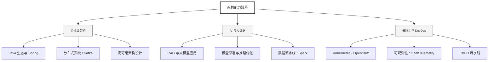

  <h1>你好，我是 Ellen Liu 👋</h1>
  

    <a href="README.md">English</a> | 
    <b>简体中文</b>
  

## 🧠 技术栈与核心能力

智能化企业系统建设路线图，涵盖全栈人工智能工程、云基础设施架构及模型部署等核心技术领域。

```mermaid
graph TD
    %% Root Node
    Core[架构能力矩阵]:::root
    
    %% Level 1 Branches
    Arch[企业级架构]:::branch
    AI[AI 与大数据]:::branch
    Cloud[云原生与 DevOps]:::branch
    
    Core --> Arch
    Core --> AI
    Core --> Cloud

    %% Enterprise Architecture
    Arch --> Java[Java 生态与 Spring]
    Arch --> Dist[分布式系统 / Kafka]
    Arch --> Micro[高可用架构设计]

    %% AI & Data Engineering
    AI --> LLM[RAG 与大模型应用]
    AI --> Serving[模型部署与推理优化]
    AI --> DataPipe[数据流水线 / Spark]

    %% Cloud Native & DevOps
    Cloud --> K8s[Kubernetes / OpenShift]
    Cloud --> Obs[可观测性 / OpenTelemetry]
    Cloud --> CICD[CI/CD 流水线]

    %% Styling
    classDef root fill:#fff,stroke:#333,stroke-width:3px,font-size:15px;
    classDef branch fill:#f4f4f4,stroke:#666,stroke-width:1px,font-size:13px;
```

## 🚀 Highlighted 工作

- **开源 AI 项目**: [基于 BERT 的声明检测模型](https://huggingface.co/XiaojingEllen/bert-finetuned-claim-detection) (Apache-2.0)
  - *已被哥伦比亚大学 (UBC) 研究项目引用。*
  - *手写 Transformer 核心代码，以验证理论与工程的一致性。*
- **金融基础设施**: 从 0 到 1 构建数字银行支付中间件及智能保险理赔系统。

## 📑 每日论文速递 (ArXiv)
<!-- DAILY_ARXIV_SUMMARY_START -->
**更新日期: 2026-06-26**

### 1. [当确定性成为人为产物：关键词词典盲区与修辞立场的（误）测量](http://arxiv.org/abs/2606.26062v1)
- **摘要**: 在计算社会科学中，一个具有统计显著性和大效应量的发现，是否可能完全源于测量工具的人为产物？我们呈现了一个答案似乎为肯定的案例。通过对四位公共知识分子（2016-2026年）的85次访谈进行分析，我们发现基于关键词评分时，负面情感与强调确定性之间存在稳健的词汇共现模式（四位发言者的相关系数r=0.72-0.93，p<0.01）。当用基于大语言模型的零样本语义分类替代关键词计数，对完整的说话人分割语料库（32,625个句子）进行分析时，这一相关性显著降低：达利欧的r值从0.851降至0.206，两位发言者的r(负面,强调)呈负值，一位发言者呈零值。相比之下，大语言模型揭示了发言者间强烈的负面-模糊化耦合——罗格夫的r(负面,模糊化)=0.875（p=0.001），泽汉的r(负面,模糊化)=0.722（p=0.008）——这与悲观话语倾向于吸引模糊化而非确定性的传统预期一致。句子层面的误差分析将这种差异追溯至关键词词典的三种结构性失效模式：句法盲视、多义盲视和范畴缺失，并通过关键词计数颠倒语义含义的案例加以说明（例如，“从未绝对完全自信”被计为高确定性）。我们认为，关键词词典测量的是普遍的词汇共现倾向——负面话语自然吸引强调性词汇——这与修辞立场正交，甚至可能系统性地颠倒修辞立场。将关键词计数视为对认知确定性的测量是一种范畴错误：一个看似关于说话者心理的发现，可能完全只是关于词语计数的问题。

### 2. [OCR推理的鲁棒性如何？——评估视觉语言模型在视觉扰动下的OCR推理鲁棒性](http://arxiv.org/abs/2606.26041v1)
- **摘要**: 视觉语言模型（VLMs）在基于OCR的基准测试中取得了优异表现，并日益聚焦于文本密集型理解任务，但其在受控视觉退化条件下的鲁棒性仍缺乏充分研究。这一研究空白对OCR推理尤为关键——视觉失真可能引发OCR错误和结构扭曲，从而为推理任务引入不确定性。为系统研究该问题，我们提出OCR-Robust基准测试，专门评估视觉扰动下的OCR推理鲁棒性。该基准包含812个样本，分为两个互补子集：OCR1.0涵盖文档、场景文本、收据、手写体和数学内容；OCR2.0聚焦图表、几何示意图和表格。为实现高效且信息量充足的评估，我们对18种候选扰动进行预实验，基于其影响力和跨模型区分度，最终选取5种代表性扰动类型，每种设置3个严重等级。我们采用干净准确率、相对退化保持率（RCR）、最差情况保持率（WCR）及复合退化鲁棒性指数（CRI）评估鲁棒性，并对18个模型进行基准测试，涵盖商业系统、开源VLM及OCR+LLM流水线。实验结果表明：更高的干净准确率并不必然意味着更强的鲁棒性；在结构敏感的OCR任务中，模型在最差情况下可能出现显著性能退化；图表类输入在扰动下的脆弱性远高于文档类输入。

### 3. [文学文本的AI翻译“尚可”，但读者仍更青睐人工翻译](http://arxiv.org/abs/2606.26040v1)
- **摘要**: 文学作品的AI翻译日益普遍。虽然内容可能被充分呈现，但我们对读者在沉浸感和文学效果方面的体验知之甚少——这些方面难以通过自动机器翻译指标或针对流畅性和充分性的人工评估来捕捉。我们邀请15位资深读者，将近期出版的法语、波兰语和日语15部小说的英文译本（人工翻译HT）与基于智能大语言模型（LLM）流水线生成的机器翻译（MT）进行对比。读者在两种条件下评估约8000词的摘录：对完整摘录的沉浸式阅读（30组对比），以及对386组对齐的HT-MT片段进行精读（772组对比），每本书由两位读者以交替呈现顺序完成。总体而言，读者认为MT"尚可"，但更偏好HT（摘录层面19/30略占优势，片段层面522/772更为明显），因其更易读、清晰且具有沉浸感。读者标注显示，MT在同一本书内的质量波动大于HT。关键在于，读者无法可靠区分两者（17/30正确判断），且倾向于偏好他们认为是人工翻译的版本。包括LLM作为评判方法在内的自动指标无法还原读者偏好，反而更青睐MT。我们发布LAIT（文学AI翻译）数据集，包含1000条读者评论、2000条判断与偏好评分、7200个跨段标注，以及评估协议与配套界面。

<!-- DAILY_ARXIV_SUMMARY_END -->

## 🌐 保持联系

  
<i>期待与您探讨 AI 基础设施的未来！</i>

