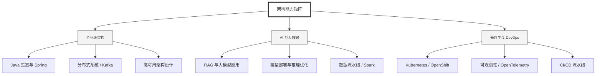

  <h1>你好，我是 Ellen Liu 👋</h1>
  

    <a href="README.md">English</a> | 
    <b>简体中文</b>
  

## 🧠 技术栈与核心能力

智能化企业系统建设路线图，涵盖全栈人工智能工程、云基础设施架构及模型部署等核心技术领域。

```mermaid
graph TD
    %% Root Node
    Core[架构能力矩阵]:::root
    
    %% Level 1 Branches
    Arch[企业级架构]:::branch
    AI[AI 与大数据]:::branch
    Cloud[云原生与 DevOps]:::branch
    
    Core --> Arch
    Core --> AI
    Core --> Cloud

    %% Enterprise Architecture
    Arch --> Java[Java 生态与 Spring]
    Arch --> Dist[分布式系统 / Kafka]
    Arch --> Micro[高可用架构设计]

    %% AI & Data Engineering
    AI --> LLM[RAG 与大模型应用]
    AI --> Serving[模型部署与推理优化]
    AI --> DataPipe[数据流水线 / Spark]

    %% Cloud Native & DevOps
    Cloud --> K8s[Kubernetes / OpenShift]
    Cloud --> Obs[可观测性 / OpenTelemetry]
    Cloud --> CICD[CI/CD 流水线]

    %% Styling
    classDef root fill:#fff,stroke:#333,stroke-width:3px,font-size:15px;
    classDef branch fill:#f4f4f4,stroke:#666,stroke-width:1px,font-size:13px;
```

## 🚀 Highlighted 工作

- **开源 AI 项目**: [基于 BERT 的声明检测模型](https://huggingface.co/XiaojingEllen/bert-finetuned-claim-detection) (Apache-2.0)
  - *已被哥伦比亚大学 (UBC) 研究项目引用。*
  - *手写 Transformer 核心代码，以验证理论与工程的一致性。*
- **金融基础设施**: 从 0 到 1 构建数字银行支付中间件及智能保险理赔系统。

## 📑 每日论文速递 (ArXiv)
<!-- DAILY_ARXIV_SUMMARY_START -->
**更新日期: 2026-03-01**

### 1. [大语言模型新手在双重用途、计算机模拟生物学任务中的提升表现](http://arxiv.org/abs/2602.23329v1)
- **摘要**: 大型语言模型（LLMs）在生物学基准测试中表现日益出色，但其能否提升新手用户的能力——即帮助人类取得比仅使用互联网资源更优的表现——仍不明确。这一不确定性对于理解科学加速与双重用途风险至关重要。我们开展了一项多模型、多基准的人类能力提升研究，比较了在八组与生物安全相关的任务中，使用LLM的新手与仅使用互联网资源的新手的表现。参与者在充足时间内（最复杂的任务耗时长达13小时）处理复杂问题。研究发现，使用LLM带来了显著的能力提升：使用LLM的新手准确率是对照组的4.16倍（95%置信区间[2.63, 6.87]）。在四个设有专家基线（仅使用互联网）的基准测试中，使用LLM的新手在其中三项上超越了专家表现。或许令人意外的是，独立运行的LLM往往优于LLM辅助的新手，这表明用户未能充分激发LLM的最强潜力。尽管存在安全防护措施，但大多数参与者（89.6%）表示获取与双重用途相关的信息并无太大困难。总体而言，LLM显著提升了新手在以往仅由专业训练人员完成的生物学任务中的表现，这凸显了在传统基准测试之外，持续开展交互式能力提升评估的必要性。

### 2. [对话中多模态情感识别的专家混合模型](http://arxiv.org/abs/2602.23300v1)
- **摘要**: 对话情感识别（ERC）面临独特挑战，需要模型捕捉多轮对话的时间流特征，并有效整合多模态线索。我们提出面向情感识别的语音-文本专家混合模型（MiSTER-E），这是一种模块化的专家混合框架，旨在解耦ERC中的两个核心挑战：模态特定上下文建模与多模态信息融合。MiSTER-E利用针对语音和文本分别微调的大语言模型，生成丰富的语句级嵌入表示，再通过卷积-循环上下文建模层进行增强。该系统通过可学习的门控机制动态加权三个专家（纯语音、纯文本及跨模态专家）的预测结果。为进一步促进跨模态的一致性与对齐，我们在配对语音-文本表征间引入监督对比损失，并在专家预测间采用基于KL散度的正则化约束。值得注意的是，MiSTER-E在所有处理阶段均不依赖说话人身份信息。在IEMOCAP、MELD和MOSI三个基准数据集上的实验表明，我们的方法分别取得了70.9%、69.5%和87.9%的加权F1分数，优于多个语音-文本ERC基线系统。我们还通过多种消融实验验证了所提方法中各组件的贡献。

### 3. [面向低延迟口语对话系统的话语感知双轨流式响应](http://arxiv.org/abs/2602.23266v1)
- **摘要**: 实现类人响应速度是级联口语对话系统关键而艰巨的目标。传统ASR-LLM-TTS流水线遵循严格串行范式，需在语音合成开始前完成完整转写与全部推理，导致响应延迟较高。我们提出话语感知双轨流式响应（DDTSR）框架，这是一种支持"边听边思考"与"边说边思考"的低延迟架构。DDTSR建立在三大核心机制之上：（1）连接词引导的大小模型协同机制，由辅助小模型生成最小承诺性话语连接词，同时大模型并行执行知识密集型推理；（2）基于流式的跨模态协作机制，动态重叠ASR、LLM推理与TTS处理以提前最早可说话时刻；（3）基于课程学习的话语连续性增强机制，确保早期响应与后续推理输出间的连贯性与逻辑一致性。在两个口语对话基准测试上的实验表明，DDTSR在保持话语质量的同时将响应延迟降低19%-51%。进一步分析显示，DDTSR可作为即插即用模块兼容多种LLM骨干网络，且在不同话语长度下均保持稳健性能，表明其在实时口语交互场景中具有强实用性与可扩展性。

<!-- DAILY_ARXIV_SUMMARY_END -->

## 🌐 保持联系

  
<i>期待与您探讨 AI 基础设施的未来！</i>

