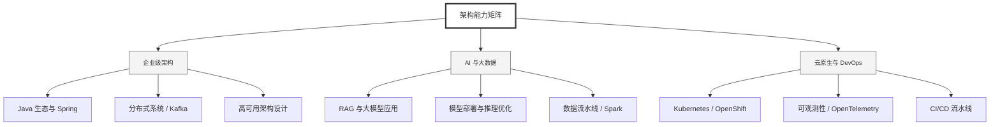

  <h1>你好，我是 Ellen Liu 👋</h1>
  

    <a href="README.md">English</a> | 
    <b>简体中文</b>
  

## 🧠 技术栈与核心能力

智能化企业系统建设路线图，涵盖全栈人工智能工程、云基础设施架构及模型部署等核心技术领域。

```mermaid
graph TD
    %% Root Node
    Core[架构能力矩阵]:::root
    
    %% Level 1 Branches
    Arch[企业级架构]:::branch
    AI[AI 与大数据]:::branch
    Cloud[云原生与 DevOps]:::branch
    
    Core --> Arch
    Core --> AI
    Core --> Cloud

    %% Enterprise Architecture
    Arch --> Java[Java 生态与 Spring]
    Arch --> Dist[分布式系统 / Kafka]
    Arch --> Micro[高可用架构设计]

    %% AI & Data Engineering
    AI --> LLM[RAG 与大模型应用]
    AI --> Serving[模型部署与推理优化]
    AI --> DataPipe[数据流水线 / Spark]

    %% Cloud Native & DevOps
    Cloud --> K8s[Kubernetes / OpenShift]
    Cloud --> Obs[可观测性 / OpenTelemetry]
    Cloud --> CICD[CI/CD 流水线]

    %% Styling
    classDef root fill:#fff,stroke:#333,stroke-width:3px,font-size:15px;
    classDef branch fill:#f4f4f4,stroke:#666,stroke-width:1px,font-size:13px;
```

## 🚀 Highlighted 工作

- **开源 AI 项目**: [基于 BERT 的声明检测模型](https://huggingface.co/XiaojingEllen/bert-finetuned-claim-detection) (Apache-2.0)
  - *已被哥伦比亚大学 (UBC) 研究项目引用。*
  - *手写 Transformer 核心代码，以验证理论与工程的一致性。*
- **金融基础设施**: 从 0 到 1 构建数字银行支付中间件及智能保险理赔系统。

## 📑 每日论文速递 (ArXiv)
<!-- DAILY_ARXIV_SUMMARY_START -->
**更新日期: 2026-06-06**

### 1. [Code2LoRA：软件演化中代码语言模型的超网络生成适配器](http://arxiv.org/abs/2606.06492v1)
- **摘要**: 代码语言模型需要仓库级上下文来解决导入、API调用和项目约定问题。现有方法通过长输入（通过RAG或依赖分析检索）或通过每个仓库的微调和LoRA注入此类知识——这在仓库规模下成本高昂且对代码库演变缺乏鲁棒性。我们提出Code2LoRA，一种超网络框架，可生成仓库特定的LoRA适配器，在零推理时间令牌开销下有效注入仓库知识。Code2LoRA支持两种使用场景：Code2LoRA-Static将单个仓库快照转换为适配器，适用于稳定代码库的理解；而Code2LoRA-Evo维护一个由GRU隐藏状态（每次代码差异更新）支持的适配器，适用于活跃开发的演变代码库。为评估Code2LoRA与参数高效微调基线的性能，我们构建了RepoPeftBench基准测试，包含604个Python仓库，设有两个赛道：静态赛道包含40K训练和12K测试断言补全任务，演变赛道包含215K从提交派生的训练和87K从提交派生的测试任务。在静态赛道上，Code2LoRA-Static实现了63.8%跨仓库和66.2%仓库内精确匹配，与每个仓库LoRA上限持平；在演变赛道上，Code2LoRA-Evo实现了60.3%跨仓库精确匹配（比单个共享LoRA高5.2个百分点）。Code2LoRA代码可在https://anonymous.4open.science/r/code2lora-6857获取；模型检查点和RepoPeftBench数据集可在https://huggingface.co/code2lora获取。

### 2. [面向扩散语言模型的自增强检索方法](http://arxiv.org/abs/2606.06474v1)
- **摘要**: 离散扩散语言模型通过并行迭代去噪整个响应来生成文本。在每一步中，它们为每个被掩码的位置预测临时令牌，将置信度高的预测提交到输出中，并丢弃置信度低的预测。我们发现，这些被丢弃的令牌实际上为检索增强生成提供了有用的前瞻信号：即使置信度低的令牌也常常在去噪轨迹早期浮现出显著实体，从而在输出最终确定之前能够检索到更强的证据。我们通过自增强检索扩散语言模型（SARDI）来利用这一特性，这是一个动态RAG框架，在去噪过程中利用这些前瞻令牌来引导检索。SARDI无需训练、与检索器无关，并且适用于任何具备推理能力的离散扩散语言模型。在五个多跳问答基准测试中，SARDI的性能优于当前无需训练的扩散和自回归检索基线，吞吐量提升高达8倍。

### 3. [MLEvolve：一种用于自动化机器学习算法发现的自我进化框架](http://arxiv.org/abs/2606.06473v1)
- **摘要**: 大语言模型（LLM）智能体正越来越多地应用于科学发现和机器学习工程（MLE）等长周期任务，其中持续自我进化成为关键能力。然而，现有MLE智能体存在分支间信息隔离、无记忆搜索和缺乏分层控制等问题，共同阻碍了长周期优化。我们提出MLEvolve——一种基于LLM的自我进化多智能体框架，用于端到端机器学习算法发现。通过将树搜索扩展为渐进式MCGS，MLEvolve利用基于图的参考边实现跨分支信息流动，并采用基于熵的渐进调度策略，使搜索从广泛探索逐步转向聚焦利用。为使智能体能够通过积累经验实现进化，我们引入回溯记忆机制，该机制将冷启动领域知识库与动态全局记忆相结合，用于任务特定经验的检索与复用。为实现稳定的长周期迭代，我们进一步将战略规划与代码生成解耦，并采用自适应编码模式。在MLE-Bench上的评估表明，MLEvolve在12小时预算（标准运行时长的一半）下，在平均奖牌率和有效提交率等多个维度均达到最先进性能。此外，MLEvolve在数学算法优化任务上还超越了包括AlphaEvolve在内的专用算法发现方法，展现出强大的跨领域泛化能力。我们的代码已开源在https://github.com/InternScience/MLEvolve。

<!-- DAILY_ARXIV_SUMMARY_END -->

## 🌐 保持联系

  
<i>期待与您探讨 AI 基础设施的未来！</i>

