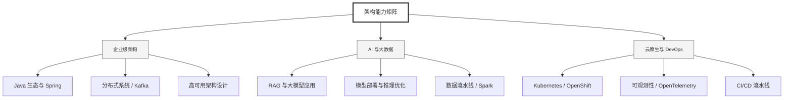

  <h1>你好，我是 Ellen Liu 👋</h1>
  

    <a href="README.md">English</a> | 
    <b>简体中文</b>
  

## 🧠 技术栈与核心能力

智能化企业系统建设路线图，涵盖全栈人工智能工程、云基础设施架构及模型部署等核心技术领域。

```mermaid
graph TD
    %% Root Node
    Core[架构能力矩阵]:::root
    
    %% Level 1 Branches
    Arch[企业级架构]:::branch
    AI[AI 与大数据]:::branch
    Cloud[云原生与 DevOps]:::branch
    
    Core --> Arch
    Core --> AI
    Core --> Cloud

    %% Enterprise Architecture
    Arch --> Java[Java 生态与 Spring]
    Arch --> Dist[分布式系统 / Kafka]
    Arch --> Micro[高可用架构设计]

    %% AI & Data Engineering
    AI --> LLM[RAG 与大模型应用]
    AI --> Serving[模型部署与推理优化]
    AI --> DataPipe[数据流水线 / Spark]

    %% Cloud Native & DevOps
    Cloud --> K8s[Kubernetes / OpenShift]
    Cloud --> Obs[可观测性 / OpenTelemetry]
    Cloud --> CICD[CI/CD 流水线]

    %% Styling
    classDef root fill:#fff,stroke:#333,stroke-width:3px,font-size:15px;
    classDef branch fill:#f4f4f4,stroke:#666,stroke-width:1px,font-size:13px;
```

## 🚀 Highlighted 工作

- **开源 AI 项目**: [基于 BERT 的声明检测模型](https://huggingface.co/XiaojingEllen/bert-finetuned-claim-detection) (Apache-2.0)
  - *已被哥伦比亚大学 (UBC) 研究项目引用。*
  - *手写 Transformer 核心代码，以验证理论与工程的一致性。*
- **金融基础设施**: 从 0 到 1 构建数字银行支付中间件及智能保险理赔系统。

## 📑 每日论文速递 (ArXiv)
<!-- DAILY_ARXIV_SUMMARY_START -->
**更新日期: 2026-03-16**

### 1. [审视推理型大语言模型在不可验证大语言模型后训练中的评判角色](http://arxiv.org/abs/2603.12246v1)
- **摘要**: 推理型大语言模型作为评判者（LLMs-as-Judges）能够受益于推理时扩展，为将推理模型的成功延伸至不可验证领域（即无法直接检验输出正确性/质量的领域）提供了可行路径。然而，尽管推理型评判者在静态评估基准中表现出更优性能，其在实际策略训练中的有效性尚未得到系统检验。为此，我们开展了一项严谨研究，旨在探究非推理型与推理型评判者在基于强化学习的大语言模型对齐过程中的实际影响。通过构建受控合成实验环境——其中"黄金标准"评判者（gpt-oss-120b）提供偏好标注来训练较小规模的评判者——我们揭示了二者关键差异：非推理型评判者易导致奖励破解，而推理型评判者能引导策略在黄金标准评判者评估下取得强劲表现。有趣的是，我们发现经推理型评判者训练的策略之所以实现优异性能，是因为其学会了生成极具效力的对抗性输出：这些输出能通过欺骗其他大语言模型评判者，在Arena-Hard等流行基准测试中获得高分。结合进一步分析，本研究既揭示了应用（推理型）大语言模型评判者进行不可验证领域后训练的重要发现，也指明了其改进空间。

### 2. [激发科学创造力：借助大语言模型驱动的跨学科灵感](http://arxiv.org/abs/2603.12226v1)
- **摘要**: 尽管跨学科研究能带来更广泛、更长远的影响，但大多数研究工作仍局限于单一领域的学术壁垒中。近期基于人工智能的科学发现方法为跨学科研究带来了希望，但许多方法优先考虑快速设计实验和解决方案，绕过了驱动创造性跨学科突破所需的探索性协作推理过程。因此，先前的研究主要侧重于自动化科学发现，而非增强支撑科学突破的推理过程。我们提出了"创意催化剂"这一新颖框架，它能系统性地识别跨学科洞见，以支持人类和大型语言模型的创造性推理。该框架从抽象的研究目标出发，专门用于辅助头脑风暴阶段，明确避免过早锚定具体解决方案。它体现了跨学科推理的关键元认知特征：(a) 定义与评估研究目标，(b) 认知特定领域的发展机遇与未解挑战，(c) 基于潜在影响力对跨学科理念进行战略性探索。具体而言，"创意催化剂"将抽象目标（例如改善人机协作）分解为核心目标领域的研究问题，用以指导分析该领域的进展与开放挑战。这些挑战被重新表述为与领域无关的概念性问题，从而能够从外部学科（如心理学、社会学）中检索处理类似问题的方案。通过综合这些领域的洞见并将其重新语境化至目标领域，"创意催化剂"可根据跨学科潜力对源领域进行排序。实证研究表明，这种定向整合使平均新颖性提升21%，深刻性提高16%，同时始终扎根于原始研究问题。

### 3. [CLASP：防御混合大型语言模型对抗隐藏状态投毒攻击](http://arxiv.org/abs/2603.12206v1)
- **摘要**: 以Mamba为代表的状态空间模型（SSM）作为Transformer的高效替代方案已获得广泛关注，其在保持竞争力的同时实现了线性复杂度。然而，近期发现的隐藏状态投毒攻击（HiSPA）——通过对抗性字符串破坏SSM记忆的漏洞——对该架构及其混合变体构成了严重威胁。本研究将HiSPA防御任务构建为词元级别的二分类问题，提出了CLASP模型以应对此威胁。CLASP通过捕捉Mamba块输出嵌入（BOE）中的特征模式，利用XGBoost分类器以极低计算开销识别恶意词元。我们设定了一个SSM与HiSPA可能同时存在的现实场景：大型语言模型筛选简历以确定岗位最佳人选。在包含2483份简历（总计950万词元）并植入受控攻击的语料库上，CLASP在恶意词元检测中实现了95.9%的词元级F1分数和99.3%的文档级F1分数。关键的是，该模型展现出对未知攻击模式的泛化能力：在留一法交叉验证中保持优异性能（文档级F1达96.9%）；在针对结构新颖触发器的聚类交叉验证中，仍维持有效检测能力（平均文档级F1为91.6%）。CLASP独立于下游模型运行，每秒可处理1032个词元且显存占用低于4GB，有望作为轻量级前线防御方案，适用于基于SSM的架构及混合架构的实际部署。所有代码及详细结果已发布于https://anonymous.4open.science/r/hispikes-91C0。

<!-- DAILY_ARXIV_SUMMARY_END -->

## 🌐 保持联系

  
<i>期待与您探讨 AI 基础设施的未来！</i>

