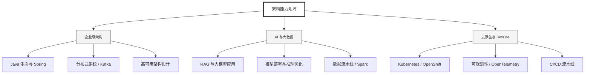

  <h1>你好，我是 Ellen Liu 👋</h1>
  

    <a href="README.md">English</a> | 
    <b>简体中文</b>
  

## 🧠 技术栈与核心能力

智能化企业系统建设路线图，涵盖全栈人工智能工程、云基础设施架构及模型部署等核心技术领域。

```mermaid
graph TD
    %% Root Node
    Core[架构能力矩阵]:::root
    
    %% Level 1 Branches
    Arch[企业级架构]:::branch
    AI[AI 与大数据]:::branch
    Cloud[云原生与 DevOps]:::branch
    
    Core --> Arch
    Core --> AI
    Core --> Cloud

    %% Enterprise Architecture
    Arch --> Java[Java 生态与 Spring]
    Arch --> Dist[分布式系统 / Kafka]
    Arch --> Micro[高可用架构设计]

    %% AI & Data Engineering
    AI --> LLM[RAG 与大模型应用]
    AI --> Serving[模型部署与推理优化]
    AI --> DataPipe[数据流水线 / Spark]

    %% Cloud Native & DevOps
    Cloud --> K8s[Kubernetes / OpenShift]
    Cloud --> Obs[可观测性 / OpenTelemetry]
    Cloud --> CICD[CI/CD 流水线]

    %% Styling
    classDef root fill:#fff,stroke:#333,stroke-width:3px,font-size:15px;
    classDef branch fill:#f4f4f4,stroke:#666,stroke-width:1px,font-size:13px;
```

## 🚀 Highlighted 工作

- **开源 AI 项目**: [基于 BERT 的声明检测模型](https://huggingface.co/XiaojingEllen/bert-finetuned-claim-detection) (Apache-2.0)
  - *已被哥伦比亚大学 (UBC) 研究项目引用。*
  - *手写 Transformer 核心代码，以验证理论与工程的一致性。*
- **金融基础设施**: 从 0 到 1 构建数字银行支付中间件及智能保险理赔系统。

## 📑 每日论文速递 (ArXiv)
<!-- DAILY_ARXIV_SUMMARY_START -->
**更新日期: 2026-05-17**

### 1. [ATLAS：主动推理还是潜在视觉推理？一词足矣涵盖两者](http://arxiv.org/abs/2605.15198v1)
- **摘要**: 视觉推理常与中间视觉状态交织，已成为该领域一个颇具前景的研究方向。一种直接的方法是在推理过程中通过统一模型直接生成图像，但这既计算成本高昂，架构设计也颇为复杂。近期替代方案包括通过代码或工具调用的智能体推理，以及使用可学习隐式嵌入的潜在推理。然而，智能体方法因外部执行而产生上下文切换延迟，而潜在方法缺乏任务泛化能力且难以通过自回归并行化训练。为融合两者优势并规避其局限，我们提出ATLAS框架——其中单个离散"词"（称为功能标记）同时充当智能体操作单元与潜在视觉推理单元。每个功能标记关联一个内化的视觉操作，但无需视觉监督，且保持为分词器词汇表中的标准标记，可通过下一标记预测生成。这种设计避免了冗长的中间视觉内容生成，同时保持与标准可扩展SFT和RL训练的兼容性，无需架构或方法层面的修改。为应对RL训练中功能标记的稀疏性问题，我们引入潜在锚定GRPO（LA-GRPO），通过静态加权辅助目标锚定功能标记来稳定训练过程，提供更强的梯度更新信号。大量实验与分析表明，ATLAS在具有挑战性的基准测试中展现出卓越性能，同时保持清晰的可解释性。我们期待ATLAS能为未来视觉推理研究提供新范式启示。

### 2. [FutureSim：重演世界事件以评估自适应智能体](http://arxiv.org/abs/2605.15188v1)
- **摘要**: 人工智能代理正越来越多地被部署在动态、开放式的环境中，这要求它们能够随着新信息的出现而实时适应。为了在实际应用场景中高效衡量这一能力，我们提出构建基于真实事件的模拟系统，按时间顺序回放现实世界事件。我们开发了FutureSim系统，在该系统中，代理需要与按时间顺序回放的世界进行交互（包括模拟期间实时出现的新闻文章和逐步解决的问题），同时预测超出其知识截止日期后的世界事件。我们通过原生测试框架评估前沿代理，测试其在2026年1月至3月三个月期间预测世界事件的能力。FutureSim清晰揭示了各代理能力的显著差异：表现最佳的代理准确率仅为25%，而多数代理的布莱尔技能分数甚至低于不作任何预测的基准。通过细致的消融实验，我们展示了FutureSim如何为研究新兴方向（如长周期测试时自适应、搜索、记忆及不确定性推理）提供现实场景。总体而言，我们希望这一基准设计能够为衡量人工智能在真实世界长周期开放式适应中的进展铺平道路。

### 3. [Grep 是否已足够？智能体如何重塑搜索机制](http://arxiv.org/abs/2605.15184v1)
- **摘要**: 大型语言模型（LLM）智能体的最新进展已实现复杂的工作流程，使模型能够自主检索信息、调用工具，并在大规模语料库中进行推理，从而代表用户完成任务。尽管检索增强生成（RAG）在智能搜索系统中得到日益广泛的应用，现有文献仍缺乏对检索策略选择如何与智能体架构及工具调用范式相互作用的系统性比较。在智能体循环中，一些重要的实践维度——例如工具输出结果如何呈现给模型，以及当搜索需要处理更多无关上下文文本时性能如何变化——仍未被充分探索。本文报告了一项由两个实验组成的实证研究。实验1基于LongMemEval数据集中的116个问题样本，比较了grep检索与向量检索，采用定制智能体框架（Chronos）及供应商原生CLI框架（Claude Code、Codex和Gemini CLI），分别测试了内联工具结果和模型单独读取的基于文件的工具结果。实验2则仅比较grep检索与向量检索，同时逐步混入额外的无关对话历史，使每个查询在相关段落之外嵌入更多干扰性材料。在Chronos及供应商CLI框架中，实验1的比较结果显示grep检索通常比向量检索获得更高准确率；与此同时，即使底层对话数据相同，整体得分仍强烈依赖于所使用的框架和工具调用风格。

<!-- DAILY_ARXIV_SUMMARY_END -->

## 🌐 保持联系

  
<i>期待与您探讨 AI 基础设施的未来！</i>

