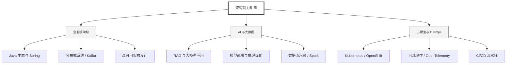

  <h1>你好，我是 Ellen Liu 👋</h1>
  

    <a href="README.md">English</a> | 
    <b>简体中文</b>
  

## 🧠 技术栈与核心能力

智能化企业系统建设路线图，涵盖全栈人工智能工程、云基础设施架构及模型部署等核心技术领域。

```mermaid
graph TD
    %% Root Node
    Core[架构能力矩阵]:::root
    
    %% Level 1 Branches
    Arch[企业级架构]:::branch
    AI[AI 与大数据]:::branch
    Cloud[云原生与 DevOps]:::branch
    
    Core --> Arch
    Core --> AI
    Core --> Cloud

    %% Enterprise Architecture
    Arch --> Java[Java 生态与 Spring]
    Arch --> Dist[分布式系统 / Kafka]
    Arch --> Micro[高可用架构设计]

    %% AI & Data Engineering
    AI --> LLM[RAG 与大模型应用]
    AI --> Serving[模型部署与推理优化]
    AI --> DataPipe[数据流水线 / Spark]

    %% Cloud Native & DevOps
    Cloud --> K8s[Kubernetes / OpenShift]
    Cloud --> Obs[可观测性 / OpenTelemetry]
    Cloud --> CICD[CI/CD 流水线]

    %% Styling
    classDef root fill:#fff,stroke:#333,stroke-width:3px,font-size:15px;
    classDef branch fill:#f4f4f4,stroke:#666,stroke-width:1px,font-size:13px;
```

## 🚀 Highlighted 工作

- **开源 AI 项目**: [基于 BERT 的声明检测模型](https://huggingface.co/XiaojingEllen/bert-finetuned-claim-detection) (Apache-2.0)
  - *已被哥伦比亚大学 (UBC) 研究项目引用。*
  - *手写 Transformer 核心代码，以验证理论与工程的一致性。*
- **金融基础设施**: 从 0 到 1 构建数字银行支付中间件及智能保险理赔系统。

## 📑 每日论文速递 (ArXiv)
<!-- DAILY_ARXIV_SUMMARY_START -->
**更新日期: 2026-05-23**

### 1. [向量策略优化：多样性训练提升测试时搜索性能](http://arxiv.org/abs/2605.22817v1)
- **摘要**: 语言模型现在必须能够开箱即用地泛化到新环境，并能在推理扩展搜索流程（如AlphaEvolve）中发挥作用——这类流程通过多种任务特定的奖励函数来选择生成结果。遗憾的是，标准的大语言模型后训练范式通常优化预设的标量奖励，这往往导致当前语言模型产生低熵的响应分布，难以展现推理时搜索所需的多样性。我们提出向量策略优化（VPO），这是一种显式训练策略以应对多样化下游奖励函数并生成多样化解决方案的强化学习算法。VPO利用实践中奖励常为向量值的特点（例如代码生成中每个测试用例的正确性，或多种不同用户画像及奖励模型）。本质上，VPO可作为GRPO优势估计器的即插即用替代方案，但它训练语言模型输出一组解决方案，其中每个解决方案专门针对向量奖励空间中的不同权衡。在四项任务中，VPO在测试时搜索（如pass@k和best@k）指标上达到或超越最强标量强化学习基线，且随着搜索预算增加差距进一步扩大。对于进化搜索，VPO模型能解锁GRPO模型完全无法解决的问题。随着测试时搜索日趋标准化，优化多样性可能需成为默认的后训练目标。

### 2. [通过一致性训练减少政治操纵](http://arxiv.org/abs/2605.22771v1)
- **摘要**: 大型语言模型（LLMs）在多种敏感语境中展现出系统性的政治偏见。我们发现，LLMs在处理对立政治立场的对应话题时存在不对称性。我们将这种现象称为隐性政治偏见，并识别出7类实现该偏见的操作技术。我们提出两种隐性偏见度量指标：情感一致性（衡量配对政治提示中修辞与框架的对称性）与助益一致性（衡量回应深度与参与度的对称性）。为减少这两类隐性偏见，我们引入政治一致性训练（PCT）——一种包含两种互补范式的强化学习训练方法：情感一致性训练与助益一致性训练。实验表明，PCT在保持整体助益性的同时，显著降低了隐性政治偏见，并能泛化至未参与训练的基准测试。相关成果已发布于https://political-manipulation.ai。

### 3. [理解数据时间性对大型语言模型预训练的影响](http://arxiv.org/abs/2605.22769v1)
- **摘要**: 大型语言模型（LLMs）通常基于打乱顺序的语料库进行训练，导致模型的知识在训练时固化，其时间关联性难以理解。本研究聚焦于数据排序对时间敏感型事实知识获取的影响，主要贡献体现在两方面：首先，我们构建了包含7000余个时间锚定问题的综合基准测试集，并设计了一套评估协议，可分析模型是否将事实与其对应时间段正确关联；其次，我们基于时间排序的Common Crawl快照预训练了60亿参数模型，并与标准打乱顺序的预训练模型进行对比。结果表明，时序训练模型在通用语言理解与常识知识方面与打乱基线模型持平，但始终展现出更前沿且时间精度更高的知识。时序预训练能提升事实的新鲜度，而打乱顺序的预训练则更擅长处理老旧数据——这可能是由于事实重复频率更高所致。这些发现，连同我们在https://github.com/kyutai-labs/kairos 发布的代码、https://huggingface.co/collections/kyutai/kairos 提供的检查点与数据集，为LLM持续学习的未来研究奠定了基础。

<!-- DAILY_ARXIV_SUMMARY_END -->

## 🌐 保持联系

  
<i>期待与您探讨 AI 基础设施的未来！</i>

