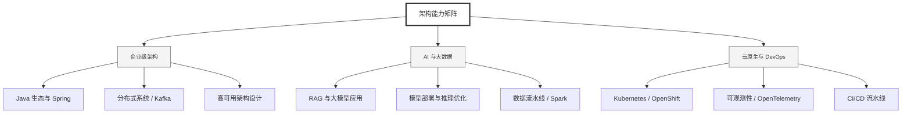

  <h1>你好，我是 Ellen Liu 👋</h1>
  

    <a href="README.md">English</a> | 
    <b>简体中文</b>
  

## 🧠 技术栈与核心能力

智能化企业系统建设路线图，涵盖全栈人工智能工程、云基础设施架构及模型部署等核心技术领域。

```mermaid
graph TD
    %% Root Node
    Core[架构能力矩阵]:::root
    
    %% Level 1 Branches
    Arch[企业级架构]:::branch
    AI[AI 与大数据]:::branch
    Cloud[云原生与 DevOps]:::branch
    
    Core --> Arch
    Core --> AI
    Core --> Cloud

    %% Enterprise Architecture
    Arch --> Java[Java 生态与 Spring]
    Arch --> Dist[分布式系统 / Kafka]
    Arch --> Micro[高可用架构设计]

    %% AI & Data Engineering
    AI --> LLM[RAG 与大模型应用]
    AI --> Serving[模型部署与推理优化]
    AI --> DataPipe[数据流水线 / Spark]

    %% Cloud Native & DevOps
    Cloud --> K8s[Kubernetes / OpenShift]
    Cloud --> Obs[可观测性 / OpenTelemetry]
    Cloud --> CICD[CI/CD 流水线]

    %% Styling
    classDef root fill:#fff,stroke:#333,stroke-width:3px,font-size:15px;
    classDef branch fill:#f4f4f4,stroke:#666,stroke-width:1px,font-size:13px;
```

## 🚀 Highlighted 工作

- **开源 AI 项目**: [基于 BERT 的声明检测模型](https://huggingface.co/XiaojingEllen/bert-finetuned-claim-detection) (Apache-2.0)
  - *已被哥伦比亚大学 (UBC) 研究项目引用。*
  - *手写 Transformer 核心代码，以验证理论与工程的一致性。*
- **金融基础设施**: 从 0 到 1 构建数字银行支付中间件及智能保险理赔系统。

## 📑 每日论文速递 (ArXiv)
<!-- DAILY_ARXIV_SUMMARY_START -->
**更新日期: 2026-04-09**

### 1. [论文圈：一个开源的多智能体研究探索与分析框架](http://arxiv.org/abs/2604.06170v1)
- **摘要**: 随着科学文献的快速增长，研究人员高效发现、评估与整合相关研究成果的难度日益增加。近年来，多智能体大语言模型在理解用户意图方面展现出强大潜力，并已开始被训练用于调用各类工具。本文提出Paper Circle——一个旨在降低学术文献查找、评估、整理与理解成本的多智能体研究探索分析系统。该系统包含两条互补的流水线：（1）集成多源离线/在线检索、多标准评分、多样性感知排序与结构化输出的发现流水线；（2）将单篇论文转化为结构化知识图谱的分析流水线，该图谱包含概念、方法、实验、图表等类型化节点，支持基于图谱的问答与覆盖度验证。两条流水线均基于编码器大语言模型的多智能体协同框架实现，每个智能体步骤均可生成完全可复现的同步输出（包括JSON、CSV、BibTeX、Markdown和HTML格式）。本文详细阐述了构成Paper Circle研究工作流的系统架构、智能体角色、检索与评分方法、知识图谱模式及评估接口。我们在论文检索与综述生成两个任务上对Paper Circle进行基准测试，汇报了命中率、平均倒数排名及K值召回率等指标。实验结果表明，采用更强智能体模型能带来持续性能提升。我们已公开系统网站（https://papercircle.vercel.app/）与代码仓库（https://github.com/MAXNORM8650/papercircle）。

### 2. [原地测试时训练](http://arxiv.org/abs/2604.06169v1)
- **摘要**: 静态的"先训练后部署"范式从根本上限制了大型语言模型（LLM）根据现实任务中持续涌现的新信息动态调整权重的能力。测试时训练（TTT）通过更新推理阶段的部分模型参数（快速权重）提供了极具吸引力的替代方案，但其在当前LLM生态中的应用潜力受制于架构不兼容、计算效率低下以及语言建模任务中快速权重目标失准等关键障碍。本研究提出原位测试时训练框架，该框架通过无缝集成的方式赋予LLM测试时训练能力。该框架将普遍存在的MLP模块中的最终投影矩阵作为可调节的快速权重，无需代价高昂的从头训练即可实现LLM的"即插即用"式增强。此外，我们摒弃了传统TTT通用的重构目标，转而采用与自回归语言建模核心任务——下一词预测——明确对齐的定制化理论目标。这一原则性目标与高效的块状更新机制相结合，形成了具备上下文并行兼容性的高可扩展算法。大量实验验证了该框架的有效性：作为原位增强方案，它使40亿参数模型在长达12.8万词元的上下文任务中取得卓越性能；当从头预训练时，其表现持续优于各类竞争性TTT相关方法。消融实验结果进一步为我们设计方案提供了深刻洞见。综合而言，本研究标志着向LLM持续学习范式迈出了坚实一步。

### 3. [迈向一致的世界模型：多令牌预测与潜在语义增强](http://arxiv.org/abs/2604.06155v1)
- **摘要**: 大语言模型是否形成连贯的内部世界模型仍是核心争议。传统下一词元预测聚焦单步监督，而多词元预测在学习结构化表征方面展现出潜力。本研究从理论视角分析多词元预测的梯度归纳偏置，并通过实证证据表明：多词元预测通过梯度耦合诱导表征收缩性，从而促进模型向内部信念状态收敛。然而我们发现，标准多词元预测常存在结构性幻觉问题——离散词元监督会促使潜在空间中出现违反环境约束的非法捷径。为此，我们提出新颖的潜在语义增强多词元预测方法，将预测锚定于真实隐藏状态轨迹。在合成图与曼哈顿出租车轨迹数据集上的实验表明，该方法能有效弥合离散词元与连续状态表征间的鸿沟，提升表征对齐度，减少结构性幻觉，并增强对扰动的鲁棒性。

<!-- DAILY_ARXIV_SUMMARY_END -->

## 🌐 保持联系

  
<i>期待与您探讨 AI 基础设施的未来！</i>

