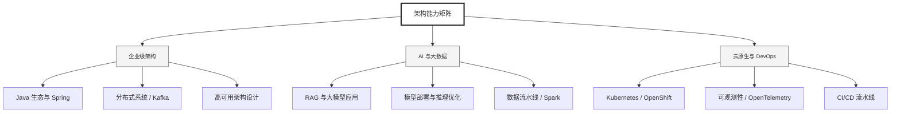

  <h1>你好，我是 Ellen Liu 👋</h1>
  

    <a href="README.md">English</a> | 
    <b>简体中文</b>
  

## 🧠 技术栈与核心能力

智能化企业系统建设路线图，涵盖全栈人工智能工程、云基础设施架构及模型部署等核心技术领域。

```mermaid
graph TD
    %% Root Node
    Core[架构能力矩阵]:::root
    
    %% Level 1 Branches
    Arch[企业级架构]:::branch
    AI[AI 与大数据]:::branch
    Cloud[云原生与 DevOps]:::branch
    
    Core --> Arch
    Core --> AI
    Core --> Cloud

    %% Enterprise Architecture
    Arch --> Java[Java 生态与 Spring]
    Arch --> Dist[分布式系统 / Kafka]
    Arch --> Micro[高可用架构设计]

    %% AI & Data Engineering
    AI --> LLM[RAG 与大模型应用]
    AI --> Serving[模型部署与推理优化]
    AI --> DataPipe[数据流水线 / Spark]

    %% Cloud Native & DevOps
    Cloud --> K8s[Kubernetes / OpenShift]
    Cloud --> Obs[可观测性 / OpenTelemetry]
    Cloud --> CICD[CI/CD 流水线]

    %% Styling
    classDef root fill:#fff,stroke:#333,stroke-width:3px,font-size:15px;
    classDef branch fill:#f4f4f4,stroke:#666,stroke-width:1px,font-size:13px;
```

## 🚀 Highlighted 工作

- **开源 AI 项目**: [基于 BERT 的声明检测模型](https://huggingface.co/XiaojingEllen/bert-finetuned-claim-detection) (Apache-2.0)
  - *已被哥伦比亚大学 (UBC) 研究项目引用。*
  - *手写 Transformer 核心代码，以验证理论与工程的一致性。*
- **金融基础设施**: 从 0 到 1 构建数字银行支付中间件及智能保险理赔系统。

## 📑 每日论文速递 (ArXiv)
<!-- DAILY_ARXIV_SUMMARY_START -->
**更新日期: 2026-05-12**

### 1. [大语言模型自我进化：面向测试时扩展的智能体发现机制](http://arxiv.org/abs/2605.08083v1)
- **摘要**: 测试时扩展（TTS）已成为一种提升大语言模型性能的有效方法，通过在推理阶段分配额外计算资源实现。然而，现有TTS策略大多依赖人工设计：研究人员凭直觉手动设计推理模式并调整启发式规则，导致大量计算分配空间未被探索。我们提出环境驱动框架AutoTTS，将研究人员的关注点从设计具体TTS启发式规则转向构建可自动发现TTS策略的环境。AutoTTS的核心在于环境构建：发现环境必须使控制空间易于处理，并为TTS搜索提供廉价且频繁的反馈。作为具体实现，我们将宽度-深度TTS问题转化为对预采集推理轨迹与探测信号的控制器综合问题——控制器决定何时分支、继续、探测、剪枝或终止，且无需重复调用LLM即可低成本评估。我们进一步引入Beta参数化使搜索易于处理，并通过细粒度执行轨迹反馈帮助智能体诊断TTS程序失败原因，提升发现效率。数学推理基准实验表明，所发现策略在准确率-成本权衡上优于强人工设计基线。这些策略可泛化至保留基准与不同规模模型，而整个发现过程仅需39.9美元和160分钟。我们的数据与代码将开源至https://github.com/zhengkid/AutoTTS。

### 2. [记忆诅咒：扩展记忆如何侵蚀LLM智能体的合作意图](http://arxiv.org/abs/2605.08060v1)
- **摘要**: 上下文窗口扩展常被视为大语言模型（LLM）的一项直接能力升级，但我们发现它在多智能体社会困境中系统性失效。在7个LLM和4种游戏场景中，经过500轮交互后，扩展可访问历史记录在28个模型-游戏组合中有18个导致合作行为退化，我们将这一现象称为"记忆诅咒"。通过三项分析，我们分离出潜在机制。首先，对37.8万条推理轨迹的词汇分析表明，这种崩溃与前瞻性意图的侵蚀相关，而非偏执倾向的上升。我们通过定向微调作为认知探针验证了这一点：仅基于前瞻性轨迹训练的LoRA适配器能缓解合作退化，并零样本迁移至不同游戏。其次，记忆净化实验在保持提示长度固定的同时，将可见历史替换为合成合作记录，显著恢复了合作水平，证明触发因素是记忆内容而非单纯的长度。最后，消融显式思维链推理通常能减轻崩溃现象，表明深思熟虑反而放大了记忆诅咒。综合这些结果，我们重新定义了记忆作为多智能体行为的主动决定因素：更长的记忆回溯既可能破坏合作，也可能促进合作，具体取决于其引发的推理模式。

### 3. [CA-SQL：基于探索与计算预算分配的文本到SQL复杂度感知推理时间推理方法](http://arxiv.org/abs/2605.08057v1)
- **摘要**: 尽管近期在推理时学习方面的进展提升了大型语言模型在文本到SQL任务上的推理能力，但现有解决方案在处理Bird-Bench（BIRD）基准测试中最具挑战性的任务时仍表现不佳。其根本原因在于对解空间探索不足——这种探索对于发现有望通过进一步优化生成正确输出的候选查询至关重要。为解决这一难题，我们提出CA-SQL这一新型文本到SQL流水线，通过预估任务难度动态调整候选解生成阶段的探索广度。此外，我们基于进化搜索原理设计了定制化提示种子生成方法，以进一步激发基础大语言模型的探索行为，并在搜索结束时采用新型投票机制筛选最优候选解。实验表明，仅使用GPT-4o-mini模型，我们的方案在BIRD开发集"高难度"任务中取得了51.72%的当前最优成绩，超越了其他上下文学习方法（包括采用更大规模模型的方法）。总体而言，本方法在BIRD开发数据集上实现了具有竞争力的61.06%执行准确率与68.77%的Soft F1分数。

<!-- DAILY_ARXIV_SUMMARY_END -->

## 🌐 保持联系

  
<i>期待与您探讨 AI 基础设施的未来！</i>

