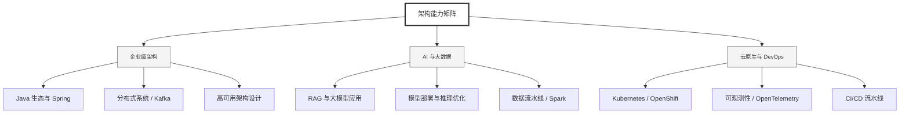

  <h1>你好，我是 Ellen Liu 👋</h1>
  

    <a href="README.md">English</a> | 
    <b>简体中文</b>
  

## 🧠 技术栈与核心能力

智能化企业系统建设路线图，涵盖全栈人工智能工程、云基础设施架构及模型部署等核心技术领域。

```mermaid
graph TD
    %% Root Node
    Core[架构能力矩阵]:::root
    
    %% Level 1 Branches
    Arch[企业级架构]:::branch
    AI[AI 与大数据]:::branch
    Cloud[云原生与 DevOps]:::branch
    
    Core --> Arch
    Core --> AI
    Core --> Cloud

    %% Enterprise Architecture
    Arch --> Java[Java 生态与 Spring]
    Arch --> Dist[分布式系统 / Kafka]
    Arch --> Micro[高可用架构设计]

    %% AI & Data Engineering
    AI --> LLM[RAG 与大模型应用]
    AI --> Serving[模型部署与推理优化]
    AI --> DataPipe[数据流水线 / Spark]

    %% Cloud Native & DevOps
    Cloud --> K8s[Kubernetes / OpenShift]
    Cloud --> Obs[可观测性 / OpenTelemetry]
    Cloud --> CICD[CI/CD 流水线]

    %% Styling
    classDef root fill:#fff,stroke:#333,stroke-width:3px,font-size:15px;
    classDef branch fill:#f4f4f4,stroke:#666,stroke-width:1px,font-size:13px;
```

## 🚀 Highlighted 工作

- **开源 AI 项目**: [基于 BERT 的声明检测模型](https://huggingface.co/XiaojingEllen/bert-finetuned-claim-detection) (Apache-2.0)
  - *已被哥伦比亚大学 (UBC) 研究项目引用。*
  - *手写 Transformer 核心代码，以验证理论与工程的一致性。*
- **金融基础设施**: 从 0 到 1 构建数字银行支付中间件及智能保险理赔系统。

## 📑 每日论文速递 (ArXiv)
<!-- DAILY_ARXIV_SUMMARY_START -->
**更新日期: 2026-03-24**

### 1. [VideoSeek：具备工具引导搜索能力的长时程视频智能体](http://arxiv.org/abs/2603.20185v1)
- **摘要**: 视频智能体模型在具有挑战性的视频-语言任务中取得了显著进展。然而，大多数智能体方法仍严重依赖对密集采样视频帧的贪婪解析，导致计算成本高昂。我们提出VideoSeek——一种长视野视频智能体，它利用视频逻辑流主动寻找答案关键证据，而非穷举解析完整视频。这一洞见使模型能够使用更少的帧数，同时保持甚至提升视频理解能力。VideoSeek通过"思考-行动-观察"循环运作，并配备精心设计的工具集以收集多粒度视频观测。该设计支持基于累积观测的查询感知探索，并实现实用的视频理解与推理。在四个具有挑战性的视频理解与推理基准测试中，VideoSeek以远少于现有视频智能体和独立大语言模型的帧数实现了强劲的准确率。值得注意的是，VideoSeek在LVBench基准上相比其基础模型GPT-5实现了10.2个百分点的绝对提升，同时帧数使用量减少93%。进一步分析揭示了利用视频逻辑流的重要性、强大的推理能力以及工具集设计的互补作用。

### 2. [忠实度测量取决于测量方式：大语言模型思维链评估中的分类器敏感性](http://arxiv.org/abs/2603.20172v1)
- **摘要**: 近期关于思维链忠实度的研究常报告单一聚合数值（例如DeepSeek-R1对提示的响应率为39%），这暗示忠实度是模型可客观测量的属性。本文证明事实并非如此。研究对来自12个开源模型（涵盖9个系列、参数量从7B到1T）的10,276条受干预推理轨迹，应用了三种分类器：纯正则表达式检测器、正则表达式+LLM两阶段流水线、独立的Claude Sonnet 4评估器。在相同数据上，这些分类器得出的总体忠实度分别为74.4%、82.6%和69.7%，其95%置信区间互不重叠。各模型间的差异幅度从2.6到30.6个百分点不等，且均具有统计显著性（McNemar检验，p < 0.001）。分歧具有系统性而非随机性：分类器间一致性（科恩卡帕系数）从谄媚提示的0.06（"轻微一致"）到评分提示的0.42（"中等一致"）不等，且呈现明显不对称性——在谄媚提示案例中，883例被流水线分类器判定为忠实却被Sonnet评估器判定为不忠实，反向案例仅2例。分类器选择甚至能逆转模型排名：Qwen3.5-27B在流水线标准下排名第1，在Sonnet评估器下却降至第7；OLMo-3.1-32B则呈现相反趋势，从第9位升至第3位。根本原因在于不同分类器对相关忠实度概念的操作化标准存在差异（词汇提及vs认知依赖），这些标准对相同行为会产生分歧测量。研究结果表明：采用不同分类器的研究间所报告的忠实度数值无法进行有效比较；未来评估应当报告多种分类方法下的敏感度范围，而非单一数值估计。

### 3. [语义标记聚类：大型语言模型中高效不确定性量化方法](http://arxiv.org/abs/2603.20161v1)
- **摘要**: 大型语言模型（LLM）已在多样化任务中展现出卓越能力，但其输出的真实性无法得到保证，且其过度自信倾向进一步限制了可靠性。不确定性量化为识别潜在不可靠输出提供了可行路径，然而现有方法大多依赖重复采样或辅助模型，会引入显著计算开销。为突破这些局限，我们提出语义令牌聚类（STC）——一种利用LLM内在编码语义信息的高效不确定性量化方法。具体而言，我们通过嵌入聚类与前缀匹配将令牌划分为语义一致的簇，并基于对应语义簇上聚合的概率质量来量化不确定性。该方法仅需单次生成过程，且不依赖辅助模型。实验结果表明，STC在显著降低计算开销的同时，取得了与前沿基线方法相媲美的性能表现。

<!-- DAILY_ARXIV_SUMMARY_END -->

## 🌐 保持联系

  
<i>期待与您探讨 AI 基础设施的未来！</i>

