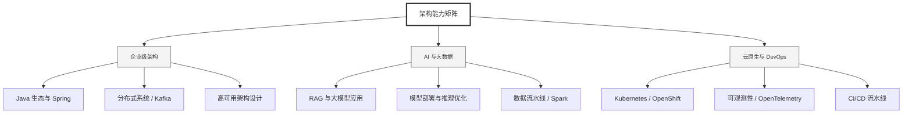

  <h1>你好，我是 Ellen Liu 👋</h1>
  

    <a href="README.md">English</a> | 
    <b>简体中文</b>
  

## 🧠 技术栈与核心能力

智能化企业系统建设路线图，涵盖全栈人工智能工程、云基础设施架构及模型部署等核心技术领域。

```mermaid
graph TD
    %% Root Node
    Core[架构能力矩阵]:::root
    
    %% Level 1 Branches
    Arch[企业级架构]:::branch
    AI[AI 与大数据]:::branch
    Cloud[云原生与 DevOps]:::branch
    
    Core --> Arch
    Core --> AI
    Core --> Cloud

    %% Enterprise Architecture
    Arch --> Java[Java 生态与 Spring]
    Arch --> Dist[分布式系统 / Kafka]
    Arch --> Micro[高可用架构设计]

    %% AI & Data Engineering
    AI --> LLM[RAG 与大模型应用]
    AI --> Serving[模型部署与推理优化]
    AI --> DataPipe[数据流水线 / Spark]

    %% Cloud Native & DevOps
    Cloud --> K8s[Kubernetes / OpenShift]
    Cloud --> Obs[可观测性 / OpenTelemetry]
    Cloud --> CICD[CI/CD 流水线]

    %% Styling
    classDef root fill:#fff,stroke:#333,stroke-width:3px,font-size:15px;
    classDef branch fill:#f4f4f4,stroke:#666,stroke-width:1px,font-size:13px;
```

## 🚀 Highlighted 工作

- **开源 AI 项目**: [基于 BERT 的声明检测模型](https://huggingface.co/XiaojingEllen/bert-finetuned-claim-detection) (Apache-2.0)
  - *已被哥伦比亚大学 (UBC) 研究项目引用。*
  - *手写 Transformer 核心代码，以验证理论与工程的一致性。*
- **金融基础设施**: 从 0 到 1 构建数字银行支付中间件及智能保险理赔系统。

## 📑 每日论文速递 (ArXiv)
<!-- DAILY_ARXIV_SUMMARY_START -->
**更新日期: 2026-03-05**

### 1. [理解与缓解大语言模型引导中的数据集污染问题](http://arxiv.org/abs/2603.03206v1)
- **摘要**: 对比引导已被证明是一种在推理时调整大语言模型生成行为的简单有效方法。该方法通过分析具有特定属性与不具该属性的提示响应示例，在中间激活层中识别出一个方向，并沿这一维子空间调整激活值。然而，尽管该方法在人工智能安全领域的应用日益广泛，人们对其在噪声或对抗性数据污染下的鲁棒性仍知之甚少。我们首次针对用于训练引导方向的示例数据集遭受污染时该过程的鲁棒性展开研究。首先我们观察到：对比引导对中等程度的数据污染表现出较强的鲁棒性，但当训练数据中有相当比例被篡改时，可能明显且恶意地引发非预期的副作用。其次，我们分析了各类数据污染的几何特性，并提出了若干防护措施。值得注意的是，学习引导方向的关键步骤涉及高维均值计算，我们证明若将该步骤替换为近期开发的鲁棒均值估计器，通常能有效缓解恶意数据污染导致的大部分非预期影响。

### 2. [学习何时行动或拒绝：守护智能推理模型以实现安全的多步骤工具使用](http://arxiv.org/abs/2603.03205v1)
- **摘要**: 智能体语言模型的安全运行机制与聊天模型存在根本差异：它们需要规划任务、调用工具并执行长程行动，其中任何单步失误（如访问文件或输入凭证）都可能导致不可逆损害。现有对齐方法主要针对静态生成和任务完成进行优化，在面临序列决策、对抗性工具反馈和过度自信的中间推理时往往失效。为此我们提出MOSAIC——一种通过显式化可学习安全决策来对齐智能体多步工具使用的训练后框架。

MOSAIC将推理过程结构化为"规划-检查-执行/拒绝"的循环范式，将显式安全推理和拒绝机制提升为一级操作。为在缺乏轨迹级标注的情况下进行训练，我们采用基于偏好的强化学习方法，通过成对轨迹比较捕捉标量奖励常忽略的安全差异。我们在Qwen2.5-7B、Qwen3-4B-Thinking和Phi-4三大模型系列上进行了零样本评估，测试范围涵盖分布外基准：有害任务、提示注入攻击、良性工具使用及跨域隐私泄露。实验表明，MOSAIC将有害行为降低达50%，在注入攻击场景下有害任务拒绝率提升超20%，有效减少隐私泄露，同时保持或提升良性任务性能，展现出跨模型、跨领域及智能体场景的鲁棒泛化能力。

### 3. [Code2Math：你的代码智能体能否通过探索有效演化数学问题？](http://arxiv.org/abs/2603.03202v1)
- **摘要**: 随着大语言模型（LLM）的数学能力向国际数学奥林匹克（IMO）水平迈进，高质量难题的稀缺已成为制约其训练与评估的关键瓶颈。与此同时，近期代码智能体在自主编码与推理方面展现出卓越能力，表明代码执行可作为数学探索的可扩展环境。本文研究了代码智能体将现有数学问题自主演化为更复杂变体的潜力，提出一种多智能体框架，该框架能在执行问题演化过程中同步验证生成问题的可解性与难度提升。实验表明，在充足的测试探索条件下，代码智能体能够合成结构新颖、难度更高且具备可解性的新问题。这项工作为代码驱动智能体在可扩展计算环境中合成高难度数学推理问题提供了实证依据。相关数据已发布于 https://github.com/TarferSoul/Code2Math。

<!-- DAILY_ARXIV_SUMMARY_END -->

## 🌐 保持联系

  
<i>期待与您探讨 AI 基础设施的未来！</i>

