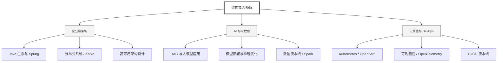

  <h1>你好，我是 Ellen Liu 👋</h1>
  

    <a href="README.md">English</a> | 
    <b>简体中文</b>
  

## 🧠 技术栈与核心能力

智能化企业系统建设路线图，涵盖全栈人工智能工程、云基础设施架构及模型部署等核心技术领域。

```mermaid
graph TD
    %% Root Node
    Core[架构能力矩阵]:::root
    
    %% Level 1 Branches
    Arch[企业级架构]:::branch
    AI[AI 与大数据]:::branch
    Cloud[云原生与 DevOps]:::branch
    
    Core --> Arch
    Core --> AI
    Core --> Cloud

    %% Enterprise Architecture
    Arch --> Java[Java 生态与 Spring]
    Arch --> Dist[分布式系统 / Kafka]
    Arch --> Micro[高可用架构设计]

    %% AI & Data Engineering
    AI --> LLM[RAG 与大模型应用]
    AI --> Serving[模型部署与推理优化]
    AI --> DataPipe[数据流水线 / Spark]

    %% Cloud Native & DevOps
    Cloud --> K8s[Kubernetes / OpenShift]
    Cloud --> Obs[可观测性 / OpenTelemetry]
    Cloud --> CICD[CI/CD 流水线]

    %% Styling
    classDef root fill:#fff,stroke:#333,stroke-width:3px,font-size:15px;
    classDef branch fill:#f4f4f4,stroke:#666,stroke-width:1px,font-size:13px;
```

## 🚀 Highlighted 工作

- **开源 AI 项目**: [基于 BERT 的声明检测模型](https://huggingface.co/XiaojingEllen/bert-finetuned-claim-detection) (Apache-2.0)
  - *已被哥伦比亚大学 (UBC) 研究项目引用。*
  - *手写 Transformer 核心代码，以验证理论与工程的一致性。*
- **金融基础设施**: 从 0 到 1 构建数字银行支付中间件及智能保险理赔系统。

## 📑 每日论文速递 (ArXiv)
<!-- DAILY_ARXIV_SUMMARY_START -->
**更新日期: 2026-07-08**

### 1. [从投票到智能体协作：面向BioASQ 14b的答案类型感知型大语言模型流水线](http://arxiv.org/abs/2607.06452v1)
- **摘要**: 生物医学问答不仅需要从科学文献中准确提取信息，还需跨多篇文档可靠整合证据。本研究针对BioASQ 14b任务B提出了一种面向问题类型的大语言模型框架，旨在提升生物医学问答中答案的稳健性与证据溯源能力。该框架并非对所有问题采用单一提示策略，而是根据是非题、事实题和列举题不同的推理与评估需求，分别选择差异化的推理流程。对于是非题，采用片段混洗与自我反思机制降低对证据排序的敏感性，提升决策稳定性；对于事实题，结合完整片段输入与基于思维链的上下文学习，支持精准的生物医学实体识别；对于列举题，则采用多智能体架构，由证据提取、候选生成、答案验证与最终聚合模块协同处理。通过BioASQ 13b的预实验为各问题类型确定有效推理策略，最终框架在官方BioASQ 14b任务B挑战中完成评估。官方评测显示，本框架在多个批次中展现出竞争力，并在第4批次的事实题子任务中取得第一名。这些结果验证了结合问题类型特定推理、集成预测与基于智能体的验证方法，对实现可靠生物医学问答的有效性。

### 2. [Danus：基于事实图谱记忆的数学推理智能体编排系统](http://arxiv.org/abs/2607.06447v1)
- **摘要**: 近期，基于大语言模型的数学推理智能体已开始涉足研究级问题，并在多个案例中为开放问题的解决做出了贡献。然而，有效扩展和协调此类智能体仍面临挑战，主要难点在于并行化证明搜索的同时，需保持中间结论的组织性与可靠性。本文提出Danus系统，这是一种面向研究级数学推理的编排系统，其核心采用共享事实图作为全局内存管理机制。Danus包含执行规划与协调的主智能体、并行执行证明搜索的多个工作智能体，以及一个无状态验证器——该验证器在数学主张被纳入事实图前对其进行校验。每个通过验证的事实将与其证明及逻辑依赖关系一同存储，使系统能够逐步构建长论证链条，同时保持共享证明状态的有序性。主智能体会定期总结动态演化的证明状态，将工作智能体导向有前景的探索方向，并通过进度报告支持与人类数学家的交互。我们通过代数几何、奇点理论和组合学领域的六个研究级案例对Danus进行评估，展示了事实图内存机制如何助力Danus构建冗长而严谨的数学证明。结果表明，基于事实图的编排方法为扩展面向长周期研究问题的数学推理智能体提供了有效路径。Danus已开源，代码仓库地址为https://github.com/frenzymath/Danus。

### 3. [RuBench：一个包含原生俄语任务规范的仓库级智能编码基准](http://arxiv.org/abs/2607.06411v1)
- **摘要**: 开发者越来越多地将实际维护工作委托给产品级编码智能体，且常以母语描述任务，采用类似客户请求的风格而非精心编写的英文问题。现有仓库级智能体基准测试并未衡量这一场景：其任务描述均为英文设计。我们推出 RuBench 1.0 基准测试，包含从五个活跃开源仓库（aiohttp、aiogram、Laravel、NestJS、Fastify；涉及 Python、PHP、TypeScript、JavaScript）近期修复提交中挖掘的 25 个任务。每个任务均以俄语原生描述——完全以真实客户请求风格从零编写，而非翻译——并由上游维护者的回归测试进行评判，这些测试未随基准发布。所有 25 个修复提交均晚于每个评估模型的训练数据截止日期，从而提供逐任务可验证的污染论证。我们对已部署的产品配置（CLI 智能体+模型+推理努力度）——包括搭载 Opus 4.8、Sonnet 5 和 Haiku 4.5 的 Claude Code，以及搭载 GPT-5.5 的 Codex CLI——进行三次独立运行评估，报告 pass@1 指标并附带任务级置信区间、配对比较、美元成本和令牌使用量。最佳配置解决了 78.7% 的任务；在 N=25 的情况下，仅与最弱模型之间的差距具有统计显著性，我们对此明确说明。通过审计第五个非竞赛配置（Claude Code + Fable 5，2026 年 7 月 2 日发布）的完整轨迹，我们发现产品在静默替换模型：在 25 个任务中的 5 个（20%）中，官方安全防护回退机制将常规 HTTP 协议修复重新路由至 Opus 4.8——这是直接、可复现的证据，表明实际衡量的单元是已部署产品而非模型。我们发布任务描述、元数据、完整智能体轨迹和差异文件；评分标准保留不公开，并在发布时提交 SHA-256 清单。

<!-- DAILY_ARXIV_SUMMARY_END -->

## 🌐 保持联系

  
<i>期待与您探讨 AI 基础设施的未来！</i>

