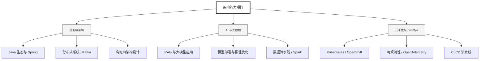

  <h1>你好，我是 Ellen Liu 👋</h1>
  

    <a href="README.md">English</a> | 
    <b>简体中文</b>
  

## 🧠 技术栈与核心能力

智能化企业系统建设路线图，涵盖全栈人工智能工程、云基础设施架构及模型部署等核心技术领域。

```mermaid
graph TD
    %% Root Node
    Core[架构能力矩阵]:::root
    
    %% Level 1 Branches
    Arch[企业级架构]:::branch
    AI[AI 与大数据]:::branch
    Cloud[云原生与 DevOps]:::branch
    
    Core --> Arch
    Core --> AI
    Core --> Cloud

    %% Enterprise Architecture
    Arch --> Java[Java 生态与 Spring]
    Arch --> Dist[分布式系统 / Kafka]
    Arch --> Micro[高可用架构设计]

    %% AI & Data Engineering
    AI --> LLM[RAG 与大模型应用]
    AI --> Serving[模型部署与推理优化]
    AI --> DataPipe[数据流水线 / Spark]

    %% Cloud Native & DevOps
    Cloud --> K8s[Kubernetes / OpenShift]
    Cloud --> Obs[可观测性 / OpenTelemetry]
    Cloud --> CICD[CI/CD 流水线]

    %% Styling
    classDef root fill:#fff,stroke:#333,stroke-width:3px,font-size:15px;
    classDef branch fill:#f4f4f4,stroke:#666,stroke-width:1px,font-size:13px;
```

## 🚀 Highlighted 工作

- **开源 AI 项目**: [基于 BERT 的声明检测模型](https://huggingface.co/XiaojingEllen/bert-finetuned-claim-detection) (Apache-2.0)
  - *已被哥伦比亚大学 (UBC) 研究项目引用。*
  - *手写 Transformer 核心代码，以验证理论与工程的一致性。*
- **金融基础设施**: 从 0 到 1 构建数字银行支付中间件及智能保险理赔系统。

## 📑 每日论文速递 (ArXiv)
<!-- DAILY_ARXIV_SUMMARY_START -->
**更新日期: 2026-05-11**

### 1. [基于验证器支持的数学推理难题生成](http://arxiv.org/abs/2605.06660v1)
- **摘要**: 大型语言模型（LLMs）在解决科学和数学问题方面展现出强大能力，但在生成有效、具有挑战性且新颖的问题方面仍存在不足——而这一能力对于推动LLM训练和实现自主科学研究至关重要。现有的问题生成方法要么依赖昂贵的人类专家参与，要么采用简单的自我博弈范式，这类方法常因奖励机制漏洞而产生无效问题。本研究提出VHG（验证器增强型难题生成框架），该框架基于三方自我博弈构建。通过在传统的出题者-解题者二元结构中引入独立验证器，我们的设计将出题者的奖励约束为问题有效性（由验证器评估）与难度（由解题者评估）的联合决定。我们实现了两种验证器变体：硬符号验证器和基于软LLM的验证器，并在不定积分任务和通用数学推理任务上进行了评估。实验结果表明，VHG在所有基线方法中均展现出显著优势。

### 2. [当无基准存在时：在没有真实标签的情况下验证大语言模型比较安全性评分](http://arxiv.org/abs/2605.06652v1)
- **摘要**: 许多部署场景需要在相关语言、行业或监管体系尚未建立标注基准的情况下，对候选语言模型进行安全性比较。我们将这一场景形式化为无基准比较安全评分，并明确基于场景的审计可作为部署证据的契约条件。评分仅在固定场景包、评分标准、审计方、评审方、采样配置及重跑预算下有效。由于缺乏标注数据，我们以工具有效性链条替代真实标签一致性：对受控安全与消融消解对比的响应性、目标驱动方差对审计方与评审方人为因素的支配性、以及跨重跑稳定性。我们在本地优先评分工具SimpleAudit中实例化该链条，并在挪威语安全包上完成验证。安全与消融消解目标的AUROC值介于0.89至1.00之间，目标身份是主导方差成分（η²≈0.52），严重性分布曲线在十次重跑后趋于稳定。将该链条应用于Petri框架时，表明两种工具均可兼容。实质性差异出现在链条上游的声明契约执行与部署适配环节。通过挪威公共部门采购案例（比较Borealis与Gemma 3）展示实际证据：更安全的模型取决于场景类别与风险度量指标。因此，评分、匹配差值、临界比率、不确定性、以及所使用的审计方与评审方必须联合报告，而非简化为单一排名。

### 3. [超越负面部署：基于隐式负梯度的纯正向策略优化](http://arxiv.org/abs/2605.06650v1)
- **摘要**: 基于可验证奖励的强化学习（RLVR），由于确定性验证机制，已成为提升大语言模型（LLMs）推理能力的主流范式。学界见证了从近端策略优化（PPO）到群体相对策略优化（GRPO）的快速演进——GRPO通过简化分组正负轨迹的估计，替代了复杂的优势函数计算。然而我们发现，负轨迹可能无法体现失败严重程度的梯度差异，且组合空间的海量性使得对少量采样负样本的惩罚，在稀疏二值奖励下难以覆盖有意义的奖励信号。为此，本文提出仅正向策略优化（POPO），一种仅通过在线正轨迹实现学习的新型RLVR框架。具体而言，POPO采用有界重要性采样技术处理正轨迹集合，完全摒弃了用于梯度引导的负轨迹。我们证明通过轨迹重分布强化正概率时，隐式负梯度会自然涌现。接着，POPO通过双重机制稳定策略优化：首先，采用孪生策略网络配合动量自适应更新律实现策略的稳定演化；其次，在孪生表征空间中以有界相似度惩罚项替代KL散度约束。我们基于公开成熟的文本LLM模型（如Qwen系列）在各级数学基准上开展广泛实验，结果表明POPO能达到与GRPO相当甚至更优的性能。值得注意的是，采用Qwen-Math-7B模型时，POPO在AIME 2025基准上取得36.67%的准确率，超越GRPO的30.00%。消融实验与参数扫描研究进一步验证了POPO各组件的必要性与鲁棒性。

<!-- DAILY_ARXIV_SUMMARY_END -->

## 🌐 保持联系

  
<i>期待与您探讨 AI 基础设施的未来！</i>

