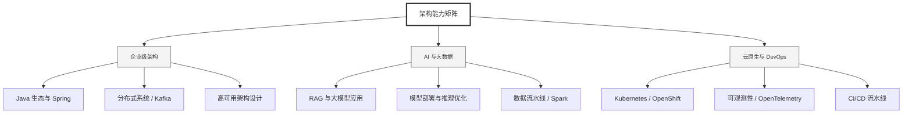

  <h1>你好，我是 Ellen Liu 👋</h1>
  

    <a href="README.md">English</a> | 
    <b>简体中文</b>
  

## 🧠 技术栈与核心能力

智能化企业系统建设路线图，涵盖全栈人工智能工程、云基础设施架构及模型部署等核心技术领域。

```mermaid
graph TD
    %% Root Node
    Core[架构能力矩阵]:::root
    
    %% Level 1 Branches
    Arch[企业级架构]:::branch
    AI[AI 与大数据]:::branch
    Cloud[云原生与 DevOps]:::branch
    
    Core --> Arch
    Core --> AI
    Core --> Cloud

    %% Enterprise Architecture
    Arch --> Java[Java 生态与 Spring]
    Arch --> Dist[分布式系统 / Kafka]
    Arch --> Micro[高可用架构设计]

    %% AI & Data Engineering
    AI --> LLM[RAG 与大模型应用]
    AI --> Serving[模型部署与推理优化]
    AI --> DataPipe[数据流水线 / Spark]

    %% Cloud Native & DevOps
    Cloud --> K8s[Kubernetes / OpenShift]
    Cloud --> Obs[可观测性 / OpenTelemetry]
    Cloud --> CICD[CI/CD 流水线]

    %% Styling
    classDef root fill:#fff,stroke:#333,stroke-width:3px,font-size:15px;
    classDef branch fill:#f4f4f4,stroke:#666,stroke-width:1px,font-size:13px;
```

## 🚀 Highlighted 工作

- **开源 AI 项目**: [基于 BERT 的声明检测模型](https://huggingface.co/XiaojingEllen/bert-finetuned-claim-detection) (Apache-2.0)
  - *已被哥伦比亚大学 (UBC) 研究项目引用。*
  - *手写 Transformer 核心代码，以验证理论与工程的一致性。*
- **金融基础设施**: 从 0 到 1 构建数字银行支付中间件及智能保险理赔系统。

## 📑 每日论文速递 (ArXiv)
<!-- DAILY_ARXIV_SUMMARY_START -->
**更新日期: 2026-05-19**

### 1. [面向智能公用事业计费的生成式AI框架：二氧化碳分析与可持续资源优化](http://arxiv.org/abs/2605.16250v1)
- **摘要**: 配电公司如今被要求提供客户真正能读懂的电费账单，为每千瓦时售电量附上可验证的碳排放数据，并根据电网负荷压力与排放约束安排用电计划。我们提出一个端到端框架，将四项生产级能力统一在同一架构下：基于生成式AI的智能体，在受限解码策略下根据结构化数值输入为客户起草自然语言账单说明；基于Transformer的预测模型，提供带有校准分位区间的日前用电量估算；

### 2. [AI中介的沟通能够引导集体意见](http://arxiv.org/abs/2605.16245v1)
- **摘要**: 生成式人工智能（AI）正日益融入人类交流观点的在线平台；大型语言模型（LLM）如今不仅优化用户在领英（LinkedIn）上的帖子，还为X平台（原推特）上分享的内容提供背景信息。尽管已有研究表明，AI在人机互动中可能表达带有偏见的观点并塑造个体意见，但关于其在调解人际沟通时对集体意见形成的影响，关注仍显不足。我们通过结合实证分析与理论建模来填补这一研究空白。实证结果表明，来自多个主流系列的LLM在受命编辑争议性话题的人类文本时，会引入方向性偏见——例如，促使文本倾向支持枪支管控、反对无神论立场。基于这一发现，我们构建了一个意见动态数学模型：AI系统作为社交网络中用户之间的中介，转化他们表达和感知的观点。通过解析该模型的均衡特征并在真实社交网络数据上进行模拟，我们证明AI在人际沟通中引入的偏见会通过网络效应放大，并推动集体意见向偏见方向偏移。基于这些发现，我们进一步探究此类偏见是否可控。通过审计X平台的"解释此帖"功能，我们发现在Grok模型处理堕胎相关内容时存在"反堕胎"偏见，并追溯其源头至特定设计选择。最后，我们结合欧盟现行立法进程，探讨了这些发现更广泛的政策启示。

### 3. [FORGE：通过群体广播实现无需权重更新的自进化智能体记忆](http://arxiv.org/abs/2605.16233v1)
- **摘要**: LLM智能体能否在不进行梯度更新的情况下，通过自生成记忆提升决策能力？我们提出FORGE（失败优化反思性演进与进化）协议，这是一种基于种群的分阶段协议，通过提示注入自然语言记忆来进化分层ReAct智能体。FORGE封装了反思式内循环，其中专用反思智能体（使用相同底层LLM，无需从更强模型进行蒸馏）将失败轨迹转化为可复用知识制品：文本启发式规则（Rules）、少样本示例（Examples）或两者混合（Mixed）。外循环则在阶段间将表现最优实例的记忆传播至整个种群，并通过毕业标准冻结已收敛实例。我们在CybORG CAGE-2（一个面向B线攻击者的30步随机网络防御POMDP）上评估，所有四种测试LLM家族（Gemini-2.5-Flash-Lite、Grok-4-Fast、Llama-4-Maverick、Qwen3-235B）均呈现强负值、重尾分布的零样本奖励。与零样本基线和反思基线（孤立单流学习）相比，FORGE在所有12种模型-表征条件下，平均评估回报较零样本提升1.7-7.7倍，较反思提升29-72%，并将重大失败率（低于-100）降至约1%。我们发现：（1）种群广播是关键机制，无毕业消融实验证实广播承载性能提升，而毕业主要节省计算资源；（2）对于四种模型中的三种，Examples获得最强回报，Rules以约40%更少token提供最佳成本-可靠性曲线；（3）较弱基线模型获益不成比例，表明FORGE可能弥合能力差距而非放大强模型优势。所有证据局限于CAGE-2 B线；跨家族发现为方向性证据。

<!-- DAILY_ARXIV_SUMMARY_END -->

## 🌐 保持联系

  
<i>期待与您探讨 AI 基础设施的未来！</i>

