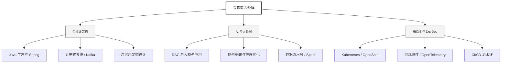

  <h1>你好，我是 Ellen Liu 👋</h1>
  

    <a href="README.md">English</a> | 
    <b>简体中文</b>
  

## 🧠 技术栈与核心能力

智能化企业系统建设路线图，涵盖全栈人工智能工程、云基础设施架构及模型部署等核心技术领域。

```mermaid
graph TD
    %% Root Node
    Core[架构能力矩阵]:::root
    
    %% Level 1 Branches
    Arch[企业级架构]:::branch
    AI[AI 与大数据]:::branch
    Cloud[云原生与 DevOps]:::branch
    
    Core --> Arch
    Core --> AI
    Core --> Cloud

    %% Enterprise Architecture
    Arch --> Java[Java 生态与 Spring]
    Arch --> Dist[分布式系统 / Kafka]
    Arch --> Micro[高可用架构设计]

    %% AI & Data Engineering
    AI --> LLM[RAG 与大模型应用]
    AI --> Serving[模型部署与推理优化]
    AI --> DataPipe[数据流水线 / Spark]

    %% Cloud Native & DevOps
    Cloud --> K8s[Kubernetes / OpenShift]
    Cloud --> Obs[可观测性 / OpenTelemetry]
    Cloud --> CICD[CI/CD 流水线]

    %% Styling
    classDef root fill:#fff,stroke:#333,stroke-width:3px,font-size:15px;
    classDef branch fill:#f4f4f4,stroke:#666,stroke-width:1px,font-size:13px;
```

## 🚀 Highlighted 工作

- **开源 AI 项目**: [基于 BERT 的声明检测模型](https://huggingface.co/XiaojingEllen/bert-finetuned-claim-detection) (Apache-2.0)
  - *已被哥伦比亚大学 (UBC) 研究项目引用。*
  - *手写 Transformer 核心代码，以验证理论与工程的一致性。*
- **金融基础设施**: 从 0 到 1 构建数字银行支付中间件及智能保险理赔系统。

## 📑 每日论文速递 (ArXiv)
<!-- DAILY_ARXIV_SUMMARY_START -->
**更新日期: 2026-03-12**

### 1. [CREATE：测试大语言模型的联想创造力](http://arxiv.org/abs/2603.09970v1)
- **摘要**: 创造力的一个关键组成部分是联想推理：即在概念之间建立新颖而有意义的联系的能力。我们推出了CREATE基准测试，旨在评估模型进行创造性联想推理的能力。CREATE要求模型生成连接其参数知识中概念的路径集合。这些路径应具备高特异性（概念联系的独特性和紧密性）与高多样性（与其他路径的差异性），且模型若能生成更多强而多样的路径，将获得更高评分。该任务与假设生成等实际创造性任务具有相似要求，包括极大的搜索空间，但能够通过客观答案评分收集大规模基准数据。对前沿模型的评估表明，最强模型能获得比其他模型更高的创造性效用，但由于答案的高度多重性和搜索复杂性，基准饱和难以实现。此外，我们的结果表明，即使在高令牌预算下，思维模型在我们的任务中并不总是更有效。近期提出的创造性提示方法虽能带来一定改进，但提升有限。CREATE为开发新方法以提升模型联想创造力提供了一个实验平台。

### 2. [三思而后言：推理如何提升诚实](http://arxiv.org/abs/2603.09957v1)
- **摘要**: 现有对大语言模型（LLM）的评估虽能测量欺骗率，但对引发欺骗行为的深层条件仍缺乏理解。我们通过一个新颖的现实道德权衡数据集来研究该问题——该情境中诚实行为需付出可变代价。与人类在深思熟虑后往往降低诚实度（Capraro, 2017; Capraro et al., 2019）的特性相反，我们发现推理过程能持续提升多种规模及系列LLM的诚实度。这种效应并非仅源于推理内容本身，因为推理轨迹往往难以预测最终行为。我们进一步证明，表征空间的内在几何结构对此效应具有贡献：该空间中的欺骗性区域呈现亚稳态特征——相较于诚实回答，欺骗性答案更容易因输入改写、输出重采样和激活噪声而发生失稳。基于此，我们将推理的作用解释为：在道德推理过程中生成审慎标记，意味着在带有偏见的表征空间中穿行，最终将模型推向更稳定的诚实默认状态。

### 3. [大语言模型时代的模型融合：方法、应用与未来方向](http://arxiv.org/abs/2603.09938v1)
- **摘要**: 模型融合已成为一种变革性范式，能够将多个神经网络的能力整合至单一统一模型中，且无需额外训练。随着微调后大语言模型（LLMs）的快速激增，融合技术为集成学习和全量重训练提供了计算高效的替代方案，使实践者能够以极低成本组合专业化能力。本综述通过**FUSE**分类法——一个沿**F**（理论基础）、**U**（统一策略）、**S**（应用场景）、**E**（生态系统）四维度构建的框架，对LLM时代的模型融合进行了全面而结构化的梳理。我们首先建立融合的理论基础，包括损失景观几何、模态连通性及线性模态连通性假说。随后系统回顾算法体系，涵盖权重平均、任务向量运算、稀疏化增强方法、专家混合架构及进化优化方法。针对每一方法族类，我们分析其核心公式，重点介绍代表性工作，并探讨实际权衡问题。进一步地，我们审视了多任务学习、安全对齐、领域专业化、多语言迁移及联邦学习等下游应用场景。最后，我们梳理了开源工具、社区平台与评估基准构成的支撑生态，并指出当前面临的关键开放挑战，包括理论缺口、可扩展性瓶颈及标准化需求。本综述旨在为研究者和实践者提供推进模型融合研究的结构化基础。

<!-- DAILY_ARXIV_SUMMARY_END -->

## 🌐 保持联系

  
<i>期待与您探讨 AI 基础设施的未来！</i>

