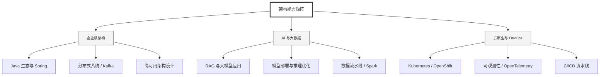

  <h1>你好，我是 Ellen Liu 👋</h1>
  

    <a href="README.md">English</a> | 
    <b>简体中文</b>
  

## 🧠 技术栈与核心能力

智能化企业系统建设路线图，涵盖全栈人工智能工程、云基础设施架构及模型部署等核心技术领域。

```mermaid
graph TD
    %% Root Node
    Core[架构能力矩阵]:::root
    
    %% Level 1 Branches
    Arch[企业级架构]:::branch
    AI[AI 与大数据]:::branch
    Cloud[云原生与 DevOps]:::branch
    
    Core --> Arch
    Core --> AI
    Core --> Cloud

    %% Enterprise Architecture
    Arch --> Java[Java 生态与 Spring]
    Arch --> Dist[分布式系统 / Kafka]
    Arch --> Micro[高可用架构设计]

    %% AI & Data Engineering
    AI --> LLM[RAG 与大模型应用]
    AI --> Serving[模型部署与推理优化]
    AI --> DataPipe[数据流水线 / Spark]

    %% Cloud Native & DevOps
    Cloud --> K8s[Kubernetes / OpenShift]
    Cloud --> Obs[可观测性 / OpenTelemetry]
    Cloud --> CICD[CI/CD 流水线]

    %% Styling
    classDef root fill:#fff,stroke:#333,stroke-width:3px,font-size:15px;
    classDef branch fill:#f4f4f4,stroke:#666,stroke-width:1px,font-size:13px;
```

## 🚀 Highlighted 工作

- **开源 AI 项目**: [基于 BERT 的声明检测模型](https://huggingface.co/XiaojingEllen/bert-finetuned-claim-detection) (Apache-2.0)
  - *已被哥伦比亚大学 (UBC) 研究项目引用。*
  - *手写 Transformer 核心代码，以验证理论与工程的一致性。*
- **金融基础设施**: 从 0 到 1 构建数字银行支付中间件及智能保险理赔系统。

## 📑 每日论文速递 (ArXiv)
<!-- DAILY_ARXIV_SUMMARY_START -->
**更新日期: 2026-05-22**

### 1. [您只需最少的RLVR训练：通过秩1轨迹外推大型语言模型](http://arxiv.org/abs/2605.21468v1)
- **摘要**: 基于可验证奖励的强化学习（RLVR）已成为提升大语言模型（LLMs）推理能力的主流范式，然而其参数轨迹的底层几何结构仍鲜有探索。本研究发现，RLVR权重轨迹具有极低秩性和高度可预测性。具体而言，下游性能提升的主要部分可由参数变化的秩-1近似捕获，且该投影分量的幅度随训练步数呈近线性演化。受此启发，我们提出了一种简洁高效的计算方法RELEX（强化学习外推法），该方法通过短观测窗口估计秩-1子空间，并利用线性回归外推未来检查点，无需任何学习模型。在三个模型（Qwen2.5-Math-1.5B、Qwen3-4B-Base和Qwen3-8B-Base）上的实验表明，RELEX生成的检查点在域内和域外基准测试中均能达到或超越RLVR性能，且仅需完整RLVR训练15%的步数。值得注意的是，RELEX能在零训练成本下实现远超观测窗口的外推，预测的检查点可达到观测前缀的10-20倍并持续改进（例如仅观测前50步即可外推至1000步）。消融分析证实了RELEX的极简充分性：无论是增加子空间秩还是采用非线性建模，均未带来外推性能的进一步提升。最后，我们证明RELEX的成功源于"去噪"效应：通过将更新投影到秩-1子空间，模型丢弃了本会在外推过程中降低性能的随机优化噪声。我们的代码已开源至https://github.com/weizhepei/RELEX。

### 2. [利用大型语言模型进行语法适配：元模型与语法协同演化研究](http://arxiv.org/abs/2605.21465v1)
- **摘要**: 在模型驱动工程中，元模型演化导致需要调整相应语法以保持一致性，这通常需要繁琐的人工操作。现有基于规则的方法虽能实现部分自动化，但在处理复杂语法场景时存在局限性。本文提出一种基于大语言模型的方法，通过学习先前版本的语法适配方式，在演化后自动将适配应用于新语法。我们基于六个真实世界的Xtext领域特定语言对该方法进行了评估，使用四个DSL作为训练集制定提示策略，两个DSL作为测试集进行验证，并对QVTo开展了纵向案例研究。评估采用三种大语言模型（Claude Sonnet 4.5、ChatGPT 5.1、Gemini 3），从语法规则级适配一致性、输出相似度和元模型符合度三个维度衡量语法适配质量。结果表明，在测试集上三种LLM均实现了100%的适配一致性和输出相似度，而基于规则的方法在DOT和Xcore上分别仅达到84.21%和62.50%。在QVTo纵向研究中，基于LLM的方法在三个演化步骤中均成功复用了已学习的适配模式，无需人工编辑语法，而基于规则的方法在三次转换中有两次需要人工调整。但在大规模语法（EAST-ADL，297条规则）上，LLM的适配一致性远低于90%。本研究展示了基于LLM的方法在处理复杂语法场景中的优势，同时揭示了其在大规模语法适配中的局限性。

### 3. [Mem-$π$：通过学习何时生成与生成什么实现自适应记忆](http://arxiv.org/abs/2605.21463v1)
- **摘要**: 我们提出了Mem-$π$，一种面向大语言模型（LLM）智能体的自适应记忆框架，该框架能按需生成有效指导，而非从外部记忆库中检索信息。现有记忆增强型智能体通常依赖基于相似性的情节记忆库或技能库检索，返回的静态条目往往与当前语境不匹配。相比之下，Mem-$π$采用独立于下游智能体的专用语言或视觉语言模型（拥有独立参数），为复杂任务生成上下文特定的指导。该模型基于当前智能体语境，联合决策何时生成指导以及生成何种指导。我们通过决策-内容解耦的强化学习（RL）目标对其进行训练，使其在生成无益时能够主动放弃，否则生成简洁有效的指导。在涵盖网页导航、终端工具使用和文本具身交互的多样化智能体基准测试中，Mem-$π$始终优于基于检索和先前RL优化的记忆基线，在网页导航任务上实现了超过30%的相对性能提升。

<!-- DAILY_ARXIV_SUMMARY_END -->

## 🌐 保持联系

  
<i>期待与您探讨 AI 基础设施的未来！</i>

