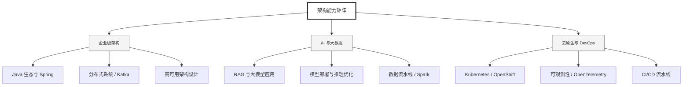

  <h1>你好，我是 Ellen Liu 👋</h1>
  

    <a href="README.md">English</a> | 
    <b>简体中文</b>
  

## 🧠 技术栈与核心能力

智能化企业系统建设路线图，涵盖全栈人工智能工程、云基础设施架构及模型部署等核心技术领域。

```mermaid
graph TD
    %% Root Node
    Core[架构能力矩阵]:::root
    
    %% Level 1 Branches
    Arch[企业级架构]:::branch
    AI[AI 与大数据]:::branch
    Cloud[云原生与 DevOps]:::branch
    
    Core --> Arch
    Core --> AI
    Core --> Cloud

    %% Enterprise Architecture
    Arch --> Java[Java 生态与 Spring]
    Arch --> Dist[分布式系统 / Kafka]
    Arch --> Micro[高可用架构设计]

    %% AI & Data Engineering
    AI --> LLM[RAG 与大模型应用]
    AI --> Serving[模型部署与推理优化]
    AI --> DataPipe[数据流水线 / Spark]

    %% Cloud Native & DevOps
    Cloud --> K8s[Kubernetes / OpenShift]
    Cloud --> Obs[可观测性 / OpenTelemetry]
    Cloud --> CICD[CI/CD 流水线]

    %% Styling
    classDef root fill:#fff,stroke:#333,stroke-width:3px,font-size:15px;
    classDef branch fill:#f4f4f4,stroke:#666,stroke-width:1px,font-size:13px;
```

## 🚀 Highlighted 工作

- **开源 AI 项目**: [基于 BERT 的声明检测模型](https://huggingface.co/XiaojingEllen/bert-finetuned-claim-detection) (Apache-2.0)
  - *已被哥伦比亚大学 (UBC) 研究项目引用。*
  - *手写 Transformer 核心代码，以验证理论与工程的一致性。*
- **金融基础设施**: 从 0 到 1 构建数字银行支付中间件及智能保险理赔系统。

## 📑 每日论文速递 (ArXiv)
<!-- DAILY_ARXIV_SUMMARY_START -->
**更新日期: 2026-05-05**

### 1. [当大语言模型不再遵循步骤：语言模型中程序执行过程的诊断研究](http://arxiv.org/abs/2605.00817v1)
- **摘要**: 大型语言模型（LLMs）在推理基准测试中常表现出色，但仅凭最终答案的准确性无法判断模型是否忠实地执行了提示中指定的步骤流程。我们通过一个受控的诊断性基准测试来研究这一问题——该测试聚焦于程序化执行任务：模型需根据分步算术算法和两个数值输入，返回最终计算结果。基准测试采用简单算术运算，但通过算法长度和中间变量的回溯依赖关系增加复杂度。在14个模型和55个数据集上的测试显示，5步程序的平均首次答案准确率为61%，而95步程序则降至20%。生成层级分析表明，失败模式常涉及答案缺失、过早输出答案、初始错误后的自我修正、未完整执行的轨迹，以及幻觉性额外步骤。这些发现表明，表面上的推理能力可能掩盖了忠实执行指令方面的显著缺陷。

### 2. [编码代理能否复现计算材料科学中的研究成果？](http://arxiv.org/abs/2605.00803v1)
- **摘要**: 大型语言模型正越来越多地被部署为自主编码智能体，并在软件工程基准测试中取得了显著优异的性能。然而，尚不清楚这种成功是否能迁移到计算科学工作流中——这类任务不仅要求强大的编码能力，还需要掌握复杂的领域特定流程，并能在科学论断的语境中解读结果。为探究这一问题，我们提出了AutoMat基准，用于评估基于LLM的智能体复现计算材料科学论断的能力。AutoMat提出了三个相互关联的挑战：还原未明确说明的计算流程、驾驭专业化工具链，以及判断所得证据是否支持特定论断。通过与领域专家紧密合作，我们从真实材料科学论文中精选出一组论断，用以测试编码智能体能否还原并执行支持（或反驳）这些论断所需的端到端工作流。随后，我们评估了多种基础模型上的代表性编码智能体配置。结果表明，当前基于LLM的智能体在AutoMat上的整体成功率较低，表现最佳的配置也仅达到54.1%的成功率。错误分析进一步揭示：当工作流必须仅凭论文文本重建时，智能体表现最差；其失败主因在于流程不完整、方法偏差以及执行脆弱性。综合来看，这些发现使AutoMat既成为计算科学可复现性的基准测试工具，也成为诊断当前AI-for-Science场景中智能体系统局限性的分析工具。

### 3. [RunAgent：基于约束引导执行的自然语言计划解析](http://arxiv.org/abs/2605.00798v1)
- **摘要**: 人类通过执行有针对性的计划来解决问题，然而大型语言模型（LLM）在结构化工作流执行方面仍不可靠。我们提出RunAgent——一个多智能体计划执行平台，该平台能够解析自然语言计划，同时通过约束条件和评分细则强制实现逐步执行。RunAgent通过引入包含显式控制结构（如\texttt{IF}、\texttt{GOTO}、\texttt{FORALL}）的智能体语言，将自然语言的表达力与编程的确定性相衔接。除了基于每个步骤的具体指令验证步骤输出的语法和语义正确性外，RunAgent还能根据任务描述及其在各步骤中的实例，自主推导并验证约束条件。该平台还动态选择基于LLM的推理、工具调用、代码生成与执行（如Python）等方案，并集成错误修正机制以确保正确性。最后，RunAgent在执行每个步骤时通过仅保留相关信息来过滤上下文历史。在Natural-plan和SciBench数据集上的评估表明，RunAgent的性能优于基线LLM及当前最先进的PlanGEN方法。

<!-- DAILY_ARXIV_SUMMARY_END -->

## 🌐 保持联系

  
<i>期待与您探讨 AI 基础设施的未来！</i>

