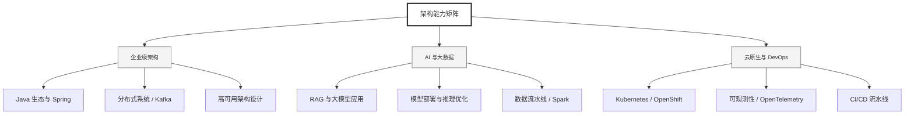

  <h1>你好，我是 Ellen Liu 👋</h1>
  

    <a href="README.md">English</a> | 
    <b>简体中文</b>
  

## 🧠 技术栈与核心能力

智能化企业系统建设路线图，涵盖全栈人工智能工程、云基础设施架构及模型部署等核心技术领域。

```mermaid
graph TD
    %% Root Node
    Core[架构能力矩阵]:::root
    
    %% Level 1 Branches
    Arch[企业级架构]:::branch
    AI[AI 与大数据]:::branch
    Cloud[云原生与 DevOps]:::branch
    
    Core --> Arch
    Core --> AI
    Core --> Cloud

    %% Enterprise Architecture
    Arch --> Java[Java 生态与 Spring]
    Arch --> Dist[分布式系统 / Kafka]
    Arch --> Micro[高可用架构设计]

    %% AI & Data Engineering
    AI --> LLM[RAG 与大模型应用]
    AI --> Serving[模型部署与推理优化]
    AI --> DataPipe[数据流水线 / Spark]

    %% Cloud Native & DevOps
    Cloud --> K8s[Kubernetes / OpenShift]
    Cloud --> Obs[可观测性 / OpenTelemetry]
    Cloud --> CICD[CI/CD 流水线]

    %% Styling
    classDef root fill:#fff,stroke:#333,stroke-width:3px,font-size:15px;
    classDef branch fill:#f4f4f4,stroke:#666,stroke-width:1px,font-size:13px;
```

## 🚀 Highlighted 工作

- **开源 AI 项目**: [基于 BERT 的声明检测模型](https://huggingface.co/XiaojingEllen/bert-finetuned-claim-detection) (Apache-2.0)
  - *已被哥伦比亚大学 (UBC) 研究项目引用。*
  - *手写 Transformer 核心代码，以验证理论与工程的一致性。*
- **金融基础设施**: 从 0 到 1 构建数字银行支付中间件及智能保险理赔系统。

## 📑 每日论文速递 (ArXiv)
<!-- DAILY_ARXIV_SUMMARY_START -->
**更新日期: 2026-03-06**

### 1. [AgentIR：面向深度研究智能体的推理感知检索](http://arxiv.org/abs/2603.04384v1)
- **摘要**: 深度研究智能体正迅速成为现代检索系统的主要使用者。与人类用户仅提出并优化查询而不记录中间思考过程不同，深度研究智能体在每次搜索调用前会生成显式的自然语言推理，这些推理揭示了丰富的意图和上下文信息，而现有检索器完全忽略了这些信息。为利用这一被忽视的信号，我们提出：（1）推理感知检索——一种将智能体推理轨迹与其查询联合编码的检索范式；（2）DR-Synth——一种从标准问答数据集生成深度研究检索器训练数据的数据合成方法。实验证明这两个组件各自独立有效，且其组合训练出的嵌入模型AgentIR-4B性能显著提升。在具有挑战性的BrowseComp-Plus基准测试中，AgentIR-4B与开源智能体通义深度研究配合实现了68%的准确率，而参数量两倍于它的传统嵌入模型准确率为50%，BM25方法仅为37%。代码与数据已开源：https://texttron.github.io/AgentIR/。

### 2. [$τ$-知识：基于非结构化知识的对话代理评估](http://arxiv.org/abs/2603.04370v1)
- **摘要**: 对话智能体正日益被部署于知识密集型场景中，其正确行为依赖于在与用户实时交互过程中，从大规模、专有且非结构化的语料库中检索并应用领域特定知识。然而现有基准测试大多独立评估检索能力或工具使用能力，导致在长周期交互中对非结构化数据进行真实、完全自主的智能体评估存在空白。我们推出$τ$-Knowledge——作为$τ$-Bench的扩展，用于评估智能体在需协调外部自然语言知识与工具输出以产生可验证、符合策略的状态变化的环境中的表现。我们构建的新领域$τ$-Banking模拟了真实的金融科技客服工作流，智能体需在执行工具介导的账户更新操作时，在约700份相互关联的知识文档中精准导航。无论是基于嵌入向量的检索还是基于终端的搜索，即便配置高推理预算的前沿模型也仅能达到约25.5%的通过率^1，且在重复试验中可靠性急剧下降。智能体难以从高度互联的知识库中准确检索文档，亦无法对复杂的内部策略进行精确推理。总体而言，$τ$-Knowledge为开发面向人类部署场景、需整合非结构化知识的智能体提供了真实的测试平台。

### 3. [双模态多阶段对抗性安全训练：增强多模态网络代理抵御跨模态攻击的鲁棒性](http://arxiv.org/abs/2603.04364v1)
- **摘要**: 能够同时处理屏幕截图和无障碍树的多模态网页智能体正日益广泛地应用于网页交互，但其双流架构却暴露出一个尚未被充分探索的攻击面：攻击者通过向网页DOM注入内容，可同时污染两个观测通道，形成具有一致欺骗性的虚假信息流。我们在MiniWob++平台上的漏洞分析表明，包含视觉组件的攻击效果远超纯文本注入，这暴露出当前以文本为中心的视觉语言模型安全训练存在重大缺陷。基于这一发现，我们提出双模态多阶段对抗安全训练框架，该框架将智能体与攻击者的交互形式化为双人零和马尔可夫博弈，并通过三阶段流程实现协同训练：（1）基于强教师模型的模仿学习；（2）采用新型零确认策略的预言机引导监督微调，使模型在对抗噪声中保持任务导向的推理能力；（3）通过群组相对策略优化的自对抗强化学习。在分布外任务测试中，该框架在将任务完成效率提升一倍的同时，显著降低了对抗风险。我们的方法在性能上全面超越现有基于训练和提示的防御方案，展现出真正的协同进化能力，并能稳健地泛化至复杂未知环境。

<!-- DAILY_ARXIV_SUMMARY_END -->

## 🌐 保持联系

  
<i>期待与您探讨 AI 基础设施的未来！</i>

