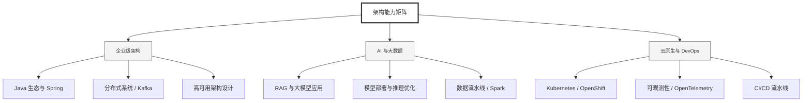

  <h1>你好，我是 Ellen Liu 👋</h1>
  

    <a href="README.md">English</a> | 
    <b>简体中文</b>
  

## 🧠 技术栈与核心能力

智能化企业系统建设路线图，涵盖全栈人工智能工程、云基础设施架构及模型部署等核心技术领域。

```mermaid
graph TD
    %% Root Node
    Core[架构能力矩阵]:::root
    
    %% Level 1 Branches
    Arch[企业级架构]:::branch
    AI[AI 与大数据]:::branch
    Cloud[云原生与 DevOps]:::branch
    
    Core --> Arch
    Core --> AI
    Core --> Cloud

    %% Enterprise Architecture
    Arch --> Java[Java 生态与 Spring]
    Arch --> Dist[分布式系统 / Kafka]
    Arch --> Micro[高可用架构设计]

    %% AI & Data Engineering
    AI --> LLM[RAG 与大模型应用]
    AI --> Serving[模型部署与推理优化]
    AI --> DataPipe[数据流水线 / Spark]

    %% Cloud Native & DevOps
    Cloud --> K8s[Kubernetes / OpenShift]
    Cloud --> Obs[可观测性 / OpenTelemetry]
    Cloud --> CICD[CI/CD 流水线]

    %% Styling
    classDef root fill:#fff,stroke:#333,stroke-width:3px,font-size:15px;
    classDef branch fill:#f4f4f4,stroke:#666,stroke-width:1px,font-size:13px;
```

## 🚀 Highlighted 工作

- **开源 AI 项目**: [基于 BERT 的声明检测模型](https://huggingface.co/XiaojingEllen/bert-finetuned-claim-detection) (Apache-2.0)
  - *已被哥伦比亚大学 (UBC) 研究项目引用。*
  - *手写 Transformer 核心代码，以验证理论与工程的一致性。*
- **金融基础设施**: 从 0 到 1 构建数字银行支付中间件及智能保险理赔系统。

## 📑 每日论文速递 (ArXiv)
<!-- DAILY_ARXIV_SUMMARY_START -->
**更新日期: 2026-05-14**

### 1. [LongMemEval-V2：面向资深同事的长期智能体记忆评估](http://arxiv.org/abs/2605.12493v1)
- **摘要**: 长期记忆对于专业网络环境中的智能体至关重要，其成功取决于能否回忆界面功能、状态动态、工作流程及常见故障模式。然而，现有针对智能体的记忆基准测试主要聚焦于用户历史记录、短时轨迹或下游任务成功率，未能直接评估记忆系统能否有效内化环境特定经验。为填补这一空白，我们提出LongMemEval-V2（LME-V2）基准测试，用于评估记忆系统能否帮助智能体在定制化环境中积累成为"专家级协作者"所需的经验。LME-V2包含451个手工筛选的问题，覆盖网络智能体的五项核心记忆能力：静态状态回忆、动态状态追踪、工作流知识、环境陷阱识别及前提感知。每个问题均配备包含最多500条轨迹和1.15亿词元的历史轨迹数据。我们采用上下文聚合框架：记忆系统通过处理历史轨迹，为下游问答任务生成精简证据。我们提出两种记忆方法：AgentRunbook-R——基于RAG的高效记忆系统，通过知识池存储原始状态观测、事件及策略笔记；AgentRunbook-C——将轨迹存储为文件，在增强沙盒环境中调用编码智能体收集证据。实验表明，AgentRunbook-C以72.5%的平均准确率取得最佳性能，超越最强RAG基线（48.5%）和现成编码智能体基线（69.3%）。尽管性能显著提升，基于编码智能体的方法存在高延迟成本。虽然AgentRunbook-C推动了准确率-延迟帕累托前沿的发展，但仍有较大改进空间。这些结果共同确立了LME-V2作为开发环境经验长期记忆系统的挑战性测试平台。

### 2. [基于测试时大语言模型引导的任务自适应嵌入精炼](http://arxiv.org/abs/2605.12487v1)
- **摘要**: 我们探索了一种基于大语言模型（LLM）引导的查询精化范式，旨在扩展嵌入模型在具有挑战性的零样本搜索与分类任务中的可用性。该方法通过利用生成式LLM对少量文档的反馈，精化用户查询的嵌入表示，使嵌入能够实时适应目标任务。我们使用最先进的文本嵌入模型，在多种具有挑战性的搜索与分类基准上进行了广泛实验。实证结果表明，LLM引导的查询精化在所有模型和数据集上均能带来持续的性能提升，在文献搜索、意图检测、关键点匹配以及细粒度查询指令遵循等任务中，相对改进幅度高达+25%。精化后的查询不仅提升了排序质量，还在语料库中诱导出更清晰的二元分离边界，使嵌入空间能更好地反映每个临时用户查询中细微且任务特定的约束。重要的是，这拓展了嵌入模型可有效部署的实际场景范围，使其在语料库规模下无法承担昂贵LLM管线时成为极具吸引力的替代方案。我们公开了实验代码以确保可复现性，地址为：https://github.com/IBM/task-aware-embedding-refinement。

### 3. [MEME：多实体与演进记忆评估](http://arxiv.org/abs/2605.12477v1)
- **摘要**: 基于大语言模型的智能体越来越多地运行在持久化环境中，它们需要在多个会话间存储、更新和推理信息。现有基准测试仅评估单实体更新场景，而MEME定义了涵盖多实体与动态演化两个维度的六项任务，其中三项未被先前工作评估：级联推理、缺失推理（依赖关系推理）和删除推理（移除后状态）。通过在100个受控场景中评估涵盖三种记忆范式的六种记忆系统，我们发现所有系统在默认配置下均无法完成依赖关系推理（级联推理平均准确率3%，缺失推理平均准确率1%），尽管其静态检索性能表现尚可。提示优化、深度检索、减少填充噪声以及多数更强的大语言模型均无法弥合这一差距。仅当采用基于文件的智能体配合Claude Opus 4.7作为内部大语言模型时，才能部分弥合差距，但成本约为基准方案的70倍，这表明当前弥合差距的方案在规模化应用中并不实用。代码与数据已发布于项目页面：https://seokwonjung-jay.github.io/meme-eval/。

<!-- DAILY_ARXIV_SUMMARY_END -->

## 🌐 保持联系

  
<i>期待与您探讨 AI 基础设施的未来！</i>

