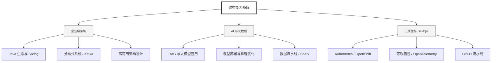

  <h1>你好，我是 Ellen Liu 👋</h1>
  

    <a href="README.md">English</a> | 
    <b>简体中文</b>
  

## 🧠 技术栈与核心能力

智能化企业系统建设路线图，涵盖全栈人工智能工程、云基础设施架构及模型部署等核心技术领域。

```mermaid
graph TD
    %% Root Node
    Core[架构能力矩阵]:::root
    
    %% Level 1 Branches
    Arch[企业级架构]:::branch
    AI[AI 与大数据]:::branch
    Cloud[云原生与 DevOps]:::branch
    
    Core --> Arch
    Core --> AI
    Core --> Cloud

    %% Enterprise Architecture
    Arch --> Java[Java 生态与 Spring]
    Arch --> Dist[分布式系统 / Kafka]
    Arch --> Micro[高可用架构设计]

    %% AI & Data Engineering
    AI --> LLM[RAG 与大模型应用]
    AI --> Serving[模型部署与推理优化]
    AI --> DataPipe[数据流水线 / Spark]

    %% Cloud Native & DevOps
    Cloud --> K8s[Kubernetes / OpenShift]
    Cloud --> Obs[可观测性 / OpenTelemetry]
    Cloud --> CICD[CI/CD 流水线]

    %% Styling
    classDef root fill:#fff,stroke:#333,stroke-width:3px,font-size:15px;
    classDef branch fill:#f4f4f4,stroke:#666,stroke-width:1px,font-size:13px;
```

## 🚀 Highlighted 工作

- **开源 AI 项目**: [基于 BERT 的声明检测模型](https://huggingface.co/XiaojingEllen/bert-finetuned-claim-detection) (Apache-2.0)
  - *已被哥伦比亚大学 (UBC) 研究项目引用。*
  - *手写 Transformer 核心代码，以验证理论与工程的一致性。*
- **金融基础设施**: 从 0 到 1 构建数字银行支付中间件及智能保险理赔系统。

## 📑 每日论文速递 (ArXiv)
<!-- DAILY_ARXIV_SUMMARY_START -->
**更新日期: 2026-06-25**

### 1. [SHERLOC：面向代码修复代理的结构化诊断定位方法](http://arxiv.org/abs/2606.24820v1)
- **摘要**: LLM代理通过多轮工具使用解决仓库级编码任务，但在编辑前会将一半预算用于定位故障。尽管专用定位框架已出现，但其评估仍停留在文件检索层面，而非可操作的诊断——仅提供位置信息，却缺乏修复代理所需的诊断上下文。我们提出SHERLOC（结构化假设驱动探索与推理定位），这是一种无需训练框架，将推理型LLM与紧凑型仓库工具及自我恢复机制相结合，无需微调或多代理编排。SHERLOC在不同规模模型上均达到顶尖定位性能：在SWE-Bench Lite上实现84.33%的准确率@1，在SWE-Bench Verified上实现81.27%的召回率@1；在约300亿参数规模下，其表现匹配或超越其他代理方法。将我们的定位结果与诊断发现注入修复代理后，SWE-Bench Verified的平均修复率提升5.95个百分点，同时定位环节与总令牌消耗分别降低36.7%和23.1%。

### 2. [付费求知：代理型电商中验证产品信息的微交易市场](http://arxiv.org/abs/2606.24783v1)
- **摘要**: 商业自然语言处理将购物聊天机器人视为推荐工具或转化工具：其任务是将用户与商品目录条目匹配并促成交易。我们认为，智能体原生微支付通道（如x402、AP2）的出现改变了稀缺资源的定义。当买家是能够进行穷举式调查的自主智能体时，瓶颈不再是产品匹配，而是获取关于产品的可信、与决策相关的信息。我们设想智能体电商将成为验证信息的微交易市场：买家智能体花费不到一分钱的费用，逐步解锁由卖家和评论者提供的数据——服务历史、第三方测试报告、物料清单、经审计的销售与支持指标——在免费增值模式下按需付费，评论者的可信度则通过声誉评分衡量。我们勾勒出这一市场的架构，并论证其能奖励真正的产品质量，比基于排名的线上店铺带来更真实的竞争。随后，我们将这一愿景转化为具体的自然语言处理问题——成本最优的信息获取、数据定价与谈判、实时实体解析、基于实体的价值交换，以及隐私保护的人格建模——并主张这些（而非对话流畅度）才是该领域应关注的重点。

### 3. [我们准备好迎接智能体原生记忆系统了吗？](http://arxiv.org/abs/2606.24775v1)
- **摘要**: 面向大语言模型（LLM）智能体的记忆系统已从简单的检索增强机制，快速演进为支持持久化信息存储、检索、更新、整合及动态生命周期治理的数据管理系统。然而，现有评估仍主要采用端到端任务成功率指标（如F1值、BLEU值）对智能体记忆进行基准测试，将底层系统视为单一黑盒。这导致关键系统级问题——包括运行成本、记忆模块间的架构权衡，以及动态知识更新下的鲁棒性——尚未得到充分探索。本文从数据管理视角对智能体记忆展开系统性实验研究，提出将智能体记忆分解为四个核心模块的分析框架：记忆表征与存储、提取、检索与路由、维护。基于该框架，我们评估了12个代表性记忆系统及两个参考基线，覆盖涵盖11个数据集的五种基准工作负载。全面的端到端评估表明：不存在适用于所有场景的通用架构，记忆效果高度依赖记忆结构与工作负载瓶颈的匹配程度。通过细粒度消融实验，我们量化了各模块对表征保真度、检索精度、更新正确性及长期稳定性的独立影响。最终，我们揭示了真实工作负载下的成本-性能权衡关系，证明局部维护比全局重组更具成本效益。基于这些发现，我们指出了构建真正原生智能体记忆系统的可行方向。相关代码已开源至 https://github.com/OpenDataBox/MemoryData。

<!-- DAILY_ARXIV_SUMMARY_END -->

## 🌐 保持联系

  
<i>期待与您探讨 AI 基础设施的未来！</i>

