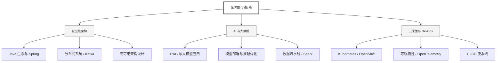

  <h1>你好，我是 Ellen Liu 👋</h1>
  

    <a href="README.md">English</a> | 
    <b>简体中文</b>
  

## 🧠 技术栈与核心能力

智能化企业系统建设路线图，涵盖全栈人工智能工程、云基础设施架构及模型部署等核心技术领域。

```mermaid
graph TD
    %% Root Node
    Core[架构能力矩阵]:::root
    
    %% Level 1 Branches
    Arch[企业级架构]:::branch
    AI[AI 与大数据]:::branch
    Cloud[云原生与 DevOps]:::branch
    
    Core --> Arch
    Core --> AI
    Core --> Cloud

    %% Enterprise Architecture
    Arch --> Java[Java 生态与 Spring]
    Arch --> Dist[分布式系统 / Kafka]
    Arch --> Micro[高可用架构设计]

    %% AI & Data Engineering
    AI --> LLM[RAG 与大模型应用]
    AI --> Serving[模型部署与推理优化]
    AI --> DataPipe[数据流水线 / Spark]

    %% Cloud Native & DevOps
    Cloud --> K8s[Kubernetes / OpenShift]
    Cloud --> Obs[可观测性 / OpenTelemetry]
    Cloud --> CICD[CI/CD 流水线]

    %% Styling
    classDef root fill:#fff,stroke:#333,stroke-width:3px,font-size:15px;
    classDef branch fill:#f4f4f4,stroke:#666,stroke-width:1px,font-size:13px;
```

## 🚀 Highlighted 工作

- **开源 AI 项目**: [基于 BERT 的声明检测模型](https://huggingface.co/XiaojingEllen/bert-finetuned-claim-detection) (Apache-2.0)
  - *已被哥伦比亚大学 (UBC) 研究项目引用。*
  - *手写 Transformer 核心代码，以验证理论与工程的一致性。*
- **金融基础设施**: 从 0 到 1 构建数字银行支付中间件及智能保险理赔系统。

## 📑 每日论文速递 (ArXiv)
<!-- DAILY_ARXIV_SUMMARY_START -->
**更新日期: 2026-07-23**

### 1. [自我笔记：大型语言模型能否从经验抽象中受益？](http://arxiv.org/abs/2607.20372v1)
- **摘要**: 人类将经验提炼为可复用的抽象概念（如策略和警示提醒），并逐步运用这些概念更高效地解决问题。我们研究大型语言模型（LLM）是否也能从这类经验性抽象中获益。通过分析LLM在MATH训练集上的解题轨迹，更强的教师模型或LLM自身可将自然语言抽象提取到可检索的库中。我们探索两种使用模式：（1）推理时检索；（2）结合抽象增强训练提示的强化学习（RL）。经验性抽象能提升LLM在数学与逻辑推理基准测试中的表现。自提取抽象与教师提取抽象效果相当，且我们的抽象使用框架可迁移至其他数据集和模型。这些发现表明，LLM能够像人类利用提炼后的经验一样，提取并应用经验性抽象。

### 2. [PyroDash：成本高效的令牌级小-大语言模型协同推理](http://arxiv.org/abs/2607.20327v1)
- **摘要**: 大型语言模型（LLMs）具备强大的推理能力，但大规模部署成本高昂；而小型语言模型（SLMs）成本较低，但在复杂问题上可靠性不足。我们提出PyroDash框架，这是一种面向成本的词元级SLM-LLM协同推理方案。在生成过程中，SLM通过发射控制词元自主决定是否请求协助，协作引擎随后将查询与部分推理轨迹通过单次交接发送至冻结的LLM完成推理。该策略内置于SLM中，无需独立路由器、LLM重训练或访问LLM对数概率。PyroDash通过三阶段训练SLM：控制词元嵌入学习、面向卸载的监督微调，以及基于群体相对策略优化的成本感知对齐。其奖励函数在答案准确性与以LLM推理成本为基准的推理成本之间取得平衡。在五个数学推理基准测试中，PyroDash支持不同的准确率-成本运行点。当λ=0.05时，平均准确率达64.04%，较纯LLM基线提升6.36个百分点，同时成本降低20.4%。当λ=0.6时，准确率为54.55%，LLM词元占比仅1.90%，每个样本仅需0.012次LLM调用，总成本从49.36美元降至1.78美元。这些结果表明，学习型词元级交接机制能在保持强大推理性能的同时显著减少LLM使用量。

### 3. [维度的恩赐：高维空间中的近正交性如何解释时间可迁移性](http://arxiv.org/abs/2607.20301v1)
- **摘要**: 微调已被广泛用于使大型语言模型（LLMs）适应特定领域任务。参数高效微调（PEFT）方法，如低秩适配（LoRA），常被用于降低计算成本。PortLLM是一种无需训练且无需数据的方案，用于在持续预训练后适配LLMs。尽管初步的PortLLM结果表明LoRA补丁具有短期时间可移植性，但PortLLM在多次持续预训练更新中的长期性能仍未得到充分探索。此外，PortLLM引人注目的有效性在理论层面尚未被充分理解。我们通过以下方式解决这两个开放问题：（1）使用基础模型Mistral、Gemma和Qwen，在10个持续预训练步骤中开展广泛的实证研究，分析PortLLM补丁的长期时间可移植性；（2）提供两种理论分析，解释我们观察到的简单PortLLM方法能达到竞争性性能的现象。实证发现，这种可移植性在更长时间跨度内依然存在，表明当基础模型定期更新时无需重复微调。理论分析表明，高维向量的近正交性是时间可移植性的关键依据。我们的分析还从几何视角展示了损失景观，有助于对不同适配方案进行理论比较。

<!-- DAILY_ARXIV_SUMMARY_END -->

## 🌐 保持联系

  
<i>期待与您探讨 AI 基础设施的未来！</i>

