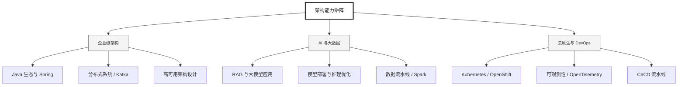

  <h1>你好，我是 Ellen Liu 👋</h1>
  

    <a href="README.md">English</a> | 
    <b>简体中文</b>
  

## 🧠 技术栈与核心能力

智能化企业系统建设路线图，涵盖全栈人工智能工程、云基础设施架构及模型部署等核心技术领域。

```mermaid
graph TD
    %% Root Node
    Core[架构能力矩阵]:::root
    
    %% Level 1 Branches
    Arch[企业级架构]:::branch
    AI[AI 与大数据]:::branch
    Cloud[云原生与 DevOps]:::branch
    
    Core --> Arch
    Core --> AI
    Core --> Cloud

    %% Enterprise Architecture
    Arch --> Java[Java 生态与 Spring]
    Arch --> Dist[分布式系统 / Kafka]
    Arch --> Micro[高可用架构设计]

    %% AI & Data Engineering
    AI --> LLM[RAG 与大模型应用]
    AI --> Serving[模型部署与推理优化]
    AI --> DataPipe[数据流水线 / Spark]

    %% Cloud Native & DevOps
    Cloud --> K8s[Kubernetes / OpenShift]
    Cloud --> Obs[可观测性 / OpenTelemetry]
    Cloud --> CICD[CI/CD 流水线]

    %% Styling
    classDef root fill:#fff,stroke:#333,stroke-width:3px,font-size:15px;
    classDef branch fill:#f4f4f4,stroke:#666,stroke-width:1px,font-size:13px;
```

## 🚀 Highlighted 工作

- **开源 AI 项目**: [基于 BERT 的声明检测模型](https://huggingface.co/XiaojingEllen/bert-finetuned-claim-detection) (Apache-2.0)
  - *已被哥伦比亚大学 (UBC) 研究项目引用。*
  - *手写 Transformer 核心代码，以验证理论与工程的一致性。*
- **金融基础设施**: 从 0 到 1 构建数字银行支付中间件及智能保险理赔系统。

## 📑 每日论文速递 (ArXiv)
<!-- DAILY_ARXIV_SUMMARY_START -->
**更新日期: 2026-03-11**

### 1. [智能体关键训练](http://arxiv.org/abs/2603.08706v1)
- **摘要**: 训练大型语言模型作为自主智能体通常从模仿学习开始，但这种方法仅教会智能体"如何行动"而不理解"为何如此"：智能体从未将成功行动与次优替代方案进行对比，因而缺乏对行动质量的认知。近期研究尝试通过引入专家行动与替代行动对比产生的自我反思监督来解决这一问题。然而，这种训练范式本质上仍是模仿学习：模型只是在模仿预先构建的反思文本，而非学习自主推理。我们提出智能体批判性训练（ACT），这是一种强化学习范式，通过训练智能体在替代行动中识别更优选择来解决问题。通过奖励模型判断的正确性，ACT驱动模型自主形成对行动质量的推理能力，产生真正的自我反思而非简单模仿。在三个具有挑战性的智能体基准测试中，ACT与不同后训练方法结合时均能持续提升智能体性能，相比模仿学习平均提升5.07分，相比强化学习平均提升4.62分。与通过知识蒸馏注入反思能力的方法相比，ACT也展现出明显优势，平均提升达2.42分。此外，ACT在智能体基准测试中展现出强大的分布外泛化能力，并在未使用任何推理专项训练数据的情况下，提升了通用推理基准测试的性能，凸显了我们方法的价值。这些结果表明，ACT是开发更具反思性和能力的大型语言模型智能体的可行路径。

### 2. [无监督RLVR能将LLM训练扩展到何种程度？](http://arxiv.org/abs/2603.08660v1)
- **摘要**: 无监督强化学习与可验证奖励机制（URLVR）通过无需真实标签即可生成奖励的方式，为突破大语言模型训练的监督瓶颈提供了可能。近期研究利用模型内在信号已展现出初步成效，但其潜力与局限尚不明确。本文重新审视URLVR方法，从分类体系、理论框架到大规模实验进行全面分析。我们首先依据奖励来源将URLVR方法划分为内在型与外部型，进而建立统一理论框架，揭示所有内在型方法本质上都趋向于强化模型的初始分布。当初始置信度与正确性一致时，这种强化机制能够成功；但当二者错位时，则会导致灾难性失败。通过系统性实验，我们发现内在奖励在不同方法中均呈现先升后降的规律，其崩溃时机由模型先验决定，而非工程选择。尽管存在扩展性局限，但内在奖励在小数据集测试时训练中仍具价值。我们提出"模型崩溃步数"作为衡量模型先验的指标，为强化学习可训练性提供实践依据。最后，我们探索了基于计算不对称性的外部奖励验证方法，初步证据表明这类方法可能突破置信度-正确性的天花板。本研究划定了内在型URLVR的能力边界，同时为探索可扩展替代方案指明了方向。

### 3. [OfficeQA Pro：面向端到端基础推理的企业级基准测试](http://arxiv.org/abs/2603.08655v1)
- **摘要**: 我们推出OfficeQA Pro基准测试，旨在评估AI代理在大型异构文档库上进行基于文档的多文档推理能力。该文档库包含近百年间的美国财政部公报，共计89,000页文档与超过2,600万个数值。OfficeQA Pro包含133个问题，这些问题要求对非结构化文本和表格数据进行精确的文档解析、检索与分析推理。前沿大语言模型（包括Claude Opus 4.6、GPT-5.4和Gemini 3.1 Pro Preview）在仅依赖参数化知识时，于OfficeQA Pro上的准确率不足5%；即使额外开放网络检索权限，准确率仍低于12%。当直接提供完整文档库时，前沿模型对超过半数问题仍表现不佳，平均得分仅为34.1%。我们发现，若为模型提供由Databricks的ai_parse_document生成的结构化文档表征，各类代理的平均相对性能可提升16.1%。我们通过额外消融实验研究了模型选择、表格表征方式、检索策略及测试时扩展对性能的影响。尽管已有这些改进，要使AI代理在企业级文档推理任务中达到可靠水平，仍存在显著的提升空间。

<!-- DAILY_ARXIV_SUMMARY_END -->

## 🌐 保持联系

  
<i>期待与您探讨 AI 基础设施的未来！</i>

