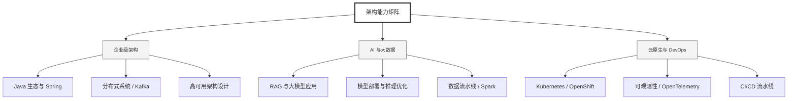

  <h1>你好，我是 Ellen Liu 👋</h1>
  

    <a href="README.md">English</a> | 
    <b>简体中文</b>
  

## 🧠 技术栈与核心能力

智能化企业系统建设路线图，涵盖全栈人工智能工程、云基础设施架构及模型部署等核心技术领域。

```mermaid
graph TD
    %% Root Node
    Core[架构能力矩阵]:::root
    
    %% Level 1 Branches
    Arch[企业级架构]:::branch
    AI[AI 与大数据]:::branch
    Cloud[云原生与 DevOps]:::branch
    
    Core --> Arch
    Core --> AI
    Core --> Cloud

    %% Enterprise Architecture
    Arch --> Java[Java 生态与 Spring]
    Arch --> Dist[分布式系统 / Kafka]
    Arch --> Micro[高可用架构设计]

    %% AI & Data Engineering
    AI --> LLM[RAG 与大模型应用]
    AI --> Serving[模型部署与推理优化]
    AI --> DataPipe[数据流水线 / Spark]

    %% Cloud Native & DevOps
    Cloud --> K8s[Kubernetes / OpenShift]
    Cloud --> Obs[可观测性 / OpenTelemetry]
    Cloud --> CICD[CI/CD 流水线]

    %% Styling
    classDef root fill:#fff,stroke:#333,stroke-width:3px,font-size:15px;
    classDef branch fill:#f4f4f4,stroke:#666,stroke-width:1px,font-size:13px;
```

## 🚀 Highlighted 工作

- **开源 AI 项目**: [基于 BERT 的声明检测模型](https://huggingface.co/XiaojingEllen/bert-finetuned-claim-detection) (Apache-2.0)
  - *已被哥伦比亚大学 (UBC) 研究项目引用。*
  - *手写 Transformer 核心代码，以验证理论与工程的一致性。*
- **金融基础设施**: 从 0 到 1 构建数字银行支付中间件及智能保险理赔系统。

## 📑 每日论文速递 (ArXiv)
<!-- DAILY_ARXIV_SUMMARY_START -->
**更新日期: 2026-07-20**

### 1. [理解从预训练到后训练的推理过程](http://arxiv.org/abs/2607.16097v1)
- **摘要**: 强化学习（RL）已成为提升大语言模型（LLMs）在复杂推理任务上表现的核心技术，然而RL后训练的研究大多独立于其前置的预训练阶段。由此引发两个基本问题尚未解决：（1）预训练选择（模型规模、数据）如何影响RL计算投入的回报率；（2）RL究竟对模型产生了何种影响？在标准LLM场景中研究这些问题存在困难：预训练语料库庞大且不可控，难以区分行为源于预训练还是RL，且跨两阶段的系统性计算量扫描成本过高。为应对这些挑战，我们以国际象棋作为受控实验平台，研究从预训练到后训练全流程中的推理机制。遵循标准LLM训练流程：在人类棋谱数据上预训练5M至1B参数的语言模型，对合成推理轨迹进行监督微调（SFT），并在可验证奖励机制下对棋局谜题运行RL。通过该框架发现：给定RL计算量下的后RL性能可由预训练损失准确预测，且RL奖励曲线的斜率随预训练token数量近似线性提升。除规模效应外，RL并非简单强化SFT策略：在简单谜题中，它放大了SFT策略已偏好的正确走法；而在困难谜题中，它揭示了SFT策略中几乎不存在的正确走法。我们进一步验证发现，在数学领域文本上训练的1B语言模型同样呈现相同预测模式：预训练更充分的检查点在RL后达到更高性能，且RL优化速度更快。综上，我们提供了预训练与RL接口的量化描述，以及研究从预训练到后训练全流程推理机制的可控实验平台。

### 2. [前沿语言模型在复制方面存在困难：文本在二维视角下更易理解](http://arxiv.org/abs/2607.16072v1)
- **摘要**: 尽管大型语言模型（LLMs）能在数秒内解决复杂的推理问题，但我们发现，即便是最先进的模型也无法完成一项更简单的操作：精确复制一个完全处于其上下文窗口内的输入字符串。我们将这一失败归因于Transformer架构中的位置编码，其归纳偏置倾向于通过匹配局部上下文的捷径进行复制，而非精确定位对应的输入位置。为解决此问题，我们提出2D-RoPE方法，将文本组织为二维网格而非一维序列，并为每个词元分配行ID和列ID。在此视角下，复制操作简化为在固定列偏移处检索输入词元，使任务更易学习。在合成复制实验中，采用2D-RoPE的浅层Transformer能在远超训练时输入长度的数百倍文本上实现完美复制，而标准位置编码则表现不佳。我们进一步证明，在DCLM大规模预训练中（模型参数规模达1.4B），2D-RoPE语言模型在复制任务上的优势始终成立。总体而言，我们的结果表明，将文本视为二维结构有助于语言建模，并期待未来研究能进一步探索二维位置编码的潜力。

### 3. [前沿人工智能在各商业学科中的表现：基于案例的知识工作与分析推理基准测试](http://arxiv.org/abs/2607.16057v1)
- **摘要**: 大型语言模型（LLMs）正以基准测试分数所反映的速度快速进步，然而这些AI基准测试主要评估的是事实回忆、窄域问答、数学问题求解、编程及智能体工具使用等能力。当前对AI在知识型分析工作（即白领专业人员日常从事的工作）中的进展测量仍显不足，这类工作包括综合复杂信息、在不确定性和信息不完整情况下做出判断、在多利益相关方场景中运用战略与对抗性思维、权衡利弊，以及产出具有说服力的结构化分析。对于这类工作中难以定义成功标准的主观性环节，这种测量缺口更为显著。顶级商学院采用的"案例教学法"为解决这一测量缺口提供了天然基础。我们据此构建了BusinessCaseBench基准测试，涵盖来自18个学科商业案例的数百道问题，每道题均配有基于专家编写的教学案例解决方案的评分标准。在BusinessCaseBench上，前沿AI模型已能根据教学评分标准获得高分，且同一模型家族的能力在两年内显著提升。这些结果有力证明：AI在这类工作上的表现已达到较高水平且正在快速进步，这对采用案例教学法培养本科生和MBA学生分析推理能力的商学院，以及历史上依赖此类技能开展初级专业岗位工作的领域具有重要启示。

<!-- DAILY_ARXIV_SUMMARY_END -->

## 🌐 保持联系

  
<i>期待与您探讨 AI 基础设施的未来！</i>

