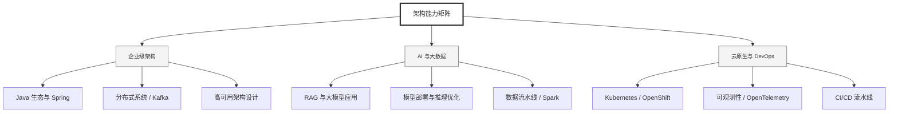

  <h1>你好，我是 Ellen Liu 👋</h1>
  

    <a href="README.md">English</a> | 
    <b>简体中文</b>
  

## 🧠 技术栈与核心能力

智能化企业系统建设路线图，涵盖全栈人工智能工程、云基础设施架构及模型部署等核心技术领域。

```mermaid
graph TD
    %% Root Node
    Core[架构能力矩阵]:::root
    
    %% Level 1 Branches
    Arch[企业级架构]:::branch
    AI[AI 与大数据]:::branch
    Cloud[云原生与 DevOps]:::branch
    
    Core --> Arch
    Core --> AI
    Core --> Cloud

    %% Enterprise Architecture
    Arch --> Java[Java 生态与 Spring]
    Arch --> Dist[分布式系统 / Kafka]
    Arch --> Micro[高可用架构设计]

    %% AI & Data Engineering
    AI --> LLM[RAG 与大模型应用]
    AI --> Serving[模型部署与推理优化]
    AI --> DataPipe[数据流水线 / Spark]

    %% Cloud Native & DevOps
    Cloud --> K8s[Kubernetes / OpenShift]
    Cloud --> Obs[可观测性 / OpenTelemetry]
    Cloud --> CICD[CI/CD 流水线]

    %% Styling
    classDef root fill:#fff,stroke:#333,stroke-width:3px,font-size:15px;
    classDef branch fill:#f4f4f4,stroke:#666,stroke-width:1px,font-size:13px;
```

## 🚀 Highlighted 工作

- **开源 AI 项目**: [基于 BERT 的声明检测模型](https://huggingface.co/XiaojingEllen/bert-finetuned-claim-detection) (Apache-2.0)
  - *已被哥伦比亚大学 (UBC) 研究项目引用。*
  - *手写 Transformer 核心代码，以验证理论与工程的一致性。*
- **金融基础设施**: 从 0 到 1 构建数字银行支付中间件及智能保险理赔系统。

## 📑 每日论文速递 (ArXiv)
<!-- DAILY_ARXIV_SUMMARY_START -->
**更新日期: 2026-04-15**

### 1. [跨多智能体轨迹的安全违规检测](http://arxiv.org/abs/2604.11806v1)
- **摘要**: 为识别安全违规行为，审计人员通常需要在大规模智能体轨迹集中进行搜索。这种搜索极具挑战性，因为故障往往具有罕见性、复杂性，有时甚至被对抗性隐藏——仅当同时分析多条轨迹时才能被发现。这些挑战广泛存在于滥用攻击、隐蔽破坏、奖励机制破解及提示注入等多种场景中。现有方法在此类场景中表现不佳，原因包括：单轨迹判定器会遗漏跨轨迹才显现的故障；简单的智能体审计难以扩展至大规模轨迹集；固定监测器对未预见的异常行为缺乏适应能力。我们提出的Meerkat系统通过结合聚类分析与智能体搜索，能够基于自然语言描述的规则发现违规行为。该系统通过结构化搜索和对潜在风险区域的自适应探查，无需依赖初始场景设定、固定工作流程或穷举枚举，即可定位稀疏分布的故障案例。在滥用攻击、目标偏离及任务规则规避等场景的测试中，Meerkat较基线监测器显著提升了安全违规检测能力：在顶级智能体基准测试中发现普遍存在的开发者作弊行为，并在CyBench测试中发现的奖励机制破解案例数量达到以往审计结果的近4倍。

### 2. [心理概念神经元：神经控制能否在大型语言模型中偏置探测并影响生成偏移？](http://arxiv.org/abs/2604.11802v1)
- **摘要**: 利用大五人格等心理学构念，大语言模型能够模拟特定人格剖面并预测用户人格特征。尽管大语言模型可以表现出与这些构念一致的行为，但其内部表征的具体位置、形成机制以及与行为输出的关联仍不明确。为填补这一空白，本研究聚焦问卷操作化的大五人格概念，分析其内部表征的形成与定位，并通过干预实验探究这些表征与行为输出的关系。

实验中，我们首先采用探针技术检测大五人格信息在模型深度中的涌现位置。随后识别对各个大五概念具有选择性的神经元，测试增强或抑制其激活是否能使潜在表征和标签生成朝预期方向偏移。研究发现：大五人格信息在模型浅层即可快速解码，并持续可检测至最终层；概念选择性神经元主要集中在中层，且跨领域重叠有限；对这些神经元的干预能持续将探针读数导向目标概念，部分概念的目标成功率超过0.8，表明模型对大五人格特质的内在分离具有因果可操控性。

在标签生成层面，相同干预虽常使生成标签分布朝预期方向偏移，但效果较弱、存在概念依赖性，且常伴随跨特质溢出效应。这表明即使对大量概念选择性神经元实施干预，仍难以实现对生成标签的等效控制。总体而言，我们的研究揭示了大语言模型中表征控制与行为控制之间存在差距。

### 3. [CLSGen：一种用于联合概率分类与语言化解释的双头微调框架](http://arxiv.org/abs/2604.11801v1)
- **摘要**: 随着大语言模型（LLM）的快速发展，将其应用于解决复杂挑战性问题的兴趣日益增长。现代大语言模型能够处理长上下文并生成语言化解释，在应对现实世界应用场景中展现出巨大潜力。然而，在将大语言模型部署于实际决策时，其无法提供可靠量化概率的问题成为关键障碍。虽然通过传统判别式目标（类似于仅编码器模型）对LLM进行任务特定微调可获得概率估计，但这往往导致灾难性遗忘和语言能力崩溃。其结果是模型丧失了解释生成能力，严重损害了可解释性与可用性。

为应对这一挑战，我们提出了CLSGen——一个专为二元分类任务设计的新型大语言模型微调框架。该框架包含全新的模型架构、训练方法和数据构建策略，能够在保持模型固有解释生成能力的同时实现稳健的概率估计。在多个基准数据集上的实验结果表明，经CLSGen微调的模型在分类指标（AUROC和F1分数）上均优于现有基线方法。在解释性方面，实验结果显示出预测标签与生成理由之间的高度一致性，同时保持了出色的可读性。

<!-- DAILY_ARXIV_SUMMARY_END -->

## 🌐 保持联系

  
<i>期待与您探讨 AI 基础设施的未来！</i>

