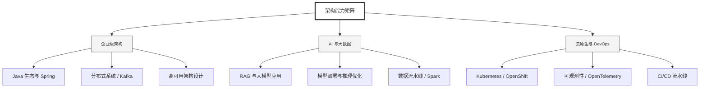

  <h1>你好，我是 Ellen Liu 👋</h1>
  

    <a href="README.md">English</a> | 
    <b>简体中文</b>
  

## 🧠 技术栈与核心能力

智能化企业系统建设路线图，涵盖全栈人工智能工程、云基础设施架构及模型部署等核心技术领域。

```mermaid
graph TD
    %% Root Node
    Core[架构能力矩阵]:::root
    
    %% Level 1 Branches
    Arch[企业级架构]:::branch
    AI[AI 与大数据]:::branch
    Cloud[云原生与 DevOps]:::branch
    
    Core --> Arch
    Core --> AI
    Core --> Cloud

    %% Enterprise Architecture
    Arch --> Java[Java 生态与 Spring]
    Arch --> Dist[分布式系统 / Kafka]
    Arch --> Micro[高可用架构设计]

    %% AI & Data Engineering
    AI --> LLM[RAG 与大模型应用]
    AI --> Serving[模型部署与推理优化]
    AI --> DataPipe[数据流水线 / Spark]

    %% Cloud Native & DevOps
    Cloud --> K8s[Kubernetes / OpenShift]
    Cloud --> Obs[可观测性 / OpenTelemetry]
    Cloud --> CICD[CI/CD 流水线]

    %% Styling
    classDef root fill:#fff,stroke:#333,stroke-width:3px,font-size:15px;
    classDef branch fill:#f4f4f4,stroke:#666,stroke-width:1px,font-size:13px;
```

## 🚀 Highlighted 工作

- **开源 AI 项目**: [基于 BERT 的声明检测模型](https://huggingface.co/XiaojingEllen/bert-finetuned-claim-detection) (Apache-2.0)
  - *已被哥伦比亚大学 (UBC) 研究项目引用。*
  - *手写 Transformer 核心代码，以验证理论与工程的一致性。*
- **金融基础设施**: 从 0 到 1 构建数字银行支付中间件及智能保险理赔系统。

## 📑 每日论文速递 (ArXiv)
<!-- DAILY_ARXIV_SUMMARY_START -->
**更新日期: 2026-05-13**

### 1. [面向智能体强化学习的动态技能生命周期管理](http://arxiv.org/abs/2605.10923v1)
- **摘要**: 大型语言模型智能体日益依赖外部技能来解决复杂任务，其中技能作为模块化单元，扩展了其超越参数化记忆本身的能力。现有方法假设外部技能要么作为持久性指导积累，要么内化到策略中，最终实现零技能推理。我们认为这一假设过于严格——由于参数容量有限且不同技能的边际贡献不均衡，最优活跃技能集呈现非单调性，且依赖于具体任务与阶段。为此，我们提出SLIM框架，即面向智能体强化学习的动态技能生命周期管理。该框架将活跃外部技能集视为动态优化变量，与策略学习联合更新。具体而言，SLIM通过留一技能验证法评估每个活跃技能的边际外部贡献，随后执行三类生命周期操作：保留高价值技能、在充分暴露后淘汰贡献可忽略的技能、以及当持续失败暴露能力覆盖缺失时扩展技能库。实验表明，在ALFWorld和SearchQA基准测试中，SLIM平均超越最优基线7.1个百分点。结果进一步揭示：策略学习与外部技能保留并非互斥——部分技能被策略吸收，而其他技能持续提供外部价值，这支持了SLIM作为基于技能的智能体强化学习更通用范式的定位。

### 2. [WildClawBench：面向真实世界长周期智能体评估的基准测试](http://arxiv.org/abs/2605.10912v1)
- **摘要**: 大型语言模型与视觉语言模型正越来越多地通过命令行界面（CLI）工具驱动代理，代表用户执行操作。然而，现有的大多数代理基准测试仍依赖合成沙箱、短周期任务、模拟服务API及最终答案校验，未能验证代理能否在真实部署环境中完成长周期实际工作。本文提出WildClawBench——一个包含60个由人类编写的双语多模态任务的原生运行时基准测试，涵盖六大主题类别。每个任务平均耗时约8分钟（挂钟时间），需调用超过20次工具，并在可复现的Docker容器中运行，该容器搭载真实CLI代理工具（OpenClaw、Claude Code、Codex或Hermes Agent），可访问真实工具而非模拟服务。评分采用混合机制，结合确定性规则校验、环境状态副作用审计，以及用于语义验证的LLM/VLM评判器。在19个前沿模型中，表现最佳的Claude Opus 4.7在OpenClaw框架下整体准确率仅达62.2%，其余模型均低于60%，而仅更换代理框架即可使同一模型性能波动高达18个百分点。这些结果表明，对于当前前沿模型而言，长周期原生运行时代理评估仍远未解决。我们已开源任务集、代码及容器化工具，以支持可复现评估。

### 3. [RubricEM：基于准则引导策略分解的元强化学习方法——超越可验证奖励](http://arxiv.org/abs/2605.10899v1)
- **摘要**: 训练深度研究型智能体——即能够规划、搜索、评估证据并综合生成长篇报告的系统——将强化学习推向了可验证奖励机制之外的领域。这类系统的输出缺乏标准答案，其运行轨迹涉及大量工具增强型决策，而标准的后训练方法几乎无法将过往尝试转化为可复用的经验。在本研究中，我们认为评估准则不应仅作为最终答案的评判工具，而应成为构建策略执行、裁判反馈与智能体记忆的共享接口。基于这一观点，我们提出RubricEM——一种基于评估准则引导的强化学习框架，该框架将分阶段策略分解与基于反思的元策略进化相结合。RubricEM首先通过让规划、证据收集、审查与综合环节依赖自生成的评估准则，使研究轨迹具备阶段感知能力。随后采用阶段结构化GRPO进行信用分配，利用分阶段评估准则判断为长周期优化提供更密集的语义反馈。同时，RubricEM训练共享骨干网络的反思元策略，将经过评判的轨迹提炼为可复用的、基于评估准则的指导，供后续尝试使用。由此产生的RubricEM-8B在四项长篇研究基准测试中均展现出强劲性能，不仅优于同类开源模型，更接近专有深度研究系统的水平。除最终性能外，我们还通过深入分析揭示了RubricEM的关键构成要素。

<!-- DAILY_ARXIV_SUMMARY_END -->

## 🌐 保持联系

  
<i>期待与您探讨 AI 基础设施的未来！</i>

