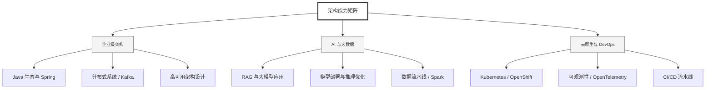

  <h1>你好，我是 Ellen Liu 👋</h1>
  

    <a href="README.md">English</a> | 
    <b>简体中文</b>
  

## 🧠 技术栈与核心能力

智能化企业系统建设路线图，涵盖全栈人工智能工程、云基础设施架构及模型部署等核心技术领域。

```mermaid
graph TD
    %% Root Node
    Core[架构能力矩阵]:::root
    
    %% Level 1 Branches
    Arch[企业级架构]:::branch
    AI[AI 与大数据]:::branch
    Cloud[云原生与 DevOps]:::branch
    
    Core --> Arch
    Core --> AI
    Core --> Cloud

    %% Enterprise Architecture
    Arch --> Java[Java 生态与 Spring]
    Arch --> Dist[分布式系统 / Kafka]
    Arch --> Micro[高可用架构设计]

    %% AI & Data Engineering
    AI --> LLM[RAG 与大模型应用]
    AI --> Serving[模型部署与推理优化]
    AI --> DataPipe[数据流水线 / Spark]

    %% Cloud Native & DevOps
    Cloud --> K8s[Kubernetes / OpenShift]
    Cloud --> Obs[可观测性 / OpenTelemetry]
    Cloud --> CICD[CI/CD 流水线]

    %% Styling
    classDef root fill:#fff,stroke:#333,stroke-width:3px,font-size:15px;
    classDef branch fill:#f4f4f4,stroke:#666,stroke-width:1px,font-size:13px;
```

## 🚀 Highlighted 工作

- **开源 AI 项目**: [基于 BERT 的声明检测模型](https://huggingface.co/XiaojingEllen/bert-finetuned-claim-detection) (Apache-2.0)
  - *已被哥伦比亚大学 (UBC) 研究项目引用。*
  - *手写 Transformer 核心代码，以验证理论与工程的一致性。*
- **金融基础设施**: 从 0 到 1 构建数字银行支付中间件及智能保险理赔系统。

## 📑 每日论文速递 (ArXiv)
<!-- DAILY_ARXIV_SUMMARY_START -->
**更新日期: 2026-07-14**

### 1. [LOGOS：一种与人类共同进化的人工智能体团队生命逻辑](http://arxiv.org/abs/2607.10878v1)
- **摘要**: AI代理正从答案引擎演变为持续运作的团队，它们能使用工具、分配任务、从经验中学习，并修改塑造自身未来行为的工件。部署的核心问题已不再是代理能做什么，而是谁控制着它们被允许成为什么。我们提出logos——一个用于自我进化与治理的可插拔层，它强化而非替代现有的多代理框架。logos将异构多模态输入（包括文档、图像、音频、表格、数据库、API及人类指令）编译为版本化的代理包，其中包含代理、工具、知识、测试、权限与策略。运行期间，它将代理活动转化为可移植、可审计的事件轨迹，并在各框架与后端间执行故障封闭验证。每个习得的提示词、记忆、技能、工具、角色或工作流，在获得保留执行证据、人类控制策略及明确授权批准前，始终被视为不可信的候选版本。该架构实现了"可验证的人机闭环工程"：代理可行动、提问、学习并提议改进，而人类则能在不中断持续运行的情况下，引导目标、权限、审批及不可逆操作。logos为可问责的自动化提供了动态逻辑。代理能以机器速度进化，但唯有证据与人类权威方能闭合循环。

### 2. [量化基于大语言模型的公共话语立场分析中的不稳定来源](http://arxiv.org/abs/2607.10846v1)
- **摘要**: 计算社会科学日益依赖自动化预处理流程——说话人分离、ASR转录文本清洗、句子分割——将原始媒体转化为可分析文本。当这些流程对同一输入产生不同输出时，可能引发两种不同的不稳定性来源：预处理流程本身（说话人分离方法、分割规则）与下游测量工具（大语言模型标注 vs. 关键词词典）。我们利用来自五个领域41位公众人物的256个YouTube访谈，比较了两种说话人分离流程和两种测量方法，均针对情感效价与认知情态之间的耦合关系展开研究。研究发现：(1) 预处理流程敏感性集中在视频样本量有限的说话人（N≤5）中；对于四个最佳采样说话人（N≥16），流程引起的r(neg, emph)平均绝对变化仅为0.13；(2) 跨方法分歧更大且更具系统性——即使在同一预处理流程内，大语言模型与关键词词典方法对多个充分采样说话人的耦合方向判定相反；(3) 聚合效价比例高度稳定（|Δp(neg)|<6个百分点），不受流程或方法影响，掩盖了两种不稳定性来源。本文贡献在于建立区分流程效应与测量效应的诊断框架：研究访谈数据中跨维度关系的研究者应验证其结论对两种变异来源的稳健性，尤其需关注测量方法的选择。

### 3. [路由、通信与推理：面向高效多智能体推理的门控路由与自适应深度机制](http://arxiv.org/abs/2607.10836v1)
- **摘要**: 多智能体集成在未解决三个基本问题的情况下，成倍增加了活跃参数和推理成本：应咨询哪些智能体、查询应深入智能体层级结构的程度，以及智能体间通信何时值得其成本。我们提出GRADE（高效推理的门控路由与自适应深度），这是一个分层多智能体系统，其中四个轻量级学习门控共同控制智能体选择、层级深度、智能体间通信和分支剪枝。训练采用CoGRPO（协作式群体相对策略优化），这是一种新颖的无评论家方法，将GRPO适配到多智能体层级结构，并为参与轨迹生成的每个门控和智能体分配共享优势信号。智能体模型来自可热插拔的专家注册表；每个智能体的校准映射允许在推理时无需重新训练即可替换专家。在约170亿平均活跃参数下，GRADE在GSM8K、MMLUPro和GPQA上超越所有基线，在MMLUPro上以一半活跃计算量比最强基线高出4.8个百分点。在模型深度占主导地位的AIME-2025上，GRADE仍与现有框架保持竞争力。消融实验表明，层级结构和掩码交叉注意力是准确率的最大贡献因素，并证明每个智能体的校准对于安全热插拔是必要的。

<!-- DAILY_ARXIV_SUMMARY_END -->

## 🌐 保持联系

  
<i>期待与您探讨 AI 基础设施的未来！</i>

