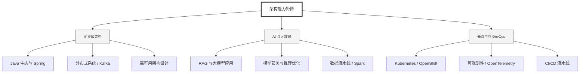

  <h1>你好，我是 Ellen Liu 👋</h1>
  

    <a href="README.md">English</a> | 
    <b>简体中文</b>
  

## 🧠 技术栈与核心能力

智能化企业系统建设路线图，涵盖全栈人工智能工程、云基础设施架构及模型部署等核心技术领域。

```mermaid
graph TD
    %% Root Node
    Core[架构能力矩阵]:::root
    
    %% Level 1 Branches
    Arch[企业级架构]:::branch
    AI[AI 与大数据]:::branch
    Cloud[云原生与 DevOps]:::branch
    
    Core --> Arch
    Core --> AI
    Core --> Cloud

    %% Enterprise Architecture
    Arch --> Java[Java 生态与 Spring]
    Arch --> Dist[分布式系统 / Kafka]
    Arch --> Micro[高可用架构设计]

    %% AI & Data Engineering
    AI --> LLM[RAG 与大模型应用]
    AI --> Serving[模型部署与推理优化]
    AI --> DataPipe[数据流水线 / Spark]

    %% Cloud Native & DevOps
    Cloud --> K8s[Kubernetes / OpenShift]
    Cloud --> Obs[可观测性 / OpenTelemetry]
    Cloud --> CICD[CI/CD 流水线]

    %% Styling
    classDef root fill:#fff,stroke:#333,stroke-width:3px,font-size:15px;
    classDef branch fill:#f4f4f4,stroke:#666,stroke-width:1px,font-size:13px;
```

## 🚀 Highlighted 工作

- **开源 AI 项目**: [基于 BERT 的声明检测模型](https://huggingface.co/XiaojingEllen/bert-finetuned-claim-detection) (Apache-2.0)
  - *已被哥伦比亚大学 (UBC) 研究项目引用。*
  - *手写 Transformer 核心代码，以验证理论与工程的一致性。*
- **金融基础设施**: 从 0 到 1 构建数字银行支付中间件及智能保险理赔系统。

## 📑 每日论文速递 (ArXiv)
<!-- DAILY_ARXIV_SUMMARY_START -->
**更新日期: 2026-06-04**

### 1. [Skill-RM：通过智能体技能统一异构评估标准](http://arxiv.org/abs/2606.03980v1)
- **摘要**: 奖励模型（RMs）为大语言模型的后训练阶段提供关键反馈信号，尤其在强化微调（RFT）和强化学习（RL）流程中作用显著。然而，当前奖励评估依赖规则验证器、真实参考、程序化检查清单及复杂评分标准等异构准则，尚未有统一机制整合所有类型的证据。为此，我们提出技能奖励模型（Skill-RM）——一个将奖励建模重构为可复用"奖励评估技能"执行的统一框架。通过将奖励计算视为结构化智能体任务，Skill-RM提供一致接口来编排异构资源，能根据每个输入的具体需求动态选择并聚合证据。该方法使奖励模型突破静态评估局限，确保跨不同任务的一致性与透明度。在奖励基准测试及下游应用（包括最佳N选与强化学习）中的大量实验表明，Skill-RM始终优于传统评判基线。研究结果表明，Skill-RM不仅为奖励建模提供统一解决方案，更通过证据的战略性动态编排实现了卓越性能。代码已开源：https://github.com/Qwen-Applications/Skill-RM

### 2. [量化大型推理模型中的忠实置信度表达](http://arxiv.org/abs/2606.03969v1)
- **摘要**: 可靠的置信度沟通对于大语言模型（LLMs）的可信度至关重要，然而忠实校准（FC）——即模型内在置信度与（语言上）表达出的置信度之间的一致性——始终是一个持续存在的失效模式。这一挑战对大型推理模型（LRMs）尤为关键，因为其扩展的推理轨迹常被用户解读为深思熟虑、能力与自信的体现。尽管FC的重要性与LRMs的广泛应用已毋庸置疑，但LRMs能否忠实地表达自身置信度仍缺乏深入理解。此外，现有FC评估范式难以有效适用于LRMs生成的长链式思维输出——这类输出往往缺乏清晰的步骤边界、步骤结构不一致，且在整个推理轨迹中编码了复杂的条件依赖关系，从而增加了内在置信度估计的复杂性。为解决这一难题，我们提出了一种系统性量化LRMs忠实校准程度的新框架。该框架基于词元概率、隐藏状态和采样响应一致性，从三种内部不确定性来源出发，分析语言表达中的决断性特征。同时，我们设计了一种前缀条件采样方法，以控制不同推理轨迹间的条件差异与结构变异。通过对主流模型、数据集和提示词的多样化测试，我们发现忠实置信度表达对LRMs而言是一项重大挑战。推理行为并不会自动转化为FC的提升，且针对非推理模型的提示干预措施在推理场景中无法改善忠实性。不同置信度估计器对同一推理轨迹的评估结果存在显著差异，揭示了既有评估方法的脆弱性。综合而言，本研究将FC确立为LRMs的独立可靠性与对齐目标——特别是在此类系统日益部署于高风险场景的背景下。

### 3. [AlignAtt4LLM：面向IWSLT 2026同声传译任务的解码器专用大语言模型快速对齐注意力机制](http://arxiv.org/abs/2606.03967v1)
- **摘要**: 我们提出AlignAtt4LLM，这是面向英译德、英译意和英译中的IWSLT 2026同声传译系统。该系统采用同步级联架构：Qwen3-ASR通过强制对齐生成增量更新的源语言转录文本，而Gemma-4 E4B-it则在机器翻译端基于AlignAtt策略处理该前缀。据我们所知，这是AlignAtt首次应用于仅解码器架构的大语言模型——此前AlignAtt系统依赖的编码器-解码器交叉注意力机制在此类模型中并不存在。我们通过以下四项创新恢复了可行的策略：(1) 在提示词中显式标注源语言跨度；(2) 离线选取翻译专用的对齐注意力头；(3) 对草稿到源语言的注意力模块实施选择性qk快速重放；(4) 运行时查询/键值捕获机制，确保模型输出比特级一致性。在IWSLT 2026开发集上，AlignAtt4LLM针对欧洲目标语言（英译德、英译意）在约2秒的低延迟区间和低于4秒CU-LongYAAL的高延迟区间均优于提供的基线系统。英译中结果虽较复杂，但该方法不局限于Gemma-4模型：由于AlignAtt4LLM仅需确定性提示词布局、校准后的注意力头及查询/键值捕获机制，同一策略可重新应用于面向非欧洲目标语言的更强专用解码器型机器翻译骨干网络。

<!-- DAILY_ARXIV_SUMMARY_END -->

## 🌐 保持联系

  
<i>期待与您探讨 AI 基础设施的未来！</i>

