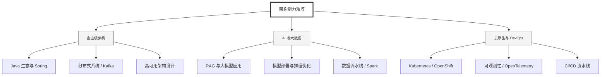

  <h1>你好，我是 Ellen Liu 👋</h1>
  

    <a href="README.md">English</a> | 
    <b>简体中文</b>
  

## 🧠 技术栈与核心能力

智能化企业系统建设路线图，涵盖全栈人工智能工程、云基础设施架构及模型部署等核心技术领域。

```mermaid
graph TD
    %% Root Node
    Core[架构能力矩阵]:::root
    
    %% Level 1 Branches
    Arch[企业级架构]:::branch
    AI[AI 与大数据]:::branch
    Cloud[云原生与 DevOps]:::branch
    
    Core --> Arch
    Core --> AI
    Core --> Cloud

    %% Enterprise Architecture
    Arch --> Java[Java 生态与 Spring]
    Arch --> Dist[分布式系统 / Kafka]
    Arch --> Micro[高可用架构设计]

    %% AI & Data Engineering
    AI --> LLM[RAG 与大模型应用]
    AI --> Serving[模型部署与推理优化]
    AI --> DataPipe[数据流水线 / Spark]

    %% Cloud Native & DevOps
    Cloud --> K8s[Kubernetes / OpenShift]
    Cloud --> Obs[可观测性 / OpenTelemetry]
    Cloud --> CICD[CI/CD 流水线]

    %% Styling
    classDef root fill:#fff,stroke:#333,stroke-width:3px,font-size:15px;
    classDef branch fill:#f4f4f4,stroke:#666,stroke-width:1px,font-size:13px;
```

## 🚀 Highlighted 工作

- **开源 AI 项目**: [基于 BERT 的声明检测模型](https://huggingface.co/XiaojingEllen/bert-finetuned-claim-detection) (Apache-2.0)
  - *已被哥伦比亚大学 (UBC) 研究项目引用。*
  - *手写 Transformer 核心代码，以验证理论与工程的一致性。*
- **金融基础设施**: 从 0 到 1 构建数字银行支付中间件及智能保险理赔系统。

## 📑 每日论文速递 (ArXiv)
<!-- DAILY_ARXIV_SUMMARY_START -->
**更新日期: 2026-04-28**

### 1. [AI代理如何花费你的资金？分析与预测代理编程任务中的代币消耗](http://arxiv.org/abs/2604.22750v1)
- **摘要**: AI智能体在复杂人类工作流程中的广泛应用，正推动大语言模型（LLM）令牌消耗量的快速增长。当智能体被部署到需要大量令牌的任务时，自然会产生三个问题：（1）AI智能体将令牌消耗在何处？（2）哪些模型的令牌效率更高？（3）智能体能否在任务执行前预测其令牌使用量？本文首次系统研究了编码任务中的令牌消耗模式。我们分析了八个前沿大语言模型在SWE-bench Verified基准测试中的运行轨迹，并评估了模型在任务执行前预测自身令牌成本的能力。研究发现：（1）智能体任务具有独特的昂贵性，其令牌消耗量比代码推理和代码对话高出1000倍，且输入令牌而非输出令牌主导了总体成本；（2）令牌使用量高度可变且具有内在随机性：同一任务的不同运行实例总令牌差异可达30倍，更高的令牌消耗量并未转化为更高准确率——准确率往往在中等成本时达到峰值，并在更高成本时趋于饱和；（3）不同模型的令牌效率差异显著：在相同任务中，Kimi-K2和Claude-Sonnet-4.5平均比GPT-5多消耗超过150万令牌；（4）人类专家评定的任务难度与实际令牌成本仅存在弱相关性，揭示了人类感知的复杂度与智能体实际计算投入之间的根本性差距；（5）前沿模型无法准确预测自身令牌使用量（弱至中等相关性，最高仅0.39），且系统性地低估了真实令牌成本。本研究为AI智能体的经济学提供了新见解，并可启发该领域的未来研究方向。

### 2. [针对全球多数民族群体的LLM生成叙事中的表征性危害](http://arxiv.org/abs/2604.22749v1)
- **摘要**: 大型语言模型（LLMs）正日益广泛应用于各类文本生成任务，从日常使用到高风险的企业和政府应用，包括对寻求庇护者进行模拟面谈。尽管许多研究强调了LLMs的新应用潜力，但这些模型也可能编码并延续对全球非主流群体的有害偏见。为更好地评估和缓解此类危害，需要更多研究来考察LLMs如何刻画不同个体。本研究聚焦于广泛采用的LLMs在回应开放式叙事生成提示时，如何呈现国籍身份。我们的发现表明，LLMs存在基于国籍的持续性表征危害，包括有害刻板印象、抹除现象以及对全球多数群体身份的单一维度刻画。少数族裔国籍身份在权力中性叙事中代表性不足，同时在从属角色刻画中被过度呈现——后者出现的可能性是主导角色刻画的五十倍以上。当输入提示中包含美国国籍线索（如"美国人"）时，危害程度会加剧。值得注意的是，我们发现这些危害无法通过谄媚效应（sycophancy）来解释，因为即使将提示中的美国国籍线索替换为非美国国籍身份，以美国为中心的偏见依然存在。基于研究结果，我们呼吁通过以全球多数群体视角为中心的方法论，进一步探索LLMs中的文化危害，并质疑不加批判地采用基于美国的LLMs对地球上大多数人群进行分类、监控和错误表征的做法。

### 3. [BERAG：基于贝叶斯集成检索增强生成的知识型视觉问答方法](http://arxiv.org/abs/2604.22678v1)
- **摘要**: 检索增强生成（RAG）问答任务中，常见做法是将文档拼接为单一上下文后输入语言模型生成答案。这种方法虽简单，却会模糊单个文档的贡献，导致归因困难，并加剧"中间迷失"效应——长上下文中相关信息被忽视。拼接策略还存在扩展性缺陷：计算成本随上下文长度呈二次增长，当上下文包含视觉数据（如视觉问答任务）时问题尤为严重。通过限制上下文长度缓解这些问题的尝试，反而会阻碍模型从深度检索带来的召回率提升中获益。为此，我们提出贝叶斯集成检索增强生成（BERAG）与贝叶斯集成微调（BEFT）框架，该框架使语言模型基于单个检索文档而非拼接上下文进行条件生成。BERAG将文档后验概率视为集成权重，在生成过程中通过贝叶斯法则逐词元更新。该方法支持概率重排序、并行内存利用及文档贡献的清晰归因，特别适用于大规模文档集合。我们在基于知识的视觉问答任务中评估BERAG与BEFT——这类任务要求模型对长且不完美的检索列表进行推理。实验结果表明，该方法在标准RAG基础上取得显著提升，包括在文档视觉问答和多模态"大海捞针"基准测试中的强劲表现。我们还证明BERAG能有效缓解"中间迷失"效应。文档后验概率可用于检测证据不足并触发拒答机制，而文档剪枝技术则使解码速度超越标准RAG。

<!-- DAILY_ARXIV_SUMMARY_END -->

## 🌐 保持联系

  
<i>期待与您探讨 AI 基础设施的未来！</i>

