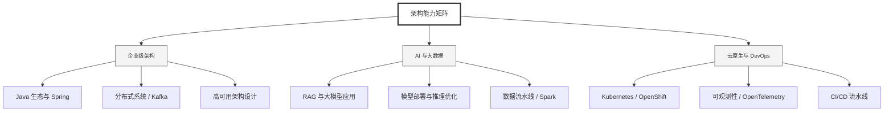

  <h1>你好，我是 Ellen Liu 👋</h1>
  

    <a href="README.md">English</a> | 
    <b>简体中文</b>
  

## 🧠 技术栈与核心能力

智能化企业系统建设路线图，涵盖全栈人工智能工程、云基础设施架构及模型部署等核心技术领域。

```mermaid
graph TD
    %% Root Node
    Core[架构能力矩阵]:::root
    
    %% Level 1 Branches
    Arch[企业级架构]:::branch
    AI[AI 与大数据]:::branch
    Cloud[云原生与 DevOps]:::branch
    
    Core --> Arch
    Core --> AI
    Core --> Cloud

    %% Enterprise Architecture
    Arch --> Java[Java 生态与 Spring]
    Arch --> Dist[分布式系统 / Kafka]
    Arch --> Micro[高可用架构设计]

    %% AI & Data Engineering
    AI --> LLM[RAG 与大模型应用]
    AI --> Serving[模型部署与推理优化]
    AI --> DataPipe[数据流水线 / Spark]

    %% Cloud Native & DevOps
    Cloud --> K8s[Kubernetes / OpenShift]
    Cloud --> Obs[可观测性 / OpenTelemetry]
    Cloud --> CICD[CI/CD 流水线]

    %% Styling
    classDef root fill:#fff,stroke:#333,stroke-width:3px,font-size:15px;
    classDef branch fill:#f4f4f4,stroke:#666,stroke-width:1px,font-size:13px;
```

## 🚀 Highlighted 工作

- **开源 AI 项目**: [基于 BERT 的声明检测模型](https://huggingface.co/XiaojingEllen/bert-finetuned-claim-detection) (Apache-2.0)
  - *已被哥伦比亚大学 (UBC) 研究项目引用。*
  - *手写 Transformer 核心代码，以验证理论与工程的一致性。*
- **金融基础设施**: 从 0 到 1 构建数字银行支付中间件及智能保险理赔系统。

## 📑 每日论文速递 (ArXiv)
<!-- DAILY_ARXIV_SUMMARY_START -->
**更新日期: 2026-06-10**

### 1. [SIGA：面向科学模拟的自演进编码智能体适配器](http://arxiv.org/abs/2606.09774v1)
- **摘要**: 先进的科学模拟器会暴露专门的输入语言，将模拟目标转化为可执行配置，但学习这些语言可能需要领域科学家花费数小时到数天的时间。我们将模拟器配置问题视为智能体-工具接口接地（agent-tool interface grounding）问题：一个现成的编码智能体需要哪些最少的模拟器特定适配才能操作真实的科学软件？我们的直觉是，编码智能体已经知道如何导航文件、编辑代码、运行命令和修复输出，但它们缺乏模拟器的可执行契约：其词汇表、结构约束、验证规则和终止条件。我们引入了SIGA（模拟器接口接地适配器），通过检索、程序记忆、轨迹内验证和验证强制终止来提供这一契约。我们主要在GEOS（一个用于地下科学领域的开源多物理场模拟器）上评估SIGA。SIGA能在约五分钟内生成完整的GEOS配置，TreeSim指标超过0.90，与花费约三小时的扩展预算人类专家相当，实现了约36倍的挂钟时间加速。在更难的保留测试集上，接地操作将TreeSim从0.720提升至0.789，相比裸智能体获得约10%的相对提升，并能将跨种子的标准差降低16倍。自我进化进一步改进了SIGA，通过从先前轨迹重写适配器内容，在GEOS保留测试集上取得了最高均值，并匹配或超越了最强的手工设计配置。向OpenFOAM和LAMMPS的迁移表明，主导机制因接口而异：当结构完整性成为瓶颈时，验证最为重要；而当领域正确性成为瓶颈时，记忆和检索最为重要。这些结果表明，轻量级、可自我改进的接地层可以将通用编码智能体转变为科学软件的实用操作者。

### 2. [iOSWorld：面向个人智能电话代理的基准测试](http://arxiv.org/abs/2606.09764v1)
- **摘要**: 一个实用的手机助手需要具备个性化智能。它应当能够基于设备上存储的用户身份、历史记录和偏好进行推理，而非仅仅在非个性化的沙盒环境中执行孤立指令。现有的移动端智能体基准测试缺乏这种个性化能力。为此，我们推出iOSWorld——首个基于持久化用户身份构建的交互式原生iOS模拟器基准测试，该身份横跨26个全新开发的iOS应用。这些应用包含交易记录、消息、出行记录、社交关系及金融活动等关联数据。iOSWorld包含133个任务，分为三个难度递增的类别：单应用任务（27个）测试单个应用，多应用任务（60个）涉及2至8个应用，记忆与个性化任务（46个）要求智能体从个人数据中推断模式。我们在纯视觉模式与特权视觉+XML模式下评估了前沿及开源计算机视觉模型。最优配置的整体完成率达52%，但多应用任务仅37%。特权视觉+XML访问使前沿模型性能提升高达26个百分点，而小型模型并未从附加的可访问性树输入中获益。我们以开源基准测试形式发布iOSWorld，包含所有应用、种子数据、任务、评分标准及评估代码。

### 3. [协作式人机协议（CHAP）](http://arxiv.org/abs/2606.09751v1)
- **摘要**: 基础模型正从响应生成转向操作执行角色。它们规划多步骤流程、调用工具、请求人工输入、与其他智能体协调，并日益承担影响客户、索赔、代码、合同及临床决策的工作责任。生产部署已不再是一人监督一个模型，而是跨越团队、时区和信任边界的多人多智能体协作。这种协作的技术规范仍显薄弱。当智能体草拟响应、人工编辑后发布时，人类判断的瞬间成为系统中最具价值的信号。当前实践中，这类信号即便被记录，也散落在应用代码、聊天记录、工单评论和群体记忆中。两项协议标准涉及相关领域：MCP标准化了智能体对工具和数据的访问，A2A标准化了智能体间的互操作性。但两者均未定义人类与智能体共同完成可问责工作的共享工作空间。本文提出CHAP（人机协作协议）。在CHAP框架下，原本湮没在聊天记录中的覆写操作将变为包含差异对比、决策依据和内容哈希的结构化事件；跨班交接从置顶消息变为便携信封；人类对智能体草稿的批准成为不可抵赖的签名决策，可在数年后追溯回放。该协议通过精简核心组件（工作空间、参与者、任务、工件及仅追加证据日志）实现上述功能，并结合可组合配置文件，根据部署需求添加审查、模式、路由、审议、交接、身份认证、数字签名及透明度审计等功能。规范文档、参考实现、一致性测试套件及实践案例详见：https://github.com/BrightbeamAI/chap

<!-- DAILY_ARXIV_SUMMARY_END -->

## 🌐 保持联系

  
<i>期待与您探讨 AI 基础设施的未来！</i>

