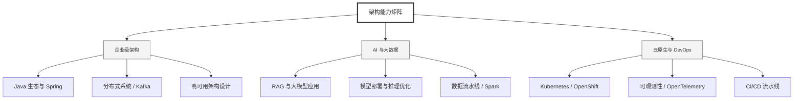

  <h1>你好，我是 Ellen Liu 👋</h1>
  

    <a href="README.md">English</a> | 
    <b>简体中文</b>
  

## 🧠 技术栈与核心能力

智能化企业系统建设路线图，涵盖全栈人工智能工程、云基础设施架构及模型部署等核心技术领域。

```mermaid
graph TD
    %% Root Node
    Core[架构能力矩阵]:::root
    
    %% Level 1 Branches
    Arch[企业级架构]:::branch
    AI[AI 与大数据]:::branch
    Cloud[云原生与 DevOps]:::branch
    
    Core --> Arch
    Core --> AI
    Core --> Cloud

    %% Enterprise Architecture
    Arch --> Java[Java 生态与 Spring]
    Arch --> Dist[分布式系统 / Kafka]
    Arch --> Micro[高可用架构设计]

    %% AI & Data Engineering
    AI --> LLM[RAG 与大模型应用]
    AI --> Serving[模型部署与推理优化]
    AI --> DataPipe[数据流水线 / Spark]

    %% Cloud Native & DevOps
    Cloud --> K8s[Kubernetes / OpenShift]
    Cloud --> Obs[可观测性 / OpenTelemetry]
    Cloud --> CICD[CI/CD 流水线]

    %% Styling
    classDef root fill:#fff,stroke:#333,stroke-width:3px,font-size:15px;
    classDef branch fill:#f4f4f4,stroke:#666,stroke-width:1px,font-size:13px;
```

## 🚀 Highlighted 工作

- **开源 AI 项目**: [基于 BERT 的声明检测模型](https://huggingface.co/XiaojingEllen/bert-finetuned-claim-detection) (Apache-2.0)
  - *已被哥伦比亚大学 (UBC) 研究项目引用。*
  - *手写 Transformer 核心代码，以验证理论与工程的一致性。*
- **金融基础设施**: 从 0 到 1 构建数字银行支付中间件及智能保险理赔系统。

## 📑 每日论文速递 (ArXiv)
<!-- DAILY_ARXIV_SUMMARY_START -->
**更新日期: 2026-04-18**

### 1. [MM-WebAgent：一种用于网页生成的分层多模态网络代理](http://arxiv.org/abs/2604.15309v1)
- **摘要**: 人工智能生成内容（AIGC）工具的快速发展，使得图像、视频和可视化内容能够按需生成并应用于网页设计，为现代用户界面/用户体验提供了一种灵活且日益普及的范式。然而，将此类工具直接集成到自动化网页生成中，往往会导致风格不一致和整体协调性差的问题，因为各元素是孤立生成的。我们提出了MM-WebAgent——一种用于多模态网页生成的分层智能体框架，通过分层规划和迭代自反思来协调基于AIGC的元素生成。MM-WebAgent联合优化全局布局、局部多模态内容及其整合，从而生成协调一致且视觉统一的网页。我们进一步引入了多模态网页生成的基准测试，以及用于系统评估的多层次评估方案。实验表明，MM-WebAgent在代码生成和基于智能体的基线方法中表现更优，尤其是在多模态元素生成与整合方面。代码与数据：https://aka.ms/mm-webagent。

### 2. [诊断LLM评判可靠性：保形预测集与传递性违规分析](http://arxiv.org/abs/2604.15302v1)
- **摘要**: LLM即评委框架正日益广泛地应用于自动自然语言生成评估，但其在单实例层面的可靠性仍鲜为人知。我们针对SummEval数据集开发了一套双轨诊断工具包：$\textbf{(1)}$ 传递性分析揭示了被较低总体违规率（$\barρ = 0.8$-$4.1\%$）掩盖的广泛存在的单输入不一致现象，其中$33$-$67\%$的文档至少存在一个有向三元环；$\textbf{(2)}$ 基于1-5分李克特量表的划分保形预测集提供了理论保证的$\geq(1{-}α)$覆盖度，其集合宽度可作为单实例可靠性指标（斯皮尔曼相关系数$r_s = {+}0.576$，样本量$N{=}1{,}918$，$p < 10^{-100}$，所有评委数据合并计算）。关键发现是，预测集宽度在不同评委间呈现稳定一致性（平均相关系数$\bar{r} = 0.32$-$0.38$），证明其捕捉的是文档层面的评估难度而非评委特异性噪声。在四位评委与四项评估标准的综合分析中，两种诊断方法结论一致：评估标准的影响大于评委差异，其中相关性评估最可靠（平均预测集宽度约$3.0$），连贯性次之（平均宽度约$3.9$），而流畅性与一致性仍不可靠（平均宽度约$4.9$）。我们已公开全部代码、提示模板及缓存结果。

### 3. [CoopEval：社会困境中合作维持机制与LLM智能体基准评测](http://arxiv.org/abs/2604.15267v1)
- **摘要**: 随着大语言模型智能体与其他目标导向型智能体的交互日益频繁，确保其交互过程既高效又安全显得愈发重要。然而，近期研究却呈现出相反的趋势：在囚徒困境和公共物品博弈等混合动机场景中，推理能力更强的大语言模型反而表现出更低的合作倾向。我们的实验也证实，无论是启用还是未启用推理功能，最新模型在单次社会困境博弈中均会持续选择背叛。

为应对这一安全隐患，我们首次对博弈论机制开展了比较研究，这些机制旨在促使理性智能体在均衡状态下达成合作结果。我们通过四项社会困境测试（分别检验稳健合作的不同维度），评估了以下机制：(1) 多轮重复博弈，(2) 声誉系统，(3) 委托决策的第三方调解机制，(4) 玩家间基于结果的条件支付契约协议。

研究发现：在能力较强的大语言模型之间，契约机制与调解机制最能有效促成合作；而重复博弈诱导的合作在参与者变动时会急剧恶化。此外，我们还证明，在追求个体收益最大化的演化压力下，这些合作机制会变得更为有效。

<!-- DAILY_ARXIV_SUMMARY_END -->

## 🌐 保持联系

  
<i>期待与您探讨 AI 基础设施的未来！</i>

