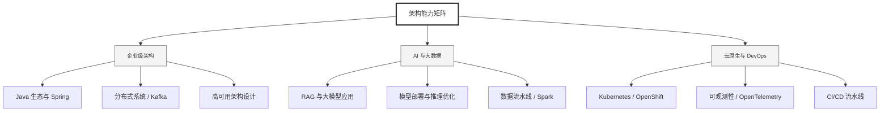

  <h1>你好，我是 Ellen Liu 👋</h1>
  

    <a href="README.md">English</a> | 
    <b>简体中文</b>
  

## 🧠 技术栈与核心能力

智能化企业系统建设路线图，涵盖全栈人工智能工程、云基础设施架构及模型部署等核心技术领域。

```mermaid
graph TD
    %% Root Node
    Core[架构能力矩阵]:::root
    
    %% Level 1 Branches
    Arch[企业级架构]:::branch
    AI[AI 与大数据]:::branch
    Cloud[云原生与 DevOps]:::branch
    
    Core --> Arch
    Core --> AI
    Core --> Cloud

    %% Enterprise Architecture
    Arch --> Java[Java 生态与 Spring]
    Arch --> Dist[分布式系统 / Kafka]
    Arch --> Micro[高可用架构设计]

    %% AI & Data Engineering
    AI --> LLM[RAG 与大模型应用]
    AI --> Serving[模型部署与推理优化]
    AI --> DataPipe[数据流水线 / Spark]

    %% Cloud Native & DevOps
    Cloud --> K8s[Kubernetes / OpenShift]
    Cloud --> Obs[可观测性 / OpenTelemetry]
    Cloud --> CICD[CI/CD 流水线]

    %% Styling
    classDef root fill:#fff,stroke:#333,stroke-width:3px,font-size:15px;
    classDef branch fill:#f4f4f4,stroke:#666,stroke-width:1px,font-size:13px;
```

## 🚀 Highlighted 工作

- **开源 AI 项目**: [基于 BERT 的声明检测模型](https://huggingface.co/XiaojingEllen/bert-finetuned-claim-detection) (Apache-2.0)
  - *已被哥伦比亚大学 (UBC) 研究项目引用。*
  - *手写 Transformer 核心代码，以验证理论与工程的一致性。*
- **金融基础设施**: 从 0 到 1 构建数字银行支付中间件及智能保险理赔系统。

## 📑 每日论文速递 (ArXiv)
<!-- DAILY_ARXIV_SUMMARY_START -->
**更新日期: 2026-04-23**

### 1. [发现共享逻辑子空间：通过自然语言与符号视角的对齐引导大语言模型逻辑推理](http://arxiv.org/abs/2604.19716v1)
- **摘要**: 大型语言模型在多步逻辑推理方面仍面临挑战。现有方法要么纯粹以自然语言形式优化推理链，要么将符号求解器作为外部模块附加使用。本研究另辟蹊径，试图探究大语言模型内部是否存在一个共享的逻辑子空间，能够同时对齐推理过程的自然语言与符号语言视角。我们的假设是：该逻辑子空间能捕捉大语言模型中跨视角共享且独立于表层形式的逻辑推理能力。

为验证这一假设，我们对自然语言与符号语言推理链产生的配对残差激活值进行典型相关分析，从而学习到一个具有最大跨视角相关性的低维子空间。进一步地，我们设计了一种无需训练的方法，能够引导大语言模型的推理链沿此逻辑子空间推进，从而有效融合双重视角下的互补推理信号。在四个逻辑推理基准测试上的实验表明，该方法最高可将准确率提升11个百分点，并在领域外问题上展现出良好的泛化能力。

### 2. [议会话语中的认知取向与协商民主相关联](http://arxiv.org/abs/2604.19699v1)
- **摘要**: 对真理的追求是民主审议与治理的核心，然而政治话语呈现出多元的认知取向——从基于可验证信息的证据推理，到根植于信念与主观诠释的直觉推理。我们提出一种可扩展的测量方法，通过大语言模型评分与嵌入语义相似度构建"证据-直觉差值"指标，用以量化认知取向。基于该方法对七个国家1946年至2025年间1500万条议会演讲片段的分析，我们考察了话语模式的时间演变及其与审议民主和治理的关联。研究发现：在国家层面，证据-直觉差值与审议民主水平呈持续正相关，这一关系在同期分析与滞后分析中均保持稳定；同时该指标也与治理维度中的法律透明度及可预测性呈正相关。这些发现表明，政治话语的认知特质对民主质量与治理效能具有关键影响。

### 3. [答案仅是起点：面向开放式文档问答的相关洞见生成](http://arxiv.org/abs/2604.19685v1)
- **摘要**: 回答开放性问题对人工智能系统而言仍具挑战性，因为这需要超越事实检索的综合分析、判断与探索能力，且用户通常通过多轮迭代完善答案而非接受单一回复。现有问答基准未能明确支持这种迭代优化过程。为填补这一空白，我们提出一项新任务——基于文档的相关洞见生成，其目标是从文档集合中生成额外洞见，以帮助改进、扩展或重新思考开放性问题的最初答案，最终支持更丰富的用户交互和更优质的整体问答体验。我们构建并发布了SCOpE-QA（开放问答科学数据集），涵盖20个研究领域的3000个开放性问题。我们提出InsightGen方法，采用两阶段流程：首先通过聚类构建文档集合的主题表征，随后基于主题图谱的邻域选择提取相关语境，并利用大语言模型生成多样且相关的洞见。通过对3000个问题使用两种生成模型和两种评估设置的广泛测试表明，InsightGen能持续生成有用、相关且可操作的洞见，为这一新任务建立了坚实的基准。

<!-- DAILY_ARXIV_SUMMARY_END -->

## 🌐 保持联系

  
<i>期待与您探讨 AI 基础设施的未来！</i>

