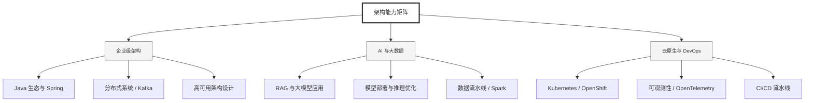

  <h1>你好，我是 Ellen Liu 👋</h1>
  

    <a href="README.md">English</a> | 
    <b>简体中文</b>
  

## 🧠 技术栈与核心能力

智能化企业系统建设路线图，涵盖全栈人工智能工程、云基础设施架构及模型部署等核心技术领域。

```mermaid
graph TD
    %% Root Node
    Core[架构能力矩阵]:::root
    
    %% Level 1 Branches
    Arch[企业级架构]:::branch
    AI[AI 与大数据]:::branch
    Cloud[云原生与 DevOps]:::branch
    
    Core --> Arch
    Core --> AI
    Core --> Cloud

    %% Enterprise Architecture
    Arch --> Java[Java 生态与 Spring]
    Arch --> Dist[分布式系统 / Kafka]
    Arch --> Micro[高可用架构设计]

    %% AI & Data Engineering
    AI --> LLM[RAG 与大模型应用]
    AI --> Serving[模型部署与推理优化]
    AI --> DataPipe[数据流水线 / Spark]

    %% Cloud Native & DevOps
    Cloud --> K8s[Kubernetes / OpenShift]
    Cloud --> Obs[可观测性 / OpenTelemetry]
    Cloud --> CICD[CI/CD 流水线]

    %% Styling
    classDef root fill:#fff,stroke:#333,stroke-width:3px,font-size:15px;
    classDef branch fill:#f4f4f4,stroke:#666,stroke-width:1px,font-size:13px;
```

## 🚀 Highlighted 工作

- **开源 AI 项目**: [基于 BERT 的声明检测模型](https://huggingface.co/XiaojingEllen/bert-finetuned-claim-detection) (Apache-2.0)
  - *已被哥伦比亚大学 (UBC) 研究项目引用。*
  - *手写 Transformer 核心代码，以验证理论与工程的一致性。*
- **金融基础设施**: 从 0 到 1 构建数字银行支付中间件及智能保险理赔系统。

## 📑 每日论文速递 (ArXiv)
<!-- DAILY_ARXIV_SUMMARY_START -->
**更新日期: 2026-05-08**

### 1. [MRI-Eval：用于评估大语言模型在磁共振物理及GE扫描仪操作知识方面性能的分层基准](http://arxiv.org/abs/2605.05175v1)
- **摘要**: 背景：现有MRI大语言模型基准测试主要依赖教科书式选择题，顶级商业模型已在此类测试中取得高分，导致模型区分度不足。目前尚无系统性基准可评估与科研型MRI实践密切相关的设备商特定操作知识。  
目的：我们开发了MRI-Eval分层基准测试，通过主选择题（MCQ）对MRI物理原理及GE扫描仪操作知识进行相对模型比较，并辅以无选项题干测试及预设诊断条件作为补充分析。  
方法：MRI-Eval包含1365道计分题，涵盖九个类别及三个难度层级，题目源自教科书、GE扫描仪手册、编程课程材料及专家编制试题。评估五个模型系列（GPT-5.4、Claude Opus 4.6、Claude Sonnet 4.6、Gemini 2.5 Pro、Llama 3.3 70B）。主测试采用选择题形式；无选项题干测试移除选项并由独立LLM裁判评分；预设题干测试则检验模型对用户错误陈述的应答能力。  
结果：主选择题整体准确率为93.2%至97.1%。所有模型中，GE扫描仪操作类别的准确率最低（88.2%至94.6%）。无选项题干测试中，前沿模型准确率降至58.4%至61.1%，Llama 3.3 70B降至37.1%；GE扫描仪操作类别的无选项准确率仅为13.8%至29.8%。  
结论：高选择题得分可能掩盖自由文本回忆能力的不足，尤其在设备商特定操作知识领域。MRI-Eval作为相对比较基准而非绝对能力评估工具更具参考价值，并提示需谨慎使用原始LLM输出进行GE特定协议指导。

### 2. [PSK在SemEval-2026任务9中的表现：基于集成Gemma模型与合成数据增强的多语言极化检测](http://arxiv.org/abs/2605.05159v1)
- **摘要**: 我们提出面向SemEval-2026任务9的多语言极化检测系统，该任务为涵盖22种语言的二分类任务。我们的方法采用低秩适配（LoRA）技术，针对每种语言独立微调Gemma~3模型（12B和27B参数），并通过大语言模型（LLM）生成的合成数据进行增强。我们利用GPT-4o-mini实施三种合成数据策略（直接生成、释义改写、对比对创建），并构建包含基于嵌入去重的多阶段质量过滤流水线。研究发现，在开发集上对每种语言进行阈值调优可在无需重新训练的情况下提升2%至4%的F1值。我们还采用加权集成策略，结合12B与27B模型预测结果，并针对不同语言选择最优集成方案。最终系统在全部22种语言上实现平均宏F1值0.811，在参赛团队中位列第二，其中在3种语言中取得第一名，在8种语言中进入前三。值得注意的是，在开发集表现优异的替代架构（XLM-RoBERTa、Qwen3）在测试集上出现30%至50%的F1值下降，这凸显了泛化能力的重要性。

### 3. [文本语料库作为概念场：黑盒幻觉与新颖性度量](http://arxiv.org/abs/2605.05103v1)
- **摘要**: 我们引入了文本语料的**概念场**：一种具有逐点不确定性的局部漂移场，该场基于句子嵌入空间中连续句子之间的差值进行估计。给定一个候选句子转换，我们通过ζ（观测到的差值与该场局部高斯估计之间的平均绝对z距离）来评估其与概念场的一致性。该评分是黑盒的（不涉及模型内部结构）、可归因于语料的（每个评分均可追溯至附近的语料句子），并且允许直接的概率解读。我们通过引入**向量序列数据库（VSDB）** 来支持计算，该数据库存储嵌入向量及其序列位置和下一差值元数据。我们在两个大规模场景中评估了该方法：美国联邦法规中的幻觉式基础性检测，以及古腾堡项目中的新颖性检测。通过受控的LLM生成改写，概念场在基于基础/非基础/不确定的三分类策略下实现了强大的选择性分类性能，与以检索为中心的基线不同，该方法在两个领域具有相似的覆盖-风险行为，支持跨领域转移的概率解释。我们还简要描述了在密集聚类上计算的概念场的散度和旋度如何揭示具有定性意义的语义模式（逻辑源、汇和隐含主题），这作为假设生成而非定量结果提供。概念场为基础性和新颖性提供了快速、轻量且可解释的信号，是对LLM作为评判器和白盒检测器的补充。

<!-- DAILY_ARXIV_SUMMARY_END -->

## 🌐 保持联系

  
<i>期待与您探讨 AI 基础设施的未来！</i>

