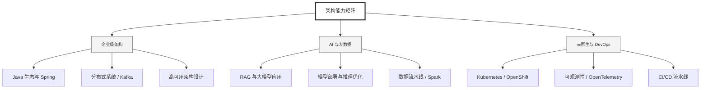

  <h1>你好，我是 Ellen Liu 👋</h1>
  

    <a href="README.md">English</a> | 
    <b>简体中文</b>
  

## 🧠 技术栈与核心能力

智能化企业系统建设路线图，涵盖全栈人工智能工程、云基础设施架构及模型部署等核心技术领域。

```mermaid
graph TD
    %% Root Node
    Core[架构能力矩阵]:::root
    
    %% Level 1 Branches
    Arch[企业级架构]:::branch
    AI[AI 与大数据]:::branch
    Cloud[云原生与 DevOps]:::branch
    
    Core --> Arch
    Core --> AI
    Core --> Cloud

    %% Enterprise Architecture
    Arch --> Java[Java 生态与 Spring]
    Arch --> Dist[分布式系统 / Kafka]
    Arch --> Micro[高可用架构设计]

    %% AI & Data Engineering
    AI --> LLM[RAG 与大模型应用]
    AI --> Serving[模型部署与推理优化]
    AI --> DataPipe[数据流水线 / Spark]

    %% Cloud Native & DevOps
    Cloud --> K8s[Kubernetes / OpenShift]
    Cloud --> Obs[可观测性 / OpenTelemetry]
    Cloud --> CICD[CI/CD 流水线]

    %% Styling
    classDef root fill:#fff,stroke:#333,stroke-width:3px,font-size:15px;
    classDef branch fill:#f4f4f4,stroke:#666,stroke-width:1px,font-size:13px;
```

## 🚀 Highlighted 工作

- **开源 AI 项目**: [基于 BERT 的声明检测模型](https://huggingface.co/XiaojingEllen/bert-finetuned-claim-detection) (Apache-2.0)
  - *已被哥伦比亚大学 (UBC) 研究项目引用。*
  - *手写 Transformer 核心代码，以验证理论与工程的一致性。*
- **金融基础设施**: 从 0 到 1 构建数字银行支付中间件及智能保险理赔系统。

## 📑 每日论文速递 (ArXiv)
<!-- DAILY_ARXIV_SUMMARY_START -->
**更新日期: 2026-03-17**

### 1. [大型语言模型指令调优中的神经元感知数据选择](http://arxiv.org/abs/2603.13201v1)
- **摘要**: 指令调优（IT）已被证明是解锁大型语言模型（LLMs）强大能力的有效方法。近期研究表明，过量的IT数据可能降低LLMs性能，而精心筛选少量高质量IT数据子集能显著提升其能力。因此，如何从IT数据集中识别最高效的子集数据，以有效开发LLMs的特定或通用能力，已成为关键挑战。为此，我们提出了一种新颖高效的框架NAIT。该框架通过分析IT数据集与目标领域能力之间神经元激活模式的相似性，评估IT数据对LLMs性能的影响。具体而言，NAIT从目标领域能力的领域内数据集中捕获神经元激活模式，构建可复用、可迁移的神经元激活特征，随后根据候选样本与目标能力预期激活特征的相似度进行评估筛选。实验结果表明，使用NAIT筛选的10% Alpaca-GPT4 IT数据子集进行训练，在多项任务中持续优于依赖外部先进模型或基于不确定性特征的方法。我们的研究还揭示了神经元激活特征在LLMs不同能力间的可迁移性：具有更强逻辑推理和程序化特征的IT数据展现出广泛的通用迁移性，能使模型在多项任务中发展出更强能力；而稳定的核心数据子集足以持续激活模型基础能力，并在多样化任务中实现性能的普遍提升。

### 2. [智能体AI中的语义不变性](http://arxiv.org/abs/2603.13173v1)
- **摘要**: 大型语言模型（LLM）正日益成为决策支持、科学问题求解和多智能体协作系统中的自主推理智能体。然而，在关键应用中部署LLM智能体时，必须确保其推理在语义等效的输入变化下保持稳定——这一特性我们称之为语义不变性。

传统的基准评估方法仅针对固定、规范的问题表述进行准确性测试，无法捕捉这一关键可靠性维度。为弥补这一缺陷，本文提出一种蜕变测试框架，用于系统评估LLM推理智能体的鲁棒性。该框架通过八种语义保持变换（原句复述、语义转述、事实重排、内容扩展、内容压缩、学术语境转换、商业语境转换、对比式表述），对涵盖四种不同架构家族的七个基础模型展开测试：Hermes（70B、405B）、Qwen3（30B-A3B、235B-A22B）、DeepSeek-R1以及gpt-oss（20B、120B）。评估范围覆盖八个科学领域的19个多步推理问题。

研究结果显示，模型规模并不能预测鲁棒性：规模较小的Qwen3-30B-A3B实现了最高稳定性（79.6%的响应保持语义不变，语义相似度达0.91），而更大规模的模型反而表现出更强的脆弱性。

### 3. [开发与评估用于支持孕产保健的聊天机器人](http://arxiv.org/abs/2603.13168v1)
- **摘要**: 通过手机聊天机器人提供可信赖的孕产健康信息的能力可能产生重大影响，尤其在资源匮乏地区——这些地区的用户健康素养较低且获得医疗服务的机会有限。然而，部署此类系统在技术上具有挑战性：用户查询简短、描述不完整且常混用多种语言，回答需要结合地区特定背景，而部分或缺失的症状描述使得安全分流决策变得困难。我们展示了一款为印度孕产健康开发的聊天机器人，该项目由学术研究人员、健康科技公司、公共卫生非营利组织和医院共同合作完成。该系统整合了（1）基于孕产阶段的分流机制，将高风险查询导向专家预设模板；（2）对精选孕产/新生儿指南进行混合检索；（3）基于大语言模型的证据条件生成。我们的核心贡献在于提出了一套适用于高风险场景、在专家监督有限情况下的评估工作流程。针对组件级和端到端测试，我们引入了：（i）标注分流基准数据集（N=150），实现86.7%的紧急情况召回率，并明确报告漏报紧急情况与过度升级之间的权衡；（ii）包含分块级证据标签的合成多证据检索基准（N=100）；（iii）基于临床医生共同设计标准，对真实查询（N=781）采用大语言模型作为评判者的对比评估；（iv）专家验证。研究结果表明，在多语言、高噪声环境中构建可信赖的医疗助手需要采用纵深防御设计，并结合多方法评估体系，而非依赖单一模型或评估方法的选择。

<!-- DAILY_ARXIV_SUMMARY_END -->

## 🌐 保持联系

  
<i>期待与您探讨 AI 基础设施的未来！</i>

