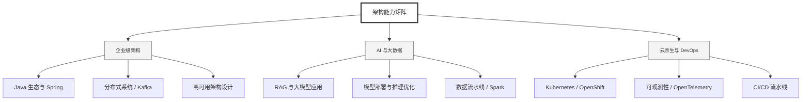

  <h1>你好，我是 Ellen Liu 👋</h1>
  

    <a href="README.md">English</a> | 
    <b>简体中文</b>
  

## 🧠 技术栈与核心能力

智能化企业系统建设路线图，涵盖全栈人工智能工程、云基础设施架构及模型部署等核心技术领域。

```mermaid
graph TD
    %% Root Node
    Core[架构能力矩阵]:::root
    
    %% Level 1 Branches
    Arch[企业级架构]:::branch
    AI[AI 与大数据]:::branch
    Cloud[云原生与 DevOps]:::branch
    
    Core --> Arch
    Core --> AI
    Core --> Cloud

    %% Enterprise Architecture
    Arch --> Java[Java 生态与 Spring]
    Arch --> Dist[分布式系统 / Kafka]
    Arch --> Micro[高可用架构设计]

    %% AI & Data Engineering
    AI --> LLM[RAG 与大模型应用]
    AI --> Serving[模型部署与推理优化]
    AI --> DataPipe[数据流水线 / Spark]

    %% Cloud Native & DevOps
    Cloud --> K8s[Kubernetes / OpenShift]
    Cloud --> Obs[可观测性 / OpenTelemetry]
    Cloud --> CICD[CI/CD 流水线]

    %% Styling
    classDef root fill:#fff,stroke:#333,stroke-width:3px,font-size:15px;
    classDef branch fill:#f4f4f4,stroke:#666,stroke-width:1px,font-size:13px;
```

## 🚀 Highlighted 工作

- **开源 AI 项目**: [基于 BERT 的声明检测模型](https://huggingface.co/XiaojingEllen/bert-finetuned-claim-detection) (Apache-2.0)
  - *已被哥伦比亚大学 (UBC) 研究项目引用。*
  - *手写 Transformer 核心代码，以验证理论与工程的一致性。*
- **金融基础设施**: 从 0 到 1 构建数字银行支付中间件及智能保险理赔系统。

## 📑 每日论文速递 (ArXiv)
<!-- DAILY_ARXIV_SUMMARY_START -->
**更新日期: 2026-07-18**

### 1. [分割、提示、聚合：语言模型中的统计自洽性](http://arxiv.org/abs/2607.15277v1)
- **摘要**: 上下文学习通常被解释为一种条件推断形式，其中提示指定了上下文，而模型的输出被视为对应条件分布的估计。若此解释成立，则大语言模型的估计应满足基本概率恒等式。特别地，全概率公式表明，先验加权的条件分布在总体任意有效划分下可聚合为总体层面的边际分布。本研究旨在探究大语言模型估计在多大程度上遵循这一自洽性原则。我们采用二叉树作为评估框架，通过递归方式将总体划分为粒度渐细的子群体。随后向大语言模型提供以自然语言表述的子群体描述作为上下文，将所得估计逆向聚合为总体层面估计，并比较不同粒度划分下的估计结果。通过跨问题领域与前沿模型应用该协议，我们发现了基本一致性属性的广泛违背现象。对人物角色提示的深入研究表明存在一种我们称之为"宏观谬误"的模式：相较于直接总体估计，从更细粒度子群体响应重建的估计往往与人类参考数据更吻合。该效应在树结构变化与估计任务类型中持续存在，并可通过隐式提示部分恢复。这些发现共同表明，模型虽具备相关子群体知识，但未能可靠地将其传播至聚合估计中。这一差距确立了统计自洽性作为评估大语言模型的无参考基准准则。

### 2. [SciDiagramEdit: 从论文修订中学习编辑科学图表](http://arxiv.org/abs/2607.15272v1)
- **摘要**: 在科研论文中修改图表是日常研究工作中一项常规且耗时的任务：作者在修订手稿时，需要重新标注组件、调整面板布局、重塑视觉风格。然而，通过自然语言指令自动化这一编辑流程极具挑战性，因为科学图表是一种密集的信息图形，其中包含示意图、数据图、照片、图注和箭头等异构视觉元素，这些元素在严格的视觉语法下组合，以支撑特定论点。为解决这一问题，我们提出了SciDiagramEdit——一个基准测试与技能进化框架，该框架能从自然论文修订中学习，并直接操作图表的可编辑矢量源文件，使用户能够与智能体共同检查并编辑每个基本图形单元。我们的基准测试从arXiv版本历史中挖掘修改前后的图表配对，每对均对应作者自身的修订意图。为适应编辑指令的多样性，我们采用基于技能进化的智能体学习机制：通过多轮执行轨迹，智能体提议器持续优化其技能规范。最终形成的技能在保留验证集上逐步提升编辑准确率，这证明自然论文修订可作为指令驱动图表编辑的有效训练信号。

### 3. [桥接证据：静态检索效用在多步智能体搜索中无法预测因果效用](http://arxiv.org/abs/2607.15253v1)
- **摘要**: 检索系统基于静态的效用概念进行训练和评估：将文档与问题输入阅读器模型，观察答案是否改善，并据此对文档评分。这种逻辑在独立阅读文档时成立，但当语言模型作为搜索代理，通过多次查询和跨轮推理时便不再适用——因为文档的价值可能体现在它允许代理下一步做什么，而非对当前问题的直接回答。我们通过测量而非论证的方式揭示这一差距。采用基于HotpotQA的ReAct风格代理，我们回放1000个开发集问题，对代理读取的每个文档执行删除操作，并从该节点重新运行后续轨迹。通过对比原始运行与反事实结果，从三个差值维度计算反事实轨迹效用（CTU）得分：最终答案质量、下一查询检索质量及交互轮次。将CTU与静态RAG效用（SRU）在23322个文档观测值上进行交叉分析，两者近乎统计独立（斯皮尔曼相关系数ρ=-0.026）。代理读取的文档中约三分之一具有因果支撑作用，但对静态阅读器而言却看似无用——我们称之为"桥梁文档"。当将基于阅读器的评估轴替换为BM25与交叉编码器代理时，该模式依然存在，在均匀分布轴上形成27.2%的桥梁单元。  

第二项实验锁定其机制。采用先前研究中的可观测实体相关性（OER）指标，区分相关与非相关候选实体的实体出现在代理下一查询中的频率，是仅存在于非相关文档中实体的4.02倍（6.1% vs 1.5%，n=227,139）。桥梁文档通过向代理提供可重定向搜索的判别性实体来体现价值。在代理式检索中，静态相关性与因果效用是不同量级的概念，优化前者并不能带来后者。

<!-- DAILY_ARXIV_SUMMARY_END -->

## 🌐 保持联系

  
<i>期待与您探讨 AI 基础设施的未来！</i>

