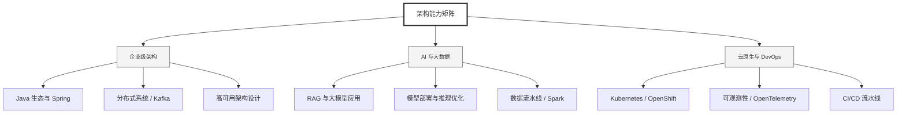

  <h1>你好，我是 Ellen Liu 👋</h1>
  

    <a href="README.md">English</a> | 
    <b>简体中文</b>
  

## 🧠 技术栈与核心能力

智能化企业系统建设路线图，涵盖全栈人工智能工程、云基础设施架构及模型部署等核心技术领域。

```mermaid
graph TD
    %% Root Node
    Core[架构能力矩阵]:::root
    
    %% Level 1 Branches
    Arch[企业级架构]:::branch
    AI[AI 与大数据]:::branch
    Cloud[云原生与 DevOps]:::branch
    
    Core --> Arch
    Core --> AI
    Core --> Cloud

    %% Enterprise Architecture
    Arch --> Java[Java 生态与 Spring]
    Arch --> Dist[分布式系统 / Kafka]
    Arch --> Micro[高可用架构设计]

    %% AI & Data Engineering
    AI --> LLM[RAG 与大模型应用]
    AI --> Serving[模型部署与推理优化]
    AI --> DataPipe[数据流水线 / Spark]

    %% Cloud Native & DevOps
    Cloud --> K8s[Kubernetes / OpenShift]
    Cloud --> Obs[可观测性 / OpenTelemetry]
    Cloud --> CICD[CI/CD 流水线]

    %% Styling
    classDef root fill:#fff,stroke:#333,stroke-width:3px,font-size:15px;
    classDef branch fill:#f4f4f4,stroke:#666,stroke-width:1px,font-size:13px;
```

## 🚀 Highlighted 工作

- **开源 AI 项目**: [基于 BERT 的声明检测模型](https://huggingface.co/XiaojingEllen/bert-finetuned-claim-detection) (Apache-2.0)
  - *已被哥伦比亚大学 (UBC) 研究项目引用。*
  - *手写 Transformer 核心代码，以验证理论与工程的一致性。*
- **金融基础设施**: 从 0 到 1 构建数字银行支付中间件及智能保险理赔系统。

## 📑 每日论文速递 (ArXiv)
<!-- DAILY_ARXIV_SUMMARY_START -->
**更新日期: 2026-05-26**

### 1. [SkillOpt：自我进化智能体技能的执行策略](http://arxiv.org/abs/2605.23904v1)
- **摘要**: 当前的智能体技能要么是手工构建、一次性生成，要么是通过松散控制的自我修正演化而来——这些方式都不具备深度学习优化器的特性，也无法在反馈中可靠地超越初始表现。我们认为，技能应当被训练为冻结智能体的外部状态，并遵循与权重空间优化相同的可复现准则。据我们所知，SkillOpt是首个面向智能体技能的系统化可控文本空间优化器：独立的优化器模型将带评分的交互轨迹转化为对单一技能文档的有界增删改操作，且仅当编辑能严格提升保留验证集分数时才被采纳。通过文本学习率预算、拒绝编辑缓冲区以及逐轮慢速/元更新机制，技能训练在保持稳定性的同时，部署阶段无需增加任何推理时模型调用。在六个基准测试、七个目标模型和三种执行框架（直接对话、Codex、Claude Code）中，SkillOpt在全部52个（模型、基准、框架）评估单元上均取得最佳或并列最佳成绩，并击败了人类、一次性LLM、Trace2Skill、TextGrad、GEPA和EvoSkill等所有单元级竞争对手。在GPT-5.5上，它将直接对话模式下的无技能基线准确率提升23.5个百分点，在Codex智能体循环中提升24.8个百分点，在Claude Code中提升19.1个百分点。迁移实验进一步表明，优化后的技能工件在跨模型规模迁移、Codex与Claude Code执行环境切换，以及迁移至邻近数学基准（无需额外优化）时仍能保持价值。

### 2. [强师未必需要？论大语言模型预训练中的知识蒸馏](http://arxiv.org/abs/2605.23857v1)
- **摘要**: 知识蒸馏通常假设存在一种强到弱的关系，即更强的教师模型能培养出更优的学生模型。本研究针对大语言模型预训练中的这一假设展开探讨。通过调整架构规模与训练token预算，我们构建了强到弱、同级水平以及弱到强三种师生关系，并分别考察蒸馏效果。研究发现：教师模型并非必须强大——当语言建模损失与知识蒸馏损失实现恰当混合时，即使是规模小且训练不足的教师模型也能提升较大学生模型的表现。与此同时，更强的教师未必更优：通过增加参数量或训练token来强化教师模型，可能导致蒸馏收益饱和甚至逆转。我们进一步观察到，蒸馏对泛化能力（分布外表现与下游任务性能）的提升效果优于对领域内拟合的改善。这些发现共同挑战了"蒸馏预训练必须依赖强教师"的传统认知。

### 3. [将查询分解为工具调用以实现长视频关键帧检索](http://arxiv.org/abs/2605.23826v1)
- **摘要**: 关键帧选择是为长视频问答（QA）提供可验证视觉证据的直接方法。不同查询所需内容各异，而找到正确帧的关键在于明确需要寻找什么。现有的关键帧选择器要么根据单一查询对每一帧进行评分，要么将查询分解为固定模式并由单一视觉工具进行评估。我们提出ToolMerge，一种基于分解与合并的关键帧检索方法：基于大语言模型（LLM）的规划器将查询分解为工具调用，并通过布尔运算符指定各工具排序结果的合并方式。为直接评估检索效果，我们构建了Molmo-2 Moments（M2M）基准测试，其中每个问题均通过构造锚定至特定时间区间。在问答、问题检索和字幕检索任务中，ToolMerge与现有关键帧选择器表现相当，尤其在字幕检索任务中，其性能比其他方法高出5%。代码与数据可在https://github.com/michalsr/ToolMerge获取。

<!-- DAILY_ARXIV_SUMMARY_END -->

## 🌐 保持联系

  
<i>期待与您探讨 AI 基础设施的未来！</i>

