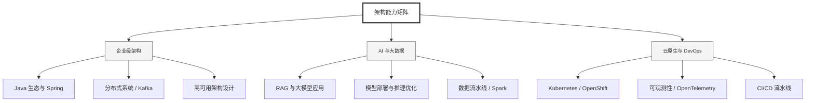

  <h1>你好，我是 Ellen Liu 👋</h1>
  

    <a href="README.md">English</a> | 
    <b>简体中文</b>
  

## 🧠 技术栈与核心能力

智能化企业系统建设路线图，涵盖全栈人工智能工程、云基础设施架构及模型部署等核心技术领域。

```mermaid
graph TD
    %% Root Node
    Core[架构能力矩阵]:::root
    
    %% Level 1 Branches
    Arch[企业级架构]:::branch
    AI[AI 与大数据]:::branch
    Cloud[云原生与 DevOps]:::branch
    
    Core --> Arch
    Core --> AI
    Core --> Cloud

    %% Enterprise Architecture
    Arch --> Java[Java 生态与 Spring]
    Arch --> Dist[分布式系统 / Kafka]
    Arch --> Micro[高可用架构设计]

    %% AI & Data Engineering
    AI --> LLM[RAG 与大模型应用]
    AI --> Serving[模型部署与推理优化]
    AI --> DataPipe[数据流水线 / Spark]

    %% Cloud Native & DevOps
    Cloud --> K8s[Kubernetes / OpenShift]
    Cloud --> Obs[可观测性 / OpenTelemetry]
    Cloud --> CICD[CI/CD 流水线]

    %% Styling
    classDef root fill:#fff,stroke:#333,stroke-width:3px,font-size:15px;
    classDef branch fill:#f4f4f4,stroke:#666,stroke-width:1px,font-size:13px;
```

## 🚀 Highlighted 工作

- **开源 AI 项目**: [基于 BERT 的声明检测模型](https://huggingface.co/XiaojingEllen/bert-finetuned-claim-detection) (Apache-2.0)
  - *已被哥伦比亚大学 (UBC) 研究项目引用。*
  - *手写 Transformer 核心代码，以验证理论与工程的一致性。*
- **金融基础设施**: 从 0 到 1 构建数字银行支付中间件及智能保险理赔系统。

## 📑 每日论文速递 (ArXiv)
<!-- DAILY_ARXIV_SUMMARY_START -->
**更新日期: 2026-03-03**

### 1. [DARE-bench：评估大语言模型在数据科学中的建模与指令遵循能力](http://arxiv.org/abs/2602.24288v1)
- **摘要**: 随着利用大语言模型处理复杂多步骤数据科学任务的需求快速增长，对精准基准测试的需求日益凸显。现有基准测试存在两大主要缺口：一是缺乏能够捕捉指令遵循与流程保真度的标准化过程感知评估体系；二是缺乏精确标注的训练数据。为填补这些缺口，我们推出DARE-bench基准测试，专门针对机器学习建模与数据科学指令遵循场景设计。与依赖人工或模型评判的现有基准不同，DARE-bench所有任务均具备可验证的基准真值，确保评估的客观性与可复现性。为覆盖广泛任务类型并支持智能体工具，DARE-bench包含6,300个源自Kaggle平台的任务，同时提供大规模训练数据集与评估集。大量实验表明，即使是GPT-4-mini等高阶模型也难以取得理想表现，尤其在机器学习建模任务中表现欠佳。使用DARE-bench训练任务进行微调可显著提升模型性能：监督微调使Qwen3-32B准确率提升1.83倍，强化学习使Qwen3-4B准确率提升超8倍。这些显著改进验证了DARE-bench作为精准评估基准与关键训练数据的双重重要性。

### 2. [大语言模型能从自身生成的内容中获益吗？](http://arxiv.org/abs/2602.24287v1)
- **摘要**: 在与大型语言模型进行多轮交互时，通常会将助手自身过往的回复保留在对话历史中。本研究重新审视了这一设计选择，探讨大型语言模型是否真的需要依赖自身先前的回复来生成响应。通过分析真实场景中的多轮对话，我们对比了标准（全上下文）提示法与仅用户轮次提示法——后者省略了所有先前的助手回复，并在三个开放推理模型和一个前沿模型中进行了验证。令人惊讶的是，我们发现移除助手先前的回复对大部分轮次的响应质量并无影响。省略助手侧历史可将累计上下文长度缩减高达10倍。为解释这一现象，我们发现多轮对话中存在大量（36.4%）自包含提示，且许多后续提示仅通过当前用户轮次及先前用户轮次即可提供足够指令。在分析仅用户轮次提示显著优于全上下文的情况时，我们发现了上下文污染现象：模型过度依赖自身先前回复，导致错误、幻觉或风格化痕迹在多轮对话中传播。基于这些发现，我们设计了一种选择性省略助手侧上下文的过滤方法。研究结果表明，有选择地省略助手历史既能提升响应质量，又能降低内存消耗。

### 3. [可控推理模型是私密思考者](http://arxiv.org/abs/2602.24210v1)
- **摘要**: 基于推理模型的智能代理需要访问敏感用户数据，但其推理过程难以控制，可能导致私人信息意外泄露给外部。我们提出训练模型不仅要遵循最终答案的指令，还要在推理过程中遵循指令，且可能需要满足不同约束条件。我们假设提升模型在推理过程中遵循指令的能力，可以增强其隐私保护技能。为验证这一假设，我们在新型指令遵循数据集上对模型进行微调，该数据集对推理过程设置了明确限制。此外，我们引入一种生成策略，通过独立的LoRA适配器将推理过程与答案生成解耦。我们在两个模型家族的六个模型上评估该方法，模型参数量从17亿到140亿不等，测试涵盖两个指令遵循基准和两个隐私基准。我们的方法带来了显著改进：指令遵循性能最高提升20.9分，隐私基准测试最高提升51.9个百分点。然而，由于推理性能与指令遵循能力之间存在权衡，这些改进可能以任务效用为代价。总体而言，我们的结果表明，提升推理模型的指令遵循行为能显著增强隐私保护能力，这为未来开发具备隐私意识的智能代理指明了有前景的方向。代码与数据已发布于https://github.com/UKPLab/arxiv2026-controllable-reasoning-models。

<!-- DAILY_ARXIV_SUMMARY_END -->

## 🌐 保持联系

  
<i>期待与您探讨 AI 基础设施的未来！</i>

