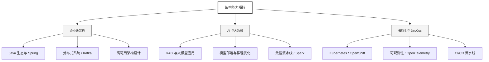

  <h1>你好，我是 Ellen Liu 👋</h1>
  

    <a href="README.md">English</a> | 
    <b>简体中文</b>
  

## 🧠 技术栈与核心能力

智能化企业系统建设路线图，涵盖全栈人工智能工程、云基础设施架构及模型部署等核心技术领域。

```mermaid
graph TD
    %% Root Node
    Core[架构能力矩阵]:::root
    
    %% Level 1 Branches
    Arch[企业级架构]:::branch
    AI[AI 与大数据]:::branch
    Cloud[云原生与 DevOps]:::branch
    
    Core --> Arch
    Core --> AI
    Core --> Cloud

    %% Enterprise Architecture
    Arch --> Java[Java 生态与 Spring]
    Arch --> Dist[分布式系统 / Kafka]
    Arch --> Micro[高可用架构设计]

    %% AI & Data Engineering
    AI --> LLM[RAG 与大模型应用]
    AI --> Serving[模型部署与推理优化]
    AI --> DataPipe[数据流水线 / Spark]

    %% Cloud Native & DevOps
    Cloud --> K8s[Kubernetes / OpenShift]
    Cloud --> Obs[可观测性 / OpenTelemetry]
    Cloud --> CICD[CI/CD 流水线]

    %% Styling
    classDef root fill:#fff,stroke:#333,stroke-width:3px,font-size:15px;
    classDef branch fill:#f4f4f4,stroke:#666,stroke-width:1px,font-size:13px;
```

## 🚀 Highlighted 工作

- **开源 AI 项目**: [基于 BERT 的声明检测模型](https://huggingface.co/XiaojingEllen/bert-finetuned-claim-detection) (Apache-2.0)
  - *已被哥伦比亚大学 (UBC) 研究项目引用。*
  - *手写 Transformer 核心代码，以验证理论与工程的一致性。*
- **金融基础设施**: 从 0 到 1 构建数字银行支付中间件及智能保险理赔系统。

## 📑 每日论文速递 (ArXiv)
<!-- DAILY_ARXIV_SUMMARY_START -->
**更新日期: 2026-09-01**

### 1. [SwarmBench：大型语言模型能否充当智能体集群的编排者？](http://arxiv.org/abs/2608.30661v1)
- **摘要**: 基于大型语言模型的多智能体系统正从固定的交互拓扑结构向动态编排的“智能体群”（Agent Swarms）演进。然而，现有的基准测试大多仍基于单一智能体或通用型智能体任务，难以系统性地评估关键的编排能力。为此，我们提出了SwarmBench，一个从准确性、效率、成本和过程质量等多个维度评估模型性能的基准测试。实验结果表明，当前模型在编排能力上表现出显著差异。这些差异不仅体现在最终的准确性、效率和成本上，还反映在编排过程本身的整体质量中。基于这些发现，我们进一步提出了SwarmExp，一种简单而有效的方法，通过经验提取和经验回放，持续提升大型语言模型的编排性能。

### 2. [散度几何：追踪隐状态轨迹以实现自适应多轮推理](http://arxiv.org/abs/2608.30650v1)
- **摘要**: LLM智能体需要在严格的资源约束下，在长时间多轮交互中维持与目标一致的推理。然而，随着多轮上下文的累积，它可能会破坏底层LLM对早期回合中任务相关信息的内在表征，模糊了建设性推理与表征漂移之间的界限。我们将多轮推理建模为底层LLM的隐状态轨迹，并通过两种互补信号对其进行刻画：时间曲率，捕捉回合间更新的方向一致性；以及方差斜率，衡量探索空间的扩张或收缩。在四个任务和三个底层LLM上，我们观察到这些几何信号能在完成之前区分正确与错误的回合序列。我们进一步将每个回合序列分解为由四个动作（读取、写入、响应、传输）形成的三动作链，并表明可分离性依赖于动作，不同信号区分各种链模式。我们的实验表明，轨迹几何能够识别推理过程中的关键回合，将τ-Bench上的任务成功率从24.1%提升至39.6%，同时将令牌成本降低11.2%。

### 3. [BiG-SURE —— 面向大语言模型语义不确定性与可靠性估计的二分图方法](http://arxiv.org/abs/2608.30646v1)
- **摘要**: 可靠的 uncertainty 估计是大型语言模型（LLMs）和视觉-语言模型（VLMs）在安全关键场景中部署的关键要求，尤其是在模型参数不可访问（黑盒）的情况下。我们提出了 BiG-SURE，一种基于跨温度语义一致性的不确定性估计器。该方法在保持语义不变的输入变换下，采样低温响应作为稳定的语义锚点，并采样高温响应作为探针。随后，它利用基于自然语言推理（NLI）的蕴含分数构建一个锚点-探针二分图（BiG），并通过该矩阵的归一化平方谱能量来定义置信度，其补数即为不确定性。这种基于二分图的语义不确定性与可靠性估计（SURE）分数衡量了高温探针是否与模型稳定的低温信念保持语义一致。我们在文本问答、多语言问答和多模态问答任务上，对多种模型家族评估了 BiG-SURE。在这些实验中，BiG-SURE 在平均弃权 AUROC 上优于先前的黑盒不确定性估计器，同时保持简单、无监督，并适用于黑盒模型设置。

<!-- DAILY_ARXIV_SUMMARY_END -->

## 🌐 保持联系

  
<i>期待与您探讨 AI 基础设施的未来！</i>

