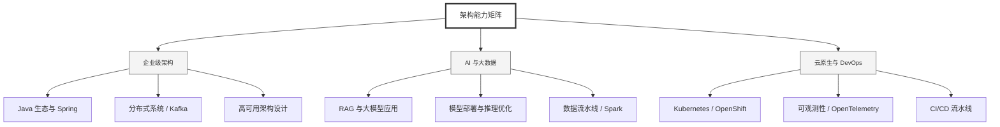

  <h1>你好，我是 Ellen Liu 👋</h1>
  

    <a href="README.md">English</a> | 
    <b>简体中文</b>
  

## 🧠 技术栈与核心能力

智能化企业系统建设路线图，涵盖全栈人工智能工程、云基础设施架构及模型部署等核心技术领域。

```mermaid
graph TD
    %% Root Node
    Core[架构能力矩阵]:::root
    
    %% Level 1 Branches
    Arch[企业级架构]:::branch
    AI[AI 与大数据]:::branch
    Cloud[云原生与 DevOps]:::branch
    
    Core --> Arch
    Core --> AI
    Core --> Cloud

    %% Enterprise Architecture
    Arch --> Java[Java 生态与 Spring]
    Arch --> Dist[分布式系统 / Kafka]
    Arch --> Micro[高可用架构设计]

    %% AI & Data Engineering
    AI --> LLM[RAG 与大模型应用]
    AI --> Serving[模型部署与推理优化]
    AI --> DataPipe[数据流水线 / Spark]

    %% Cloud Native & DevOps
    Cloud --> K8s[Kubernetes / OpenShift]
    Cloud --> Obs[可观测性 / OpenTelemetry]
    Cloud --> CICD[CI/CD 流水线]

    %% Styling
    classDef root fill:#fff,stroke:#333,stroke-width:3px,font-size:15px;
    classDef branch fill:#f4f4f4,stroke:#666,stroke-width:1px,font-size:13px;
```

## 🚀 Highlighted 工作

- **开源 AI 项目**: [基于 BERT 的声明检测模型](https://huggingface.co/XiaojingEllen/bert-finetuned-claim-detection) (Apache-2.0)
  - *已被哥伦比亚大学 (UBC) 研究项目引用。*
  - *手写 Transformer 核心代码，以验证理论与工程的一致性。*
- **金融基础设施**: 从 0 到 1 构建数字银行支付中间件及智能保险理赔系统。

## 📑 每日论文速递 (ArXiv)
<!-- DAILY_ARXIV_SUMMARY_START -->
**更新日期: 2026-07-28**

### 1. [Zing：面向大语言模型的社交心智](http://arxiv.org/abs/2607.23740v1)
- **摘要**: 随着大语言模型从孤立任务求解转向人类环境中的长期服务，它们需要具备社会智能：即推断心理状态、追踪社会关系、推理社会规范以及根据情境调整行为的能力。本报告提出Zhijing框架，这是一个集测量、内化与落地于一体的社会智能综合框架。在测量方面，我们推出SoMBench基准测试，该基准基于心理学理论构建，涵盖3个主要维度、17个次级维度及71个任务范式。它通过284个共享场景和3,481个专家验证实例，对问题格式、叙事视角和上下文长度进行控制。对20个代表性大语言模型的评估显示存在显著提升空间：最佳模型整体准确率仅为72.08%，且17个次级维度中无一达到90%的准天花板水平。在内化方面，我们开发了Zing诊断驱动训练方案，融合监督微调、在线策略蒸馏与基于评分标准的强化学习。在五项社会认知基准测试中，Zing持续超越其基础模型，其中Zing-27B-Stage2取得最佳平均分，Zing-32B-Stage2则与DeepSeek-V4-Pro保持竞争力。在部署阶段落地方面，我们构建了Actio控制推理架构，将四种类型支持路由至推理过程：PRISM提供程序化指导，Starling实现运行时心理状态表征，SAGE提供可复用经验，门控RAG提供外部社会与规范知识。在五个基础模型和三项基准测试中，完整控制架构在15个模型-基准组合中改进了14个，并在8个组合中达到最优或并列最优，验证了类型化运行时支持的有效性。这些结果表明，具备社会智能的大语言模型需要在评估、参数化内化与部署阶段落地方面实现协同进步。

### 2. [EmoTrace：一种以情感轨迹为中心的心理支持对话生成框架](http://arxiv.org/abs/2607.23648v1)
- **摘要**: 利用大型语言模型辅助心理咨询是自然语言处理领域的一项重要任务。构建高质量的心理支持对话语料库，是训练面向咨询的对话模型的关键基础。然而，现有数据生成方法普遍存在若干局限，包括寻求者情绪稳定、情绪动态变化有限，以及对咨询师引导的高度顺从等问题。这些问题导致大型语言模型缺乏有效应对情绪不稳定场景的能力。此外，咨询师的回应通常以问题解决为目标驱动，从而忽视了以情绪为中心的互动作用，而这类互动在心理咨询中至关重要。为弥补这些不足，我们提出EmoTrace——一个以建模寻求者情绪轨迹为核心的多轮对话语料库生成框架。我们构建了寻求者的认知档案，并引入包含情绪图式及其关联激活机制的寻求者模块、咨询师模块以及情绪轨迹控制模块，从而增强寻求者情绪表达的层次性以及咨询师针对性共情表达的能力。实验结果表明，所提方法在情绪丰富度和共情质量方面均优于现有方法。

### 3. [第三方API路由器在智能体软件开发中的成本究竟在哪里？](http://arxiv.org/abs/2607.23624v1)
- **摘要**: 第三方API路由器已成为统一接入日益多样化的LLM提供商的常见层。在编码智能体工作流中，高自主性操作被广泛采用，因为它减少了交互开销。因此，位于智能体与上游提供商之间的第三方API路由器不可避免地占据了可信路径。它可以检查并修改每个请求和响应，但没有任何机制能验证提供商的输出与智能体最终执行的仓库级操作之间的一致性。因此，客户端权限机制在实践中可能变得无效。这种控制差距是否会对软件开发任务产生真实且难以察觉的影响，目前仍缺乏实证测量。在本文中，我们对编码智能体中的路由器端注入进行了实证研究，考察了四种逐渐精细的干预级别：响应替换（L1）、响应附加（L2）、LLM润色注入（L3）以及带分布对齐的LLM润色注入（L4）。此外，我们开发了SIDEL框架，用于轨迹记录、重放、注入和防御评估，并构建了一个包含400个样本的精选数据集。我们评估了四种代表性编码智能体，并进一步评估了基于白名单的执行控制和LLM审查。路由器端干预显著改变了仓库级操作，且现有客户端防护措施难以检测。在没有额外缓解措施的情况下，所有评估的智能体在所有注入级别上的防御成功率均为0%。客户端缓解措施和反应式审查提高了抵抗能力，但未能完全恢复端到端控制，这促使提供商端需要输出完整性保证。我们的代码可在https://github.com/Riyasushin/SIDE获取。

<!-- DAILY_ARXIV_SUMMARY_END -->

## 🌐 保持联系

  
<i>期待与您探讨 AI 基础设施的未来！</i>

