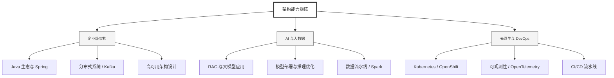

  <h1>你好，我是 Ellen Liu 👋</h1>
  

    <a href="README.md">English</a> | 
    <b>简体中文</b>
  

## 🧠 技术栈与核心能力

智能化企业系统建设路线图，涵盖全栈人工智能工程、云基础设施架构及模型部署等核心技术领域。

```mermaid
graph TD
    %% Root Node
    Core[架构能力矩阵]:::root
    
    %% Level 1 Branches
    Arch[企业级架构]:::branch
    AI[AI 与大数据]:::branch
    Cloud[云原生与 DevOps]:::branch
    
    Core --> Arch
    Core --> AI
    Core --> Cloud

    %% Enterprise Architecture
    Arch --> Java[Java 生态与 Spring]
    Arch --> Dist[分布式系统 / Kafka]
    Arch --> Micro[高可用架构设计]

    %% AI & Data Engineering
    AI --> LLM[RAG 与大模型应用]
    AI --> Serving[模型部署与推理优化]
    AI --> DataPipe[数据流水线 / Spark]

    %% Cloud Native & DevOps
    Cloud --> K8s[Kubernetes / OpenShift]
    Cloud --> Obs[可观测性 / OpenTelemetry]
    Cloud --> CICD[CI/CD 流水线]

    %% Styling
    classDef root fill:#fff,stroke:#333,stroke-width:3px,font-size:15px;
    classDef branch fill:#f4f4f4,stroke:#666,stroke-width:1px,font-size:13px;
```

## 🚀 Highlighted 工作

- **开源 AI 项目**: [基于 BERT 的声明检测模型](https://huggingface.co/XiaojingEllen/bert-finetuned-claim-detection) (Apache-2.0)
  - *已被哥伦比亚大学 (UBC) 研究项目引用。*
  - *手写 Transformer 核心代码，以验证理论与工程的一致性。*
- **金融基础设施**: 从 0 到 1 构建数字银行支付中间件及智能保险理赔系统。

## 📑 每日论文速递 (ArXiv)
<!-- DAILY_ARXIV_SUMMARY_START -->
**更新日期: 2026-08-04**

### 1. [压缩条件下的控制：工具使用智能体的可靠性前沿](http://arxiv.org/abs/2608.01056v1)
- **摘要**: 使用工具的语言模型智能体不仅受任务提示词支配，还受持久的系统端指令约束，这些指令规定了工具、参数、策略、执行协议和恢复机制。压缩这些智能体控制上下文（ACC）可以降低输入成本和上下文使用量，然而现有的提示词压缩评估并未揭示压缩后的控制是否在操作上保持可靠。我们引入了CompressAgent，这是一个环境验证的ACC压缩基准，涵盖九个独立构建的ACC、三个任务族、三个固定的Qwen API模型标识符、六个保留上下文预算以及15,525次运行。我们揭示了一个非线性、依赖方法的可靠性前沿。在保留75%上下文时，通用改写和基于章节的压缩分别达到92.7%和92.4%的成功率，接近93.8%的全上下文基线。在50%至35%之间，各方法表现急剧分化；在35%时，基于章节的、义务感知的和通用改写分别达到47.0%、39.0%和19.9%。在保留上下文预算从25%降至10%时，可执行协议变得脆弱。可靠性在不同ACC之间也存在显著差异，这使得通用的压缩器排名不适用，并促使需要针对具体上下文进行资格验证。失败分析表明，压缩主要导致工具执行和动作解析错误。这些发现将ACC压缩从单纯的令牌减少重新定义为运行时可靠性问题，必须通过可执行结果进行评估。

### 2. [不要承诺无法实现之事：面向大规模LLM技能选择的确定性可执行性门控](http://arxiv.org/abs/2608.01050v1)
- **摘要**: 生产环境中，从大型技能库中进行选择的LLM代理面临一个限制，即仅凭语义相关性无法解决：一项技能可能与用户主题匹配，但在当前账户状态下却无法执行。我们为Wix的客户关怀助手Helpmate部署了一个三阶段选择流水线。首先，一个面向召回率的语义匹配器在不考虑账户状态的情况下，识别与十项技能领域家族相关的消息。其次，一个确定性的可执行性门控移除那些内部硬性停止条件成立（即满足）的候选技能。由于门控和技能评估相同的退出谓词，只要谓词一致性得以保持，并且两个检查都观察到最新的权威状态，每个被阻止的候选技能在相同账户状态下都将无法完成。最后，LLM决定是否调用剩余候选技能之一。

在发布后的生产分析中，针对267.6万次对话中的75.66万条用户消息，语义匹配保留了174,927条消息（占23.1%）。在此匹配流中，门控从1,749,270个技能-消息对中移除了1,039,462个（占59.4%），节省了2.288亿个技能描述令牌——占语义匹配后技能描述足迹的59.1%。综合来看，语义匹配和可执行性门控相比将全部十项技能暴露给每条消息，将技能描述上下文减少了90.5%。

为测试这种剪枝是否影响模型行为而不仅仅是上下文大小，我们重放了一个风险增强的1,000次对话队列，其中暴露了全部十项技能。模型在78次对话中（占7.8%）选择了生产环境中被阻止的技能。这一反事实结果表明，确定性门控能防止不可执行的候选技能影响模型选择，同时我们不声称其对下游工具执行或客户结果有影响。

### 3. [DeBERTa-Sentinel：迈向透明可信的AI生成文本检测](http://arxiv.org/abs/2608.01046v1)
- **摘要**: 大型语言模型（LLMs）在网络上的迅速普及引发了对错误信息、学术诚信、自动化内容操纵以及对脆弱在线社区风险的担忧。现有的基于Transformer的检测器，如GPT-Sentinel，虽展现出潜力，但在泛化到多样化的模型输出和释义攻击方面存在困难，限制了其在构建可信网络生态系统中的作用。本研究引入了DeBERTa-Sentinel，一个负责任的AI生成文本检测框架，利用DeBERTa-v3的解耦注意力机制来捕捉合成内容中细微的结构性异常。其核心设计原则是透明性：与黑盒商业检测器不同，DeBERTa-Sentinel公开其决策的令牌级解释，使受影响的利益相关者——记者、教育工作者以及平台信任与安全团队——能够审计、质疑并情境化检测结果。使用包含28,057个由人类和LLM（GPT、LLaMA和Claude）生成样本的GLC-AIText数据集，并按60-20-20比例划分，DeBERTa-Sentinel实现了98.21%的验证准确率，并超越了NeurIPS 2025中的RoBERTa-Sentinel基线，达到97.53%的测试准确率、95.89%的精确率、99.33%的召回率和99.53%的ROC-AUC，同时保持0.665%的假阴性率。该模型的可解释性揭示了与合成文本相关的语言标记，如学术措辞和正式过渡，直接支持利益相关者对可验证、可审计内容真实性决策的需求。通过推进减少偏见并增强可解释性的负责任检测方法，DeBERTa-Sentinel促进了可信、道德且以人为中心的AI系统。代码和数据可在 https://github.com/Galileo-Galili/HUMAN-VS-AI-TEXT-DETECTION 获取。

<!-- DAILY_ARXIV_SUMMARY_END -->

## 🌐 保持联系

  
<i>期待与您探讨 AI 基础设施的未来！</i>

