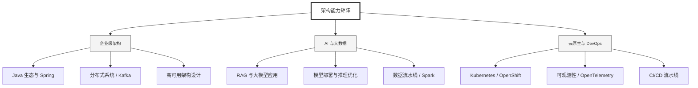

  <h1>你好，我是 Ellen Liu 👋</h1>
  

    <a href="README.md">English</a> | 
    <b>简体中文</b>
  

## 🧠 技术栈与核心能力

智能化企业系统建设路线图，涵盖全栈人工智能工程、云基础设施架构及模型部署等核心技术领域。

```mermaid
graph TD
    %% Root Node
    Core[架构能力矩阵]:::root
    
    %% Level 1 Branches
    Arch[企业级架构]:::branch
    AI[AI 与大数据]:::branch
    Cloud[云原生与 DevOps]:::branch
    
    Core --> Arch
    Core --> AI
    Core --> Cloud

    %% Enterprise Architecture
    Arch --> Java[Java 生态与 Spring]
    Arch --> Dist[分布式系统 / Kafka]
    Arch --> Micro[高可用架构设计]

    %% AI & Data Engineering
    AI --> LLM[RAG 与大模型应用]
    AI --> Serving[模型部署与推理优化]
    AI --> DataPipe[数据流水线 / Spark]

    %% Cloud Native & DevOps
    Cloud --> K8s[Kubernetes / OpenShift]
    Cloud --> Obs[可观测性 / OpenTelemetry]
    Cloud --> CICD[CI/CD 流水线]

    %% Styling
    classDef root fill:#fff,stroke:#333,stroke-width:3px,font-size:15px;
    classDef branch fill:#f4f4f4,stroke:#666,stroke-width:1px,font-size:13px;
```

## 🚀 Highlighted 工作

- **开源 AI 项目**: [基于 BERT 的声明检测模型](https://huggingface.co/XiaojingEllen/bert-finetuned-claim-detection) (Apache-2.0)
  - *已被哥伦比亚大学 (UBC) 研究项目引用。*
  - *手写 Transformer 核心代码，以验证理论与工程的一致性。*
- **金融基础设施**: 从 0 到 1 构建数字银行支付中间件及智能保险理赔系统。

## 📑 每日论文速递 (ArXiv)
<!-- DAILY_ARXIV_SUMMARY_START -->
**更新日期: 2026-08-17**

### 1. [AutoDesign：面向长时程智能体设计的元驾驭优化](http://arxiv.org/abs/2608.13560v1)
- **摘要**: 将多模态源转化为精简且结构化的媒体输出，从根本上可视为一个以模型-框架系统为中心的长期智能体过程。理想的框架系统应契合人类设计先验，并通过经验探索积累可复用经验，以驱动递归式自我改进，然而现有范式仍属静态，未能实现这一能力。本文提出AutoDesign框架，其与人类设计先验对齐，其中元框架优化器引导代码智能体基于回滚反馈递归改进框架。为实例化并评估该框架，我们聚焦于学术论文到海报生成任务，并引入PosterBench，包含涵盖五个学科的100篇论文主轨道，以及PosterBench-mini，一个用于受控评估的共享10篇论文子集。在PosterBench主轨道上，AutoDesign取得最高分78.32，超越闭源商业系统Claude Design达7.45分。在七种受控代码智能体-模型配置中，集成学习到的DesignHarness持续提升性能，将平均PosterBench得分从54.99提升至67.39（+12.4%）。在完全自主的长期循环中，它在40分钟内执行253次工具调用和11轮编辑，成本低于3美元，达到人类评估中的平均会议海报质量。一项系统盲测人类研究进一步表明，AutoDesign在评估系统中获得最高的人类偏好度。

### 2. [全能科学家：一种全模态、全学科的人工智能科学家](http://arxiv.org/abs/2608.13558v1)
- **摘要**: 基础模型的最新进展使人工智能科学家能够自动化日益完整的研究工作流程，从假设生成、代码执行到稿件准备。然而，仅覆盖工作流程并不能提供科学发现所依赖的全部证据。现有系统通常基于文本、代码、标签或预计算摘要进行推理，使得具有科学决定性的空间、时间、跨通道和程序性关系对智能体不可用。我们引入了OmniScientist，一种端到端、全模态的人工智能科学家，可直接从异构原始证据中进行多学科研究。一个感知层和三个自主智能体（分别负责构思、实验和撰写）在确定性流水线中运行，使观察能够在整个研究生命周期中塑造研究问题、实验决策和最终结论。通过在代码中执行想法、严谨性和主张检查，系统确保了新颖性筛选、统计有效性、执行溯源和数值可追溯性。我们在涵盖5个学科家族、4类科学证据以及图像、信号、音频、视频、三维结构、轨迹、表格、公式和图等模态的36个真实数据案例上评估了OmniScientist。该系统在所有36个案例中完成了从原始数据到编译稿件的完整路径，并在参考推理骨干下实现了6.3的平均总体论文得分。在与仅接收预计算标量特征的盲变体进行的配对比较中，直接感知在所有7个评估维度上均有所提升，并在85%的正面比较判断中获胜。这些结果表明，生命周期范围内的感知对于基于证据的科学发现至关重要，并为实现广泛能力的人工智能科学家提供了实用路径。

### 3. [LittleLearner：教学控制知识暴露下的语言模型](http://arxiv.org/abs/2608.13545v1)
- **摘要**: 现代语言模型是在异构的网络规模文本语料库上训练的。因此，研究知识与技能的习得过程颇具挑战，因为难以刻画模型先前接触过的相关内容。为应对这一难题，我们引入了LITTLECURRICULUM，这是一个精心策划的880亿词元预训练语料库，专为美国小学教材设计，明确排除了五年级以上教授的概念、事实和词汇。在LITTLECURRICULUM上从头训练一个50亿参数的LLM，我们得到了LITTLELEARNER，该模型具备足够的语言能力以进行开放式评估，但其知识与能力边界清晰，且与可解释的课程指南相对应。我们发布LITTLECURRICULUM和LITTLELEARNER，作为一个发展受限的沙盒环境，用于研究模型在明确界定的训练范围内如何获取、表征和使用数据。我们通过一系列初步实验，展示了该沙盒在通过后训练和上下文学习注入新知识方面的实用性。这些方法使LITTLELEARNER能更好地利用现有知识，但并未提升超出范围的能力。我们的研究结果强调了这一受控环境对未来研究的重要价值。

<!-- DAILY_ARXIV_SUMMARY_END -->

## 🌐 保持联系

  
<i>期待与您探讨 AI 基础设施的未来！</i>

